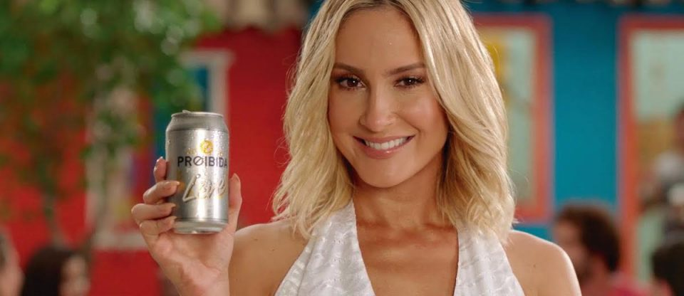

Mais uma vez mulheres tem que vir dizer que cerveja não é feita só pra homem, que mulher não necessariamente gosta apenas de cervejas leves e docinhas. Mas parece que algumas marcas não entenderam ainda isso, né Proibida?

<!--more-->

Eu levei um susto e fiquei incrédula quando percebi que a [cerveja](https://www.papodebar.com/cerveja/) Proibida tinha feito uma cerveja para nós, mulheres:

> “Proibida Puro Malte Rosa Vermelha Mulher, uma cerveja delicada e perfumada, feita especialmente para você, mulher.”

Óbvio que a repercussão disso não foi nada boa. Ainda bem que a repercussão disso não foi nada boa.

https://www.youtube.com/watch?v=7UrIL0LyW1A

A questão toda é que a Proibida parece que ainda está no século passado e faz cerveja forte “_pra macho_”, como o ator Antonio Fagundes fala no comercial, e uma cerveja delicada e perfumada pra nós, mulheres.

Gente, acontece que cervejeiro de verdade faz [cerveja](https://www.papodebar.com/cerveja/) pra agradar os paladares independente do sexo da pessoa.

A marca está esquecendo que a gente bebe com a boca **e não com nossos órgãos genitais**.

Enquanto algumas marcas estão fazendo questão de tirar [a objetificação da mulher de seus comerciais](https://www.papodebar.com/historias-de-verao-itaipava/), fazendo questão de tirar essa idéia que cerveja é coisa de homem, a cerveja Proibida vai no caminho contrário.

O que será péssimo pra eles, pois vão perder um público grande de consumidores. Mulheres tem bebido cada vez mais cerveja e eu, por exemplo, não bebo mais dessa marca.

## Finalizando

Essas atitudes nos mostram que ainda há muita luta pela frente pra mudar essa sociedade patriarcal que já entendeu que mulher bebe cerveja, mas acha que bebemos as docinhas com o menor teor de álcool possível , assistindo filme de romance com as amigas como num belo clube da luluzinha.

Que bola fora hein, Proibida? O ideal seria vocês se retratarem com as mulheres e tirarem essa [cerveja](https://www.papodebar.com/cerveja/) do mercado, porque está bem feio pro lado de vcs.

E vocês, o que acharam dessa propaganda?
