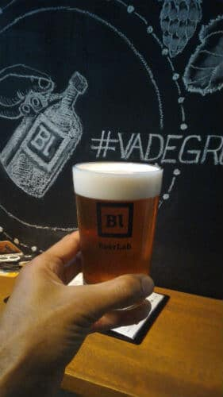

O Papo de Bar foi convidado para visitar um bar de cervejas artesanais bem aconchegante, o **BeerLab**. Muito bem localizado, comida e [cerveja](https://www.papodebar.com/cerveja/) boa.

<!--more-->

## Ambiente do BeerLab

O bar é bem pequeno, isso é verdade. A parte interna não cabe muita gente, ele te intima a ficar do lado de fora.

Curti bastante essa parte.

O BeerLab não possui televisão, algo que eu curti, já que não sou muito fã, já que tira sua atenção. Portanto, para quem gosta de novela, ver um futebol, esse não é o caso, ele é para quem quer beber e bater um papo.

### Um bar "químico"

Curti pacaralho a decoração do BeerLab. Uma pegada química, a carta de chopes artesanais fica na parede e é desenhada como uma tabela periódica.

Na parte superior esquerda, onde fica o número atômico tem onde a torneira está localizada, número de 1 a 9.

E do lado direito fica a graduação alcoólica do chopp, exatamente onde ficaria a massa atômica.

No meio tem uma mistura de estilo do chopp fantasiado de símbolo químico, por exemplo, Pilsen ficou como **Pi.**

Logo abaixo do estilo do chopp fica o nome da cervejaria.

Eu diria que o BeerLab é um bar sem frescura, gostei bastante dele, tanto a decoração, quanto as ideias.

## Petiscos do BeerLab

O que eu achei diferente foi que o bar não tem cozinha, me assustou um pouco, mas depois que o pessoal me contou o esquema, foi mais tranquilo.

Eles possuem algumas tábuas de queijos, algo que não precisa necessariamente uma cozinha para servir.

Dentre os queijos estão:

- Canastra (Serra da Canastra);
- Tarôco (São João del Rei);
- Catauá (Serra da Mantiqueira);
- Caprino Romano (cabra);
- Charolais (cabra);
- Pyramide (cabra);
- Boursin (cabra).

Os queijos acompanham cesta de pães e geleias, como a de abacaxi com pimenta. Essa última geleia é espetacular. Custa R$45

Tem também a tábua de charcutaria, com quatro frios:

- lombo;
- pernil;
- copa;
- picanha;
- salame.

Todos acompanhados com geleia à escolha e cesta de pães. Essa é a melhor cesta. Mas você pode misturar as duas, pedindo a mista, que leva dois tipos de queijos e três charcutarias. Custa R$27 e a mista R$36.

### Sandubas

Existem sanduíches clássicos deles, como o dog alemão, que é servido pão suíço com linguiça defumada ou salsicha branca, queijo meia cura, maionese e mostarda. Esse custa R$22.

Tem a opção vegetariana que vem na ciabatta e é recheado com búfala, pesto de manjericão e tomate seco. Esse custa R$27

Mais uma opção é o sanduíche de charcutaria. Ele é montado na baguete, com pernil ou picanha suína, queijo meia cura e geleia de abacaxi com pimenta. Custa 27

#### Sanduíche do dia

Eu comi também o sanduíche do dia, que no caso era um de costela na IPA com queijo canastra. Simplesmente fantástico.

O do dia custa R$32.

Fiquei na dúvida em qual sanduíche foi melhor o dog alemão ou o de costela, mas acho que foi o de costela.

## Higiene do BeerLab

Essa parte eu não tenho nada do que reclamar. Troca de copos a cada chopp apreciado, local aparentemente limpo.

Só tem um banheiro, talvez isso preocupe algumas pessoas, mas não vejo problema nisso, até porque o banheiro é bem limpinho.

## Música do BeerLab

O BeerLab em si não tem um estilo musical próprio e a música fica tocando num som agradável, o que me agrada, pois podemos conversar sem problemas.

Não tem música ao vivo, até porque o espaço físico não permite. Mas a lista de música ia desde blues, rock, pop e afins.

## Atendimento do BeerLab

Ser atendido pelos donos do bar é algo que faz a diferença. O bom de bares pequenos é isso, você troca ideia, fala o que acha, o que pode melhorar, sabe mais detalhes. Parabéns ao casal Tatiana e Helio de Macedo Soares, donos do bar. Foda demais.

Além deles tinha uma menina gringa bem simpática e que tirava os chopes muito bem, ponto para ela.

## Variação de cervejas do BeerLab

Como eu disse, o bar tem nove torneiras de chopes artesanais dos mais variados estilos. No dia que eu fui o estilo IPA era o que mais tinha nas torneiras.

O que me chamou a atenção foi que os chopes variam sempre, acabar um barril não quer dizer que aquela torneira será do mesmo chopp que tinha antes, pelo contrário, a possibilidade de entrar outro diferente é grande.

Ainda servem [cerveja](https://www.papodebar.com/cerveja/) em garrafa também, além dos chopes. E os chopes são servidos em copos de 350ml, 473ml e growler de 1 litro.

E claro, uma valorização de cervejeiros locais, algo que tem crescido bastante, junto com o mercado cervejeiro nacional.

## Localização do BeerLab

O BeerLab fica na Rua Sousa Lima, 16 C – Copacabana. Excelente localização, metrô bem pertinho.

<iframe style="border: 0;" src="https://www.google.com/maps/embed?pb=!1m18!1m12!1m3!1d649.3259415701473!2d-43.190717237663286!3d-22.981797434306245!2m3!1f0!2f0!3f0!3m2!1i1024!2i768!4f13.1!3m3!1m2!1s0x0%3A0x6d69e349e4781d92!2sBeerLab!5e0!3m2!1spt-BR!2sbr!4v1485870778736" width="800" height="450" frameborder="0" allowfullscreen="allowfullscreen"></iframe>

A estação mais perto é a General Osório, por incrível que pareça, mas é só sair pela saída (essa afirmação ficou escrota, eu sei) da rua Sá Ferreira.

Ir de ônibus também é ridiculamente fácil, é só descer no primeiro ponto após o túnel Sá Freire Alvim, na rua Raul Pompeia.

**Horário:** De terça a sexta, das 17h à 0h. Sábado, das 15h à 0h. Domingo, das 17h às 22h.

## Preços do BeerLab

Como é de se esperar de um bar de cervejas artesanais, o preço não é tão convidativo quanto um boteco pé sujo.

No dia tinha chopes de 350ml que variavam de R$10 a R$24, dentro do padrão.

Os chopes de 473ml variavam de R$14 a R$32, enquanto os growlers iam de R$29 a R$64.

## Finalizando

Uma ótima opção pra quem mora no Rio de Janeiro ou vai fazer uma visita à cidade maravilhosa.

O ponto fraco é o preço, pra quem está acostumado com algo mais barato, mas está na média dos bares de [cervejas](https://www.papodebar.com/cerveja/) artesanais.

De resto, recomendo muito, tanto a bebida quanto a comida.

E vocês, já foram?

Abs.
