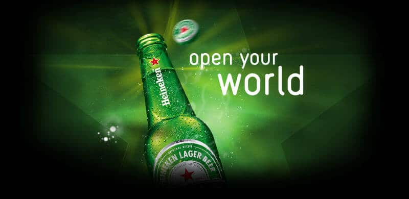

Salve, salve, amigos PdBs! Notícia boa para quem curte futebol internacional e para aqueles que adoram uma boa ação de marketing. A UEFA Champions League, mais importante competição de clubes de futebol do mundo, seguirá com um de seus principais parceiros, pois a Heineken renovou contrato até 2021 e continuará brilhando com seus fãs.

<!--more-->

## Heineken no mundo esportivo

A Heineken dedica grande parte de seus investimentos em eventos de nível mundial, como a Champions League e a Fórmula 1, por exemplo.

Isso garante a marca exposta em todo o mundo e evidencia a ambição de Heineken desejando aumentar sua participação no mercado cervejeiro global.

### Cervejas no Champions

Antes, a cerveja patrocinadora da Champions era a Amstel (que hoje pertence ao mesmo grupo proprietário da Heineken), mas em 2005 a Heineken assumiu e não saiu mais.

O contrato anterior tinha validade até 2018, mas com o interesse mútuo, a renovação foi antecipada, sendo estendida até 2021.

A ideia da marca é criar experiências envolventes que vão além dos 90 minutos. Coisa que eles fazem muito bem, por sinal.

Vejo a Heineken crescendo muito, ao menos por aqui, no Brasil. Na verdade, falo por Rio e São Paulo onde frequento mais e vejo muitas pessoas que antes consumiam as marcas da AMBEV, que são mais antigas e fáceis de encontrar no mercado, bares e restaurantes, e hoje se renderam a Heineken.

Até a Stella Artois, que tem grande apelo com parte do público, está preferindo a Heineken.

## Finalizando

Acho ótimo ver a marca da garrafa verde crescendo, se estabelecendo e investindo para ser cada vez melhor. O consumidor é quem ganha com isso.

E acho maravilhosa a renovação com a Champions, já que acompanho o torneio e fico ansioso esperando as ativações da Heineken.

Vi no nobre [MKTEsportivo.com](http://www.mktesportivo.com/2017/02/heineken-patrocinio-uefa-champions-league-2021-renovacao/)
