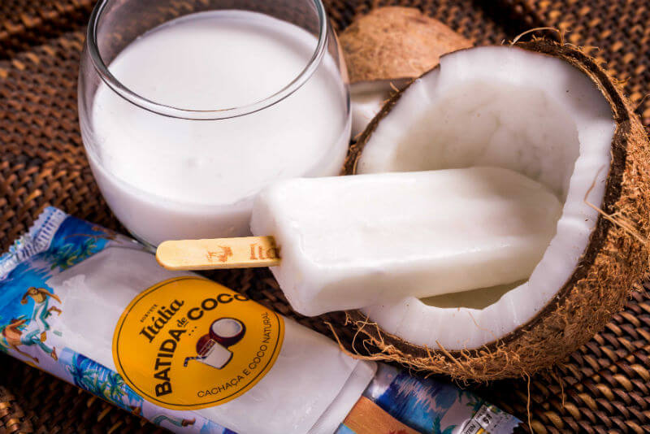

E aí, meus nobres consumidores de produtos etílicos, tranquilidade? Venho trazendo uma novidade, picolés alcoólicos, eles estão de volta com o Sorvete Itália nesse verão carioca.

<!--more-->

## Picolés alcoólicos, o drinque no palito

Essa época é de muito calor, principalmente no Rio de Janeiro. Nada melhor que lançar um sorvete ou picolé para refrescar.

O Sorvete Itália é um velho conhecido aqui na cidade, picolés e sorvetes de qualidade, com alguns sabores sem açúcar.

### Mas e que tal misturar drinks etílicos e sorvete?

Foi justamente pensando nisso que o [Sorvete Itália](http://www.sorveteitalia.com/) resolveu lançar a linha de picolés alcoólicos, que acaba de chegar às lojas.

## Tem quais sabores de picolés etílicos?

São somente dois, infelizmente, mas melhor do que nada :D

- Caipirinha (clássico)
- Batida de coco

O preço de cada um deles é de R$6. E sim, eles são realmente etílicos, levam cachaça em sua composição, sendo que o picolé alcoólico de caipirinha tem 10% de teor alcoólico e o de batida de coco tem 13%

Obviamente que todos são proibidos para menores de 18 anos ;)

## Promoção de carnaval

E ainda fizeram uma promoção 2x1 para os picolés alcoólicos. Na época de carnaval, até o dia 28 de fevereiro, na compra de um picolé da linha, o segundo sai de graça.

## Finalizando

Gostei bastante da novidade. O meu favorito era o de coco, agora então, com batida, melhor ainda.

Só acho que eles deveriam investir mais no carnaval, deixar a promoção até a quarta-feira de cinzas. E ainda mais, eu colocaria ambulantes com mochilas térmicas vendendo esses picolés pelos blocos de carnaval. Tenho certeza que faria um puta sucesso.

E o bom é que esses dois picolés alcoólicos são vendidos em todas as 31 lojas da rede do Sorvete Itália, inclusive com a promoção de carnaval.

E aí, gostou da novidade? Qual sabor você prefere?
