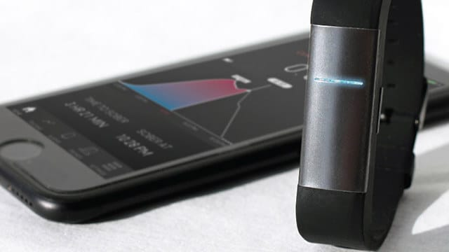
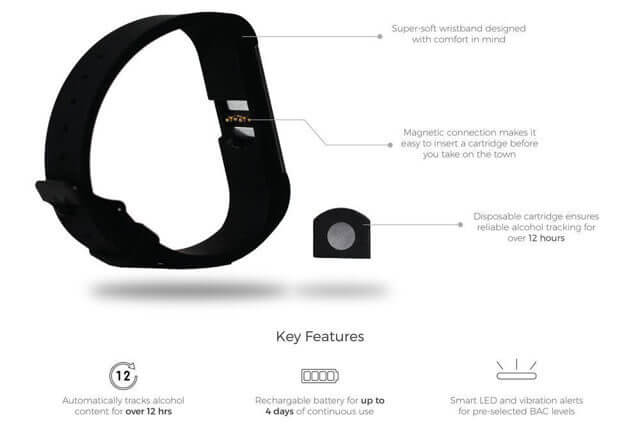

Salve, salve, galerinha moderna que usa o nosso querido smartphone para tudo e qualquer coisa. Realmente hoje em dia, o que mais existe por aí são apps que resolvem nossas vidas. Não importa em qual área você trabalha, onde você mora ou o que gosta de fazer em seus finais de semana, você vai precisar de diferentes aplicativos ou acessórios de seu smartphone. Para quem curte beber até o corpo não se aguentar em pé, está chegando ao mercado a **Proof**, uma pulseira que mede o álcool no seu sangue e ajuda a saber o quão bêbado você está.

<!--more-->

## Proof, uma smartband para bêbados

Claro que não é uma pulseira pura simples. É uma smartband, daquelas que se conectam ao seu smartphone e ficam analisando você fulltime.

Ela surge com a missão de medir diferentes compostos químicos presentes no sangue de quem a utiliza, com base na transpiração da pele.

Assim, a pessoa abre o app instalado no smartphone e vai conferindo quanto de álcool seu corpo está acumulando durante a noite.

## E quem foi o gênio que criou a Proof?

Quem criou a Proof, foi a empresa Milos Sensors, que aposta na maneira simples e discreta de medir o álcool no seu sangue.

O CEO da companhia, Evan Strenk, afirma:

> "Existem bafômetros para serem comprados, mas ninguém usa pois são estranhos. O uso aqui é que você põe o sensor às 18h e configura todos os alarmes para si mesmo, e tudo está pareado com o aplicativo"

### Como funciona?

É bem simples mesmo. O sujeito coloca a pulseira no pulso, faz a conexão com o smartphone e para não esquecer, programa uns alarmes.

De tempo em tempo, ele vai lá e confere as informações. Simples.

Ah! O app pode informar quando detectar uma quantidade pré-definida de álcool no sangue. Assim o cara nunca passará dos limites.

## Lançamento da Proof

A Proof será lançada esse ano ainda e vai custar entre 100 e 150 dólares no exterior. Acho um preço justo, mas realmente não sei se há uma demanda para o produto.

Por mostrar a quantidade de outras substâncias também, acho que o acessório pode até vingar, mas se for só pelo álcool, as vendas serão pequenas.

E quem comprar por esse motivo, deverá deixar de usar rapidamente. Isso eu acho, apenas acho.

## Finalizando

Imagina você, numa festa com os amigos, bebendo, feliz e contente quando percebe que tem a quantidade x de álcool no sangue.

E aí?! Se fosse eu, beberia uma água e seguiria com minhas cervejas, tequilas e whiskies sem nem lembrar mais da pulseira.

Enfim… Se alguém consegue ter essa disciplina, faça bom uso da smartband, mas eu não consigo.

Aquele abraço!

Fonte: [http://adrenaline.uol.com.br/](http://adrenaline.uol.com.br/)
