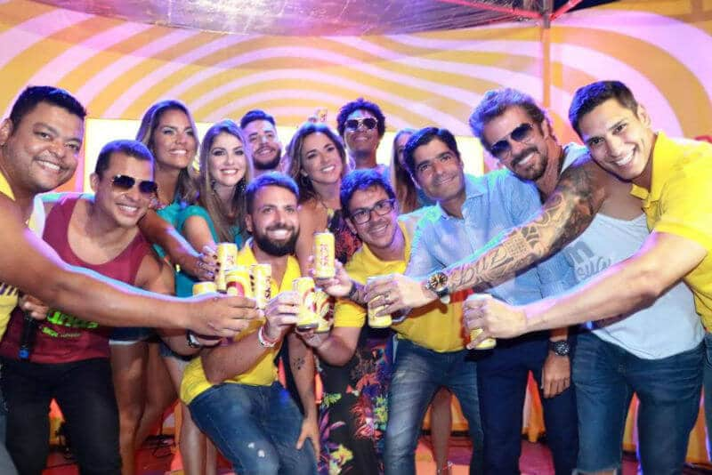

O verão na Bahia está fervendo. São inúmeros eventos por todo estado e a Ambev é presença constante na maioria deles. A empresa tem investido bastante no estado, ainda no ano de 2016 a mesma assinou um contrato de exclusividade com a prefeitura de Salvador, que prevê investimentos de 30 milhões por ano durante 3 anos, e garante exclusividade para as marcas que a empresa desejar por nas festas da capital.

<!--more-->

No entanto, a AMBEV resolveu investir em todo estado nesse verão e as ações são inúmeras e envolve varias marcas do seu portfólio.

A marca esteve presente nos ensaios de verão, intervenções urbanas como as tardes de musica no Rio Vermelho, festas privadas em boates da capital, edições do [Corona Sunset](https://www.papodebar.com/corona-sunsets-2016/) que agitaram o litoral sul do estado, badaladas festas no paradisíaco oratório ilha de maré na Baia de Todos os Santos, participação no réveillon de Salvador (hoje o maior do Brasil).

## Carnaval já chegou

Agora vem chegando o carnaval, onde a marca Skol será a cerveja oficial, além de gozar da exclusividade nos circuitos da folia, a empresa vai levar pra rua seus blocos e o badalado **camarote Skol**.

No dia 09 de fevereiro a Skol reuniu imprensa, youtubers, artistas patrocinados pela marca e o prefeito de Salvador-BA para uma mega coletiva de imprensa de um jeito completamente fora do quadrado.

A cervejaria montou um espaço na frente do famoso Forte Santa Maria (Porto da Barra) em um dos circuitos mais disputados da folia baiana e fez uma festa pra apresentar as surpresas que a marca preparou para folia de 2017.

### E o que teremos?

Além do camarote, blocos e trios patrocinados, vamos ter inclusive a adição de mais um dia no carnaval baiano. Este ano a Skol preparou algumas surpresas que vão deixar o carnaval de Salvador ainda mais redondo e fazer a folia quebrar os padrões.

A grande novidade é a antecipação do início da festa para o dia 21 (terça-feira), com um trio que animará o folião no circuito invertido da folia.

O trio Skol saíra de Ondina, em frente ao Camarote Skol, sentido Barra. Com concentração agendada para às 18 horas. O trio Skol terá show exclusivo com a banda Timbalada e os DJs Alok e Dennis.

O circuito de abertura oficial será feito ao contrário do habitual, saindo de Ondina, e terminando no Farol da Barra, com um super encontro entre a Timbalada, os DJs Alok, Dennis, e os cantores Léo Santana e Saulo.

Com isso, o carnaval de Salvador dará o start para a festa momesca da Skol em todo o Brasil. A Skol vai fazer o maior carnaval do país.

Além de ser a cerveja oficial do carnaval de Salvador, estará presente em 11 blocos, 6 camarotes e sai do quadrado oferecendo 8 dias de festa gratuita para o folião no Farol da Barra, cartão postal da capital baiana.

## Palco Skol

Além de antecipar a festa, o folião vai poder aproveitar shows gratuitos todos os dias no Palco Skol, montado em frente ao Farol da Barra.

Para sair da mesmice, a programação no palco começa sempre que o último trio passar.

A programação do Palco Skol contará na quinta-feira (23), com Gabriel Diniz e encontro de trios com Márcio Victor e Preta Gil.

Na sexta-feira (24), quem assume o palco é Thiaguinho e Duas Medidas. No sábado (25) a cantora Daniela Mercury fará um show especial para o folião.

No domingo (26) a atração está a confirmar. Na segunda-feira (27) um grande encontro com a Banda Ifá, com participação de Liniker, e Benegão.

Na terça-feira (28), último dia do carnaval, o folião vai se despedir da festa momesca ao som da banda Avenida 7.

## Camarote Skol

Um dos espaços mais disputados do Carnaval de Salvador, o Camarote Skol surpreende com uma programação que mistura diferentes ritmos musicais durante os seis dias de folia.

O tom será da mistura. Axé, forró e samba dividirão espaço com vários nomes da electromusic.

Para deixar esse caldeirão musical ainda mais divertido, no palco principal do Camarote Skol, com vista para o mar, os foliões poderão curtir shows exclusivos das bandas:

- Aviões do Forró,
- Pipo e Rafa Marques,
- Harmonia do Samba,
- Anitta,
- Bell Marques,
- Tuca Fernandes,
- Dan Valente,
- Timbalada,
- Ju Moraes,
- Léo Santana,
- Negra Cor.

Além disso, na boate [Skol Beats](https://www.papodebar.com/voce-conhece-estilo-near-beer/) dj’s renomados como M.O.N. (Mario Velloso & Pietra Bertolazzi), Miss Cady, Thascya, Luca Buzanelli, Luan Delucci e Rafael Diefentaler animarão o público.

### Onde fica o Camarote Skol?

O Camarote Skol está localizado no Clube Espanhol, Circuito Barra-Ondina. O espaço funciona todos os dias do Carnaval, das 19h às 4 horas.

Uma das principais apostas do Camarote Skol é o abadá diferenciado.

Com a assinatura da marca Soul Dila, as camisas serão estampadas com expressões usadas no dia a dia dos baianos.

Frases como “_Ô Veii, a-pro-vei-te!_”, “_Bote Fé_” e “_Hoje só Amanhã_” serão alguns dos exemplos. As camisas serão feitas com malha 100% algodão e uma lavagem especial, para que os foliões possam usar depois do Carnaval.

## Blocos, Trios e Camarotes Patrocinados

A Skol respeita as diferenças e valoriza a diversidade da festa. Baseado nesse conceito, a cervejaria vai além de palco, trio e camarote. Saindo do quadrado, a Skol patrocina 11 blocos, 6 camarotes e trios sem cordas para o folião pipoca.

Segundo Rafael Puccinelli, diretor nacional de eventos da Ambev, este é o maior investimento da cervejaria em 2017 na Bahia, e um dos principais do Brasil:

> “O Carnaval da Bahia será o start para os outros carnavais que a SKOl patrocina no Brasil inteiro. Além da capital baiana, SKOL fará um carnaval diferente e grandioso nas cidades de São Paulo (SP), Recife (PE), Belo Horizonte (MG) e Fortaleza (CE), para citar alguns”

Afirma Rafael Puccinelli.

## Finalizando

Falta pouco para a folia baiana começar, e pelo visto a Skol não está para brincadeira, então se levanta, sai do seu quadrado e vem para o carnaval de Salvador.
