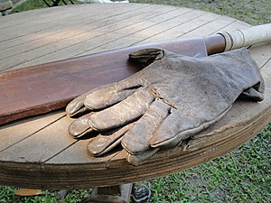

Fala galera PdB! No último domingo rolou o Superbowl, que cresce de audiência a cada ano no Brasil. Os brasileiros aprenderam a admirar o principal esporte americano e o jogo fez bastante barulho por aqui, até porque foi um jogaço! Outra parte famosa do evento são as propagandas, onde as marcas fazem de tudo para impressionar o público. A Budweiser aproveitou e deu um tapa de luva no presidente dos EUA, Donald Trump, ao contar sua própria história.

<!--more-->

## Como assim um tapa de luva?

Trump foi eleito no último ano e tomou posse em 20 de janeiro de 2017. Com pouco tempo no cargo mais importante do mundo, já assinou algumas medidas polêmicas e o político, que já não contava com grande simpatia dos americanos, passou a ser questionado por todo o mundo ao proibir imigrantes de determinados países a ingressarem nos Estados Unidos.

Bem nesse momento em que muitos protestam contra a atitude de Trump, aconteceu o Superbowl e as incríveis propagandas que, aliás, pagam o valor mais alto do mundo para mexer com os espectadores.

A Bud foi contar sua história em 60 segundos e acabou entrando no debate sobre imigrantes.

## E como foi a propaganda?

O vídeo "**Born the Hard Way**", conta sobre o fundador da marca de cerveja que está entre as 5 mais vendidas do mundo, era um alemão que chegou passando sufoco aos EUA onde não foi bem recebido e mesmo assim foi atrás de seu sonho de fazer uma cerveja. Conseguiu! Se liga no vídeo:

https://www.youtube.com/watch?v=7ZmlRtpzwos

Adolphus Bush acaba se tornando um grande exemplo de quanto os imigrantes contribuíram e contribuem até hoje para o crescimento dos EUA.

Mesmo sendo a Budweiser idealizada por um imigrante, a marca é tão americana, que [ano passado adotou o nome América](https://www.papodebar.com/budweiser-agora-e-america/).

A Bud afirma que está há quase um ano desenvolvendo a propaganda e que não tem nada a ver com o momento político atual.

### Será?

Ok. Se pensarmos que anunciar no Superbowl não é nada barato (30 segundos custam algo em torno de 5 milhões de dólares) e exige algo bem bolado, faz sentido a justificativa da Bud, mas que Trump não deve ter gostado nada, isso é fato.

Ao jornal The Washington Post, o vice-presidente de marketing da Anheuser-Busch, Marcel Marcondes disse:

> "Nosso foco esta semana está em nossos anúncios do Super Bowl e nossas marcas. Criamos o comercial Budweiser para destacar a ambição de nosso fundador, Adolphus Busch, e sua perseguição implacável do sonho americano. Esta é uma história sobre o nosso património e o empenho intransigente que vai para nossa cerveja. É uma idéia que estamos desenvolvendo junto com nossa agência criativa há quase um ano."

Eles esperam que a propaganda ressoe com a geração empresarial de hoje e aqueles que continuam a lutar por seus sonhos.

> "Quando a Budweiser nos disse que queriam celebrar aqueles que encarnam o espírito americano, percebemos que a história final vivida dentro de sua própria história de marca estava ali. Adolphus Busch é o herói da história de sonho americano, o que o torna o protagonista perfeito"

Disse Mike Byrne, diretor global de criação da agência Anomaly, responsável pela criação da peça.

## Finalizando

Eu adorei o Superbowl e queria muito que tivéssemos propagandas incríveis por aqui.

A Bud mandou muito bem na ideia e o anúncio acabou sendo exibido no momento perfeito! Tomara que o Trump nos surpreenda positivamente e reveja essa proibição.

Aquele abraço!
