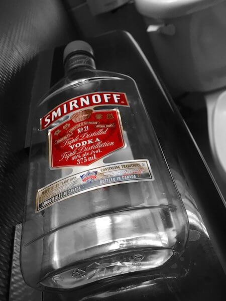

Nasceu na Rússia, cresceu na antiga capital do império romano, caminhou para a Ucrânia, onde foi batizada, e hoje em dia se reproduz nas terras do Tio Sam. Com 150 anos e todo esse caminho de história de vida, podemos afirmar que a Smirnoff é uma senhora no auge da maturidade.

<!--more-->

## Criação e atual dona da Smirnoff

Créditos: wwarby

Criação de um russo multicultural, a senhora **Smirnoff** atualmente é comandada pelo grupo Diageo, velho conhecido direto ou indireto por nós, amantes de álcool, através de outras figuras importantes que o grupo comanda como:

- Johnnie Walker
- José Cuervo
- Guinness
- além da nossa velha conhecida Ypióca

## Os sentidos da Smirnoff

No corpo americano a senhora Smirnoff se apresenta bem transparente, com alto nível de pureza e pouca densidade.

Discreta também em relação ao sabor, o que a coloca ainda mais dentro do seu estilo. Mas não passa pela boca sem chamar à atenção.

Créditos: Jamie McCaffrey

O pouco cheiro de álcool que apresenta, faz com que ela atraia o bebedor na hora certa, justamente quando aciona de maneira arrebatadora as sensações na parte de trás da língua, seguida de uma queimação agradável e curta, que é complementada por uma pós-gosto sem resíduo, simples, curto e que não colide com a acidez da boca.

## Finalizando

Isso tudo faz com que a Smirnoff seja uma ótima vodka para beber pura ou acompanhada de drinks (principalmente pelo fato de não brigar com os sabores dos demais ingredientes).

Sozinha é eficaz e honesta; acompanhada é imprescindível. Eu acho que de fato o objetivo dessa marca, ou talvez, a sua característica mais marcante, e louvável, é realmente a generosidade?

O que vocês acham?

Abraços.

Créditos da foto de capa: Ton Qu
