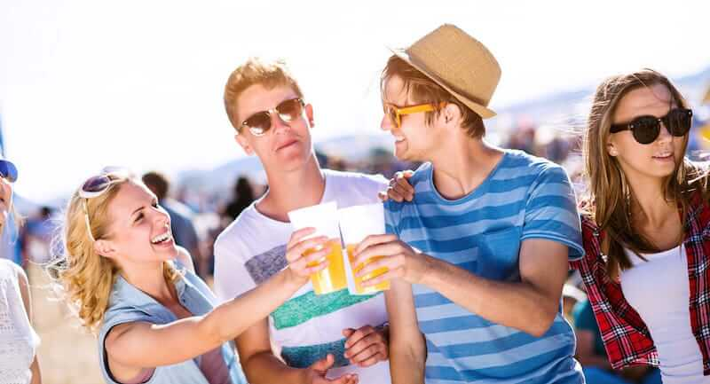

Olá amigos PdBs de plantão! O título do texto que vocês estão a ler nesse exato momento parece até uma apologia ao consumo de álcool, mas não é. Quando afirmo que **beber é cool**, digo isso baseado no cotidiano de diversas pessoas que compartilham incontáveis fotos com bebidas envolvidas.

<!--more-->

## Que tipo de fotos?

Você é daqueles que bebe todos os dias? Bebe apenas no fim de semana? Compartilha imagens suas bebendo com os amigos ou até aquele “_Stories_” do seu copo cheio de cerveja em plena terça-feira? Você está fazendo o que a maioria faz e acaba sendo cool.

As redes sociais já deixaram há muito de ser uma moda. Elas estão aí e vieram para ficar.

Mas o conteúdo que é compartilhado nessas redes, esse sim pode ser considerado modismo em alguns casos. Porém, quando se trata de bebidas alcoólicas, não. Elas são atemporais.

### WTF????

Créditos: Jozef Pol

Sim, atemporais! Beber é cool desde o tempo indefinido de Tyrion Lannister vagando pelos sete reinos e suas sempre sábias palavras.

Sábias principalmente após algumas doses.

Cool também era beber aquele vinho sagrado desde o tempo em que a igreja não tinha o poder e Jesus ainda estava por aí mitando.

Beber como bebia Charlie Cheen, e quando o fazia conquistava qualquer mulher que desejasse.

Enfim… Usando o exemplo ou tempo que você desejar, beber sempre foi cool. Hoje em dia não é diferente. Pelo contrário, somos cada vez mais cool.

Só que hoje, com o advento da internet e das redes sociais, o mundo inteiro sabe que você bebe, o que vc bebe e onde você esteve bebendo… E isso não é feio. As pessoas acabam “_invejando_” você e querendo fazer igual.

## Finalizando

Créditos: Caia Images

Você pode até discordar do tema desse texto, mas basta olhar as timelines de seus amigos e verá que a realidade é essa.

Compartilhar a vida pessoal na internet é o que mais acontece, mas em geral as pessoas preferem postar aquilo que é bom, né? Não vou postar uma foto minha gripado, de cama, tomando remédio. Mas uma festa com os amigos...

Na real, **o que vale é ser feliz**! Essa é a grande verdade.

Muitas vezes nos perdemos em nossas rotinas, sempre cheias de compromissos e aquela dose diária de pressão no trabalho, em casa… Se beber um copo de cerveja ou uma taça de vinho vai te deixar melhor, faça isso. E se quiser compartilhar, compartilhe.

Mas busque sempre o que te faça feliz! Uma boa comida, uma grande companhia, aquele bom livro, algum exercício físico, um chocolate… as possibilidades são infinitas!

Aquele abraço!
