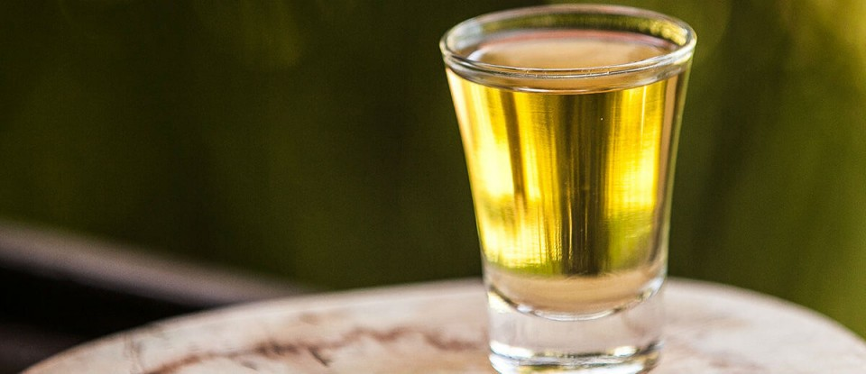

Olá, caros amigos PdBs! O Brasil sempre se orgulhou de sua [cachaça](https://www.papodebar.com/cachaca/) mundialmente conhecida. Além do consumo interno, o produto representa o país no exterior e quando turistas estrangeiros aterrizam em solo brasileiro, eles querem logo experimentar a famosa branquinha. Sabendo disso, um produtor mineiro criou o primeiro aguardente de mel do Brasil, a **Melicana**.

<!--more-->

## De onde veio a cachaça Melicana?

A [cachaçaria](http://www.cachacariamelicana.com.br) Melicana surgiu da ideia do Sr. Carlos José de Assis, que resolveu criar uma cachaça com mel bem ao seu gosto. **Na verdade ele queria uma cachaça de mel e não com mel**. Aí tentando, tentando, ele chegou a um aguardente destilado da fermentação do mel de abelha.

Após pronto, a Aguardente de Mel descansa no barril de carvalho que geram notas de amêndoas, caramelo, além do sabor amadeirado. A garrafa de 700 ml, que é linda por sinal, tem seu preço sugerido de 260 reais.

A cachaçaria Melicana produz outros tipos de cachaça mais tradicionais. São três tipos:

### E sobre Melicana Castanheira?

A Castanheira é envelhecida em madeira de castanheira e oferece notas frutadas com sabor leve, pouco amadeirada e com cor levemente amarelada. A garrafa também de 700ml tem valor sugerido de R$49,00.

### E a Melicana Amburana?

A Amburana é uma [cachaça](https://www.papodebar.com/cachaca/) armazenada em madeira amburana que oferece sabor e perfume de baunilha. A garrafa custa o mesmo preço da Castanheira,

### Tem também a Melicana Melado

É destilada da fermentação do melado da cana-de-açúcar. Melado, que é um xarope feito com o puro caldo da cana, a garapa, extraindo o líquido até que fique grosso, quase no ponto da rapadura.

Esta aguardente é envelhecida nas madeiras de Castanheira e na madeira de Ipê, **onde é feito um blend**, o que confere à bebida uma coloração amarela ouro e um sabor amadeirado. A garrafa de 700 ml sai quase pelo mesmo preço das outras, 56 reais.

## A primeira cachaça de mel do Brasil

A Melicana é a primeira a registrar no MAPA um aguardente de mel. Localizada na simpática cidade de nome Bom Despacho, em Minas Gerais, a **Melicana** decidiu abrir novos voos e conquistar o mercado brasileiro por meio de cachaças com sabor e qualidade únicas, perfeitas para acompanhar uma boa prosa em rodas de amigos.

## Mercado da cachaça

O mercado de cachaças do Brasil é muito bom! Segundo dados divulgados pela ABRABE (Associação Brasileira de Bebidas), a cachaça tem apresentado crescimento no mercado internacional, sendo o terceiro maior destilado em consumo do mundo.

Por aqui, a bebida também merece destaque já que o volume de vendas corresponde a 50% no segmento de destilados. É o segundo maior mercado de bebidas alcoólicas no Brasil, **atrás apenas da [cerveja](https://www.papodebar.com/cerveja/)**.

Temos em terras brasileiras, mais de 40 mil produtores e 4 mil marcas de cachaça, que geraram um faturamento de R$5,95 bilhões em 2013, quando foram produzidos 511,54 milhões de litros da bebida, de acordo com o Sistema de Controle da Produção de Bebidas da Receita Federal – SICOBE, que é responsável por controlar a produção das principais empresas formais do setor.

## Finalizando

Eu provei e adorei! Não esperem um Jack Honey, por exemplo, pois não se trata de cachaça com mel, mas sim cachaça de mel que leva o produto produzido pelas abelhas direto na receita.

Quem curte [cachaça](https://www.papodebar.com/cachaca/), ficará encantado. Vou fazer umas caipirinhas para ver como fica a mistura de sabores e postarei em nossas redes sociais.

Aquele abraço!
