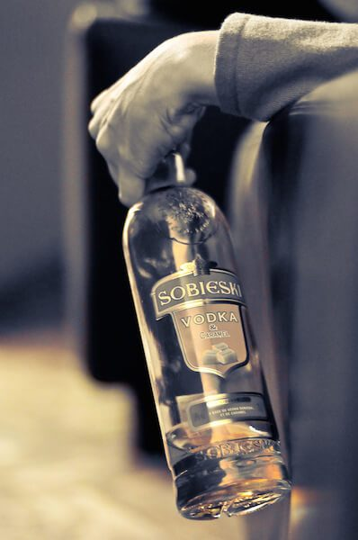
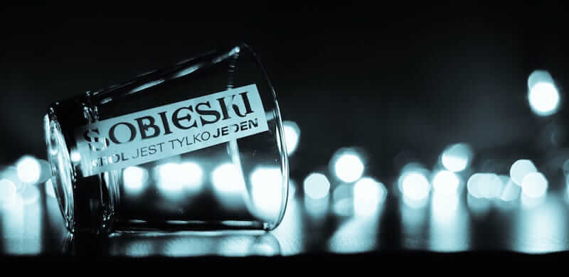
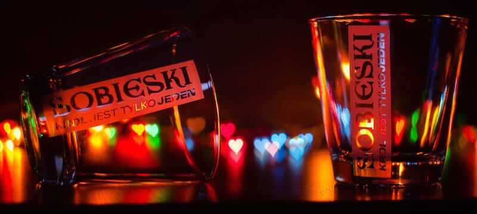

Luxo acessível, a **vodka polonesa Sobieski** promete brigar por uma fatia do imenso mercado Brasileiro de produtos etílicos. Para desbancar a concorrência, está vendendo luxo à preços sedutores.

<!--more-->

Curiosamente uma das primeiras informações que você encontra ao procurar saber mais sobre a vodka Sobieski, é um aviso. Na verdade um reclame.

## Curiosidades sobre a Sobieski

Créditos: Tranchis

No site da empresa tem uma informação histórica que confesso, nem eu sabia. A vodka foi primeiramente produzida e é a bebida oficial da Polônia e não da Rússia, como todos imaginávamos ser o país da vodka.

Documentos históricos apontam produção da bebida no país em 1405. Esclarecido esse engano, saiba que Sobieski é a vodka premium numero 1 na Polônia.

Embora você talvez nem nunca tenha ouvido falar, a marca coleciona prêmios internacionais reconhecendo sua qualidade e excelência.

## Como a vodka Sobieski é produzida?

Produzida a partir de matéria-prima nobre, como o famoso Centeio de Ouro de Dankowski, colhido nos férteis campos de Masowsze, no Leste da Polônia.

Créditos: Mateusz Frycz

A **Sobieski é destilada apenas 4 vezes**, de modo a manter suas características intactas. Depois ela é adequadamente filtrada. Possui teor alcoólico de 40%.

Os materiais e todo o processo de fabricação ímpar combinam modernidade e tradição na arte de preparar uma bebida Premium.

No caso da Sobieski clássica, o produto é importado, concentrado e aqui ele é diluído para o teor alcoólico desejado, pra depois ser engarrafado.

A verdade é que temos água de excelente qualidade, e terminar o processo no Brasil ajuda a reduzir os custos e oferecer um produto de qualidade num preço completamente acessível para o consumidor.

## História do nome Sobieski

Seu nome é uma homenagem ao Rei Leão, não o da Disney, mas o da Polônia, Rei Jan III Sobieski (1629 - 1696) o ultimo grande rei da Polônia.

Ele ficou famoso por comandar o exército que derrotou os Otomanos, que tinham o número de soldados duas vezes maior que o dos Polacos na batalha de Viena. Por isso ele representa a coragem e o gênio forte do seu povo.

## Prêmios da Sobieski

Curioso é que nos primeiros anos deste milênio a Sobieski teve um crescimento vertiginoso. Recebeu Medalha de Ouro pelo Beverage Testing Institute em Chicago. Em 2006 foi considerada a vodka internacional de maior crescimento no mundo.

Já em setembro de 2007, a revista La Revue du Vin de France promoveu uma degustação com as 25 mais famosas vodkas do mundo e novamente a Sobieski ficou entre as 10 melhores desbancando as concorrentes russas. Posteriormente ainda criou um famoso festival de musica na Polônia.

### Mas no Brasil...

Créditos: Mateusz Frycz

Entretanto, depois de chegar ao Brasil em 2008, a marca não conseguiu por aqui o mesmo sucesso. Na verdade procurei bastante, e mesmo em sites internacionais a última grande campanha publicitária da marca foi em 2010, com o ator Bruce Willis. Depois disso a marca parece ter parado de aparecer e figurar entre as melhores.

Em conversa com o Phillip Thompson, diretor de marketing da marca no Brasil, ele me revelou que algumas mudanças administrativas na empresa que era responsável pela distribuição da marca, ao menos aqui para o Brasil, acabaram por atrapalhar um pouco os planos de crescimento da marca.

A marca era distribuída pela DUBAR, que distribuía também a DANZKA, famosa vodka da garrafa de alumínio. Porém, hoje a DUBAR está sendo controlada pela Marie Brizard, subsidiaria da francesa Belvedere.

Quer saber por que contei tudo isso? Porque ao que parece, a ideia mudou e a vontade de ganhar o mundo está a todo vapor.

Na Bahia, por exemplo, a marca invadiu o carnaval de Salvador e esteve presente no Camarote Monte Pascoal, Camarote HND e Casa Bem Bahia.

O representante da marca na Bahia, meu grande amigo João Titto, que tem feito um excelente trabalho de divulgação, contou que a marca está vindo com tudo, dispostos a correr atrás de uma posição no mercado e desbancar as concorrentes.

Para isso, teve direito até a festa de lançamento em uma boate da capital Baiana.

Créditos: Andžs

Além da sua qualidade internacionalmente reconhecida, a Sobieski chega com preço bastante competitivo, **apenas R$45 nas grandes cadeias de supermercados**.

A marca também oferece uma versão Super Premium, feita de forma artesanal e em lote limitado, a **Sobieski Estate.** Essa pode ser encontrada a R$130.

## Finalizando

Prevejo que assim como aconteceu com outras marcas hoje super consagradas e até mesmo símbolos de luxo e ostentação, a Sobieski tem tudo para ser um grande nome no mercado.

E vocês, conhecem? Já beberam? O que acharam dela?

Abraços.
