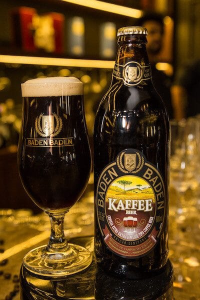
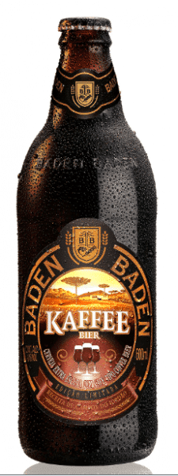

Galera a Baden Baden não poderia ter feito melhor. Seguindo tendências internacionais a marca juntou duas paixões dos Brasileiros unindo duas variedades de café, Acaiá e Bourbon para produzir a cerveja **Baden Baden Kaffee Bier**. Eu preciso dessa cerveja.

<!--more-->

Rubens Mattos, gerente de pesquisa e desenvolvimento da Brasil Kirin, descreveu que esse casamento gerou uma cerveja extraordinária, de corpo leve, com espuma cremosa em tons de bege. Além disso, o líquido traz a delicada acidez do **café gourmet** e um leve tostado que só foi possível pela escolha dos grãos, que a empresa foi buscar diretamente de Carmo de Minas, na região serrana da Mantiqueira.

Rubens ressalta estar seguro que esta novidade vai agradar a muitos paladares, justamente por casar os dois maiores amores do Brasileiro.

## Onde consigo a Baden Baden Kaffee Bier?

\[caption id="attachment_32927" align="aligncenter" width="400"\] Quero!\[/caption\]

Créditos: Edu Leporo

Galera, vocês já podem encontrar a Baden Baden Kaffee Bier nos principais pontos de vendas das regiões Sul e Sudeste, e dos estados de Pernambuco, Bahia e Goiás. Também online na [wbeer.com.br](http://wbeer.com.br).

## Conceito

O lançamento segue o conceito da marca em criar novos rótulos de cervejas que surpreendam seus consumidores com combinações inusitadas, como grãos e frutas. Alexandre Candido, gerente de marketing de cervejas especiais da Brasil Kirin, falou um pouco sobre:

> “A cervejaria Baden Baden tem em seu DNA o instinto de inovação, de criação e trazemos constantemente novos rótulos para o mercado com altíssima qualidade. Recentemente lançamos a Baden Baden Märzen, primeira cerveja feita 100% com lúpulo brasileiro, e temos o maior orgulho de nos apropriarmos desse pioneirismo. Lançar produtos com esse patamar de qualidade e reconhecimento só nos mostra que estamos no caminho certo”

## Finalizando

Para aqueles que gostam de fazer harmonizações, a dica é degustar a **Baden Baden Kaffee Bier com tiramissu**, sobremesas a base de chocolate, carne de porco defumada ou queijos semiduros.

E você, curtiu? Já bebeu? Conta pra gente ;)

Abs.

Créditos da foto de capa: Edu Leporo
