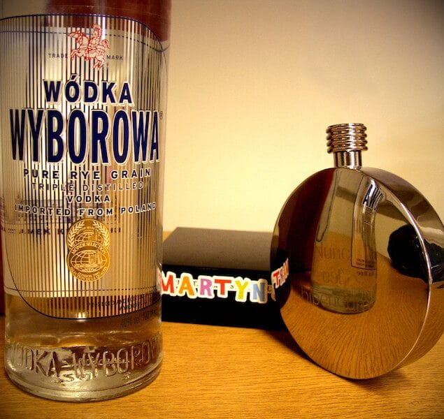

Hoje foi dia de explorar a **vodka Polonesa Wyborowa**. Chamou minha atenção o pouco destaque que essa “aguinha” tem nos bares, boates, e supermercados em geral (E aqui eu falo do Rio de Janeiro).

<!--more-->

A pouca evidência aliada ao seu preço médio nas prateleiras - na casa dos 80 a 90 reais - deixam o(a) bebedor(a) na dúvida se vale a pena ou não investir, principalmente porque marcas mais batidas estão disponíveis por uma valor próximo (Ciroq e Absolut) ou até mesmo mais baixo (Skyy e Smirnoff).

## O que faz a Wyborowa valer a pena

Créditos: late night movie

O(a) apreciador(a) mais atento(a) pode notar que a Wyborowa, cuja tradução significa “**excelente**”, é a vodka do gênero Polonês e, nesse ramo, é a mais acessível no mercado. Restava-me saber se esse produto, feito a partir de centeio, faz jus ao nome nada modesto e à tradição das vodkas Polonesas.

Ela se apresenta com boa pureza e sem cheiro forte de álcool, o aroma adocicado prevalece no primeiro contato com a Wyborowa fora da garrafa.

Na boca, o potencial aromático já anunciado antes se faz presente, o que torna a degustação ainda mais agradável quando você sente surgir lenta e levemente na ponta da língua a alma da vodka.

A experiência fica completa com uma dormência leve sem queima exagerada no pós-boca, que se mantém saboroso até o próximo gole porque ela não entra em conflito com o PH da boca.

## Finalizando

Créditos: mjaniec

Se você procura uma vodka qualquer, existem boas opções mais baratas. Mas se você quer saber o valor do aroma e do sabor de uma tradicional Polonesa, a Wyborowa é uma opção boa e honesta.

Excelente! Acho que vou deixar essa avaliação para vocês. Mas, com certeza, vale o investimento nessa visita à Polônia.

Até a próxima!

Créditos da foto de capa: jdlasica
