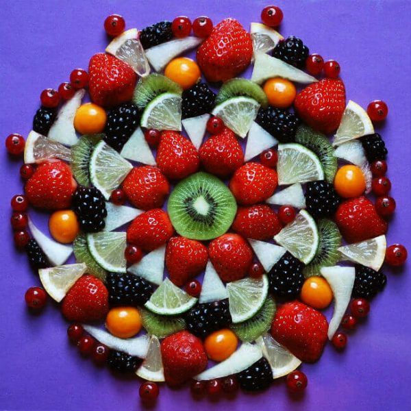
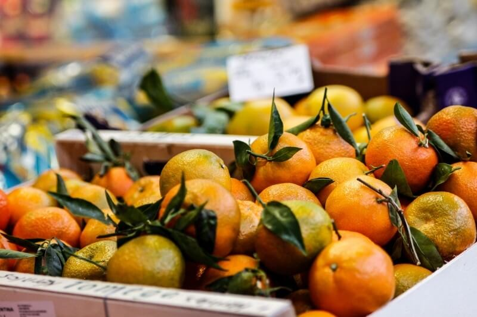

Faaala galera do Papo de Bar!! Beleza? Aqui é o Barman X e hoje venho com um post um pouco diferente, **sobre frutas cítricas**. Começo hoje com esse post uma nova proposta: Falar de cada um dos muitos ingredientes utilizados na coquetelaria.

<!--more-->

Falarei de cada protagonista dessa arte em misturar bebidas, frutas, especiarias, ervas, ingredientes artesanais, etc. Explicarei as suas funções, composições, benefícios e importância na coquetelaria.

## E para começar essa empreitada, por que não eles: Os Cítricos?

Pare e note uma coisa, raros são os coquetéis (clássicos ou não) que não possuem um limão, ou laranja, etc, em sua composição, não é verdade?

Vemos o limão em um Cuba Libre, e em uma Margarita, a laranja em um Sex on the Beach e no Negroni. Coquetéis com propostas completamente diferentes!

Não importa a década ou século, **as frutas cítricas sempre foram importantes para a Coquetelaria Mundial**. Das mais conhecidas, as mais raras, elas são indispensáveis.

## Frutas Cítricas mais conhecidas:

Créditos: Soorelis

- Abacaxi
- Acerola
- Ameixa
- Amora
- Caju
- Cidra
- Cupuaçu
- Framboesa
- Grapefruit
- Groselha
- Jabuticaba
- Kiwi
- Laranja
- Lima-da-pérsia
- Limão
- Limão Galego
- Limão Siciliano
- Morango
- Pêssego
- Pomelo
- Romã
- Tamarindo
- Tangerina (também conhecida como mexerica ou bergamota)
- Uva

## Mas o que são as Frutas Cítricas?

São frutas que possuem altas concentrações de ácido cítrico e vitamina C. O ácido cítrico é responsável pelo sabor ácido destas frutas. São originárias das regiões tropicais e subtropicais da Ásia. Grande parte das frutas cítricas também apresentam boas quantidades de potássio, vitamina A e flavonóides.

### O que são Flavonóides?

Créditos: Bellezza

São compostos químicos que podem ser encontrados em frutas. Trazem benefícios para as pessoas, como ações anti-inflamatória, hormonais, anti-hemorrágicas, anti-alérgicas e até mesmo para evitar o aparecimento do câncer.

### Benefícios para a saúde

- As frutas cítricas são ricas em vitamina C, que é um componente essencial na formação do colágeno, proteína que dá elasticidade e firmeza à pele, além de combater os radicais livres e o envelhecimento das células;
- São importantes para o fortalecimento do sistema imunológico;
- Atuam na proteção do nosso organismo;
- Atuam no combate a infecções, gripes e resfriados;
- O ácido cítrico presente nas frutas cítricas ajuda a melhorar a viscosidade do sangue;
- Os flavonoides cítricos presentes na laranja, por exemplo, auxiliam na redução dos lipídios;
- Devido às fibras presentes na casca e no bagaço destas frutas, elas ajudam na redução do colesterol, além de ajudarem no bom funcionamento do intestino, diminuindo a prisão de ventre;
- Consumir o bagaço das frutas cítricas proporciona mais saciedade;
- Auxiliam na melhor absorção do ferro (resultado da ação da vitamina C presente nestas frutas), prevenindo doenças como a anemia;
- Por terem poucas calorias, as frutas cítricas auxiliam no processo de emagrecimento;
- São ricas em água e auxiliam na hidratação do organismo.

### Importante:

Deve-se ter cuidado ao manipular e consumir estas frutas sob o Sol, pois podem provocar queimaduras e manchas na pele.

## A citricultura

Créditos: ejaugsburg

Você sabia que a citricultura é um conjunto de técnicas agronômicas voltadas para o cultivo de frutas cítricas?

**E que no dia 8 de Junho é o Dia do Citricultor?**

Cara, o que seria da nossa coquetelaria sem eles? Pra vocês verem que todas as profissões se ligam de alguma forma e nos atendem direta ou indiretamente.

### Classificação científica:

- Reino: Plantae
- Divisão: Magnoliophyta
- Classe: Magnoliopsida
- Ordem: Sapindales
- Família: Rutaceae
- Gênero: Citrus

## Finalizando

Então é isso, galera. Fico por aqui e logo logo volto pra falar de cada limão diferente (desses raros que comentei) que fui encontrando em minha pesquisa sobre as frutas cítricas.

Além de outras frutas diferentes, que eu nunca havia visto, até então.

Grande abraço e até a próxima!!
