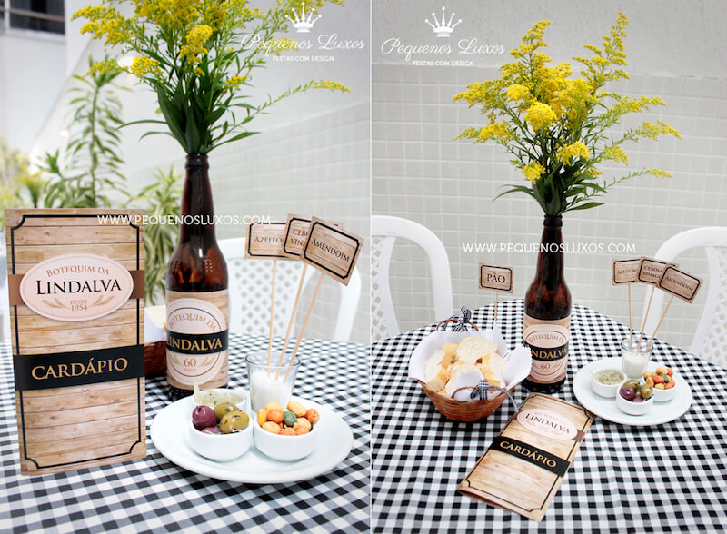

Já pensou em comemorar uma data especial em clima de Festa de Boteco? Neste artigo você confere algumas dicas super bacanas para deixar a sua festa com a cara do melhor lugar do mundo - o Bar, é claro!

<!--more-->

Todo bom Botequeiro já comemorou alguma data especial com os amigos no bar! Isso é fato como 2+2 são 4 e que a **conta da mesa nunca fecha no final**!

Com o meu aniversário chegando e junto com ele os preparativos para as comemorações (aceito presentes) lembrei de uma festa que fiz para comemorar meus 26 anos e que até hoje meus amigos comentam. Foi uma festa simples no play do prédio mesmo, decorada com tema de Botequim, com muito samba de raíz, feijoada, cerveja e que só acabou depois da última saideira...

E para provar que o Boteco é o lugar e o tema perfeito para qualquer comemoração, independente do gênero ou idade (desde que tenha mais de 18 anos), uma amiga maravilhosa, sócia-fundadora da empresa **[Pequenos Luxos](http://www.pequenosluxos.com/)** e que arrasa nas decorações de festa com os mais variados temas, me deu várias dicas inspiradas na comemoração de aniversário de 60 anos da Lindalva, pra você também fazer uma decoração diferente e deixar a sua festa com a cara do melhor lugar do mundo - o Bar, é claro!

## Decoração da Festa de Boteco

### Quadro de Lousa

Os quadros de lousa estão presentes em 11 de cada 10 botecos tradicionais! Eles são fáceis de achar e podem ser usados na festa tanto para recepcionar os amigos com um desenho bacana de boas vindas ou colocar o cardápio do dia na mesa do bolo por exemplo, tanto faz, só soltar a imaginação. Basta apoiar o quadro no cavalete, em pallet, na mesa ou no chão.

### Caixas de Pallet

As caixas pallet são um elemento curinga na decoração. Servem de apoio para as bebidas ou só como adorno pra deixar a decoração mais despojada. Além de ser uma graça ainda é super em conta. Muitas vezes é possível reaproveitar pallets usados e encontrar alguns em bom estado sendo descartados por supermercados e vendas.

### Arranjos de mesa com garrafa de cerveja

Sabe aquele arranjo de mesa que todo mundo leva pra casa no final da festa? Então, é possível enfeitar as mesas sem gastar quase nada! Você também pode aproveitar aquela garrafinha de cerveja bacana que sobrou na sua casa ou pedir para algum bar separar para você algumas com uns rótulos legais ou convencionais mesmo. Se não tiver tá aí um ótimo pretexto para juntar os amigos para beber umas antes da festa.

### Canecas, copos garrafas e rolhas na decoração

Tudo que lembre ao bar e ao universo etílico é sempre bem vindo! Podem ser canecas, garrafas de bebida, rolhas e tampinhas em garrafas ou copos de vidro e quadros de lousa que sempre dão um ar mais descolado ao ambiente e compõem a mesa.

### Cachaça em barril

Um bom Boteco é aquele que tem sempre cerveja bem gelada! Mas não é só de chopp e cerveja que vive o Botequim, uma outra opção muito legal pra colocar na festa é esse barrilzinho de cachaça com copinhos pra galera se servir. O sucesso é tão garantido quanto o grau de embriaguez dos convidados!

### Comidinhas de boteco!

\[caption id="attachment_32916" align="aligncenter" width="800"\] Delícia! S2\[/caption\]

Boteco que é boteco é repleto de petiscos deliciosos para acompanhar a cerveja gelada. As opções são super variadas, que vão desde o clássico ovo colorido, até o bolinho de feijoada gourmet. Se estiver sem criatividade a gente te ajuda! **[Aqui no PdB a gente tem várias receitas maravilhosas você se inspirar](https://www.papodebar.com/category/gastronomia/)**.

Além dos petiscos também pode ser servido um almoço com a clássica feijoada! Também vale apostar nos tradicionais caldo verde e feijão amigo que caem muito bem e ajudam a segurar a bebedeira para geral não dar PT antes da festa acabar né?

### Docinhos

\[caption id="attachment_32911" align="aligncenter" width="800"\] Quero todos!\[/caption\]

O tradicional brigadeiro também pode ter suas versões etílicas de Rum (como na foto), capirinha, vinho, conhaque, jurupinga...

### Petiscos na mesa e cardápio

Potinhos com amendoim, azeitona e outros petiscos é algo super simples que todo mundo gosta! Você pode também colocar na mesa um cardápio personalizado que é o maior charme!

### Lembrancinha

Tanto numa boa festa quanto no bar, fatalmente algumas pessoas vão acabar não lembrando de nada no dia seguinte. Normal né? Quem nunca?

\[caption id="attachment_32913" align="aligncenter" width="800"\] Oin <3\[/caption\]

Fazer um mimo para os convidados deixar umas lembrancinhas para levar pra casa é uma ótima pedida para que os convidados lembrem da festa depois que ela já acabou. Já pensou em sair da festa e poder levar uma marmitinha de docinho ou um kit-ressaca? Muito fofo!

Uma dica muito boa que a galera da pequenos luxos deu foi essa garrafinha de cachaça (que também pode ser de vinho, vodka, etc) com o rótulo personalizado do aniversariante. Se você estiver sem tempo ou paciência pra fazer você mesmo, pode contar que eles além de produzirem festas lindas também fazem esses e outros mimos super legais.

## Já pra festa de boteco!

Se você estiver sem tempo, ou sem saco mesmo, pra organizar tudo, pode contar com a ajuda de um profissional. A empresa [Pequenos Luxos](http://www.pequenosluxos.com/), que nos ajudou com essas dicas MARAVILHOSAS, faz festas lindas com esse tema e de tudo pra deixar sua comemoração ainda mais incrível.

Agora que já demos todas as dicas é só partir para a festa de boteco, se divertir e depois nos contar como foi! Não tem erro! Festa + boteco é uma combinação perfeita que tem tudo para dar certo sempre! ;)
