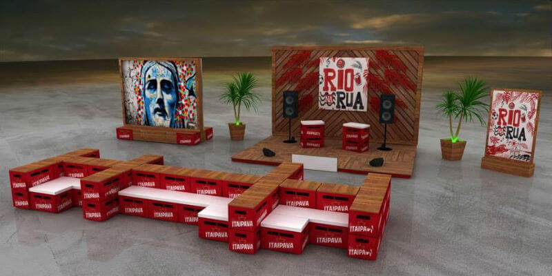

Olá amigos PdBs! O Rio de Janeiro é uma cidade cheia de encantos, possui uma população apaixonada pelo lugar e vive em clima de Verão durante todo ano. Enxergando dessa maneira, a Itaipava vem aí com o **Rio na Rua**, um projeto que que vai proporcionar diferentes experiências em alguns pontos boêmios da Cidade Maravilhosa.

<!--more-->

## Rio na Rua

As ações do projeto Rio na Rua serão abertas e gratuitas, com uma estrutura que permitirá ao público estar perto dos artistas e viver uma experiência diferente em seu momento de happy hour. O projeto será itinerante e a cada mês vai se instalar em um local de grande concentração de bares e pessoas que estão curtindo a cervejinha no final do dia.

### E onde será?

Baixo Gávea, Praça Varnhagen, Nelson Mandela, Lapa, Praça São Salvador e Barra da Tijuca são alguns pontos que receberão o Rio na Rua, com arte, música e experiências diversas a seus frequentadores.

### E quando será?

Tudo terá início hoje, dia 22 de junho, no Baixo Gávea. Uma bela escolha de data e local, já que tomar um chopp no Baixo Gávea na quinta-feira à noite é uma clássica pedida. Começando praticamente junto com a chegada do inverno, o Rio na Rua irá acontecer até dezembro, sendo encerrado com uma grande surpresa (ainda não divulgada) para os cariocas.

## Mais sobre o Projeto

No entorno das apresentações, a intitulada **Calçada Itaipava** vai oferecer diferentes serviços. O espaço contará com lounge formado por engradados de Itaipava, banheiros VIPS, **WI-FI** (olha aí, seus viciados), guarda-volumes e carregadores de celular. Para apoiar a ação, a Calçada Itaipava terá apoio de carrinhos de chopp Itaipava com valores promocionais.

Artistas cariocas participarão do Rio na Rua, como Di Couto, Airá Ocrespo, Tim Rezende, Los Vitaleros e Bianca Chami, além de outros. Uma equipe de limpeza entrará em ação ao final das apresentações e deixará os locais limpinhos.

## Finalizando

Uma ação que no papel é muito legal e casa bem com o pensamento de verão o ano todo da Itaipava. Adoro ações que usam espaços abertos e não cobram qualquer valor para as pessoas participarem. Explorando um dos lados mais bonitos do Rio de Janeiro, a boemia, o Rio da Rua tem tudo para ser um sucesso!

Hoje a programação é a seguinte:

- **Show:** surpresa
- **Grafite:** Felipe Guga
- **Onde:** Baixo Gávea – Praça Santos Dumont
- **Quando:** 22 de junho, quinta-feira, das 18 às 22 horas

Vamos avisar em nossas redes sociais sempre que houver um novo local e data definidos para novas apresentações e estaremos lá curtindo com vocês.

Aquele abraço!
