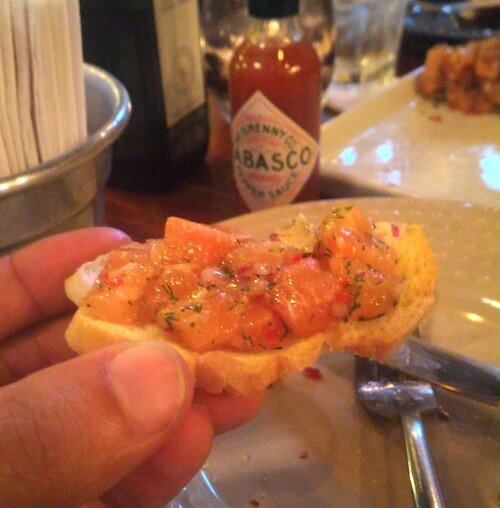
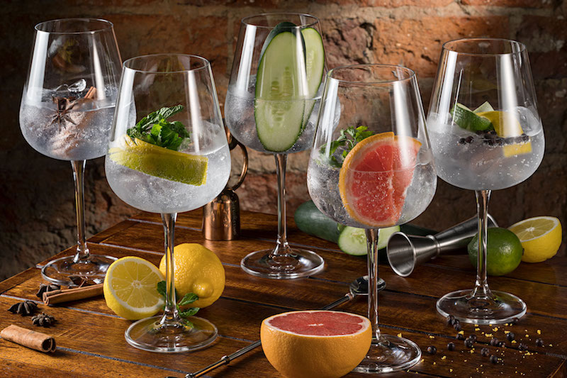

O PdB compareceu a um bar bem interessante e novato que fica na Zona Sul. Ele se chama **Garoa Bar** e tem como seu carro chefe o [gin](https://www.papodebar.com/o-que-e-gin-sabia-mais-sobre/). Uma mistura de ótima qualidade.

<!--more-->

## Ambiente do Garoa Bar

Talvez um dos melhores pontos. A decoração é fantástica, sofás, poltronas, mesa do DJ perto. É um local pequeno, porém, bem aconchegante, com uma iluminação que intima, seduz.

Não sou muito fã de TVs e lá ficava uma passando, isso me chama um pouco atenção. Mas pelo menos eram clipes de música, acredito que deve rolar futebol durante os horários dos campeonatos.

Diria que é um pouco gourmet, talvez pela localização, mas não é por causa disso que perde seu charme.

## Petiscos do Garoa Bar

Excelentes opções. Eles oferecem opções sem fritura, pra não bater de frente com os drinks. Comi a punheta de bacalhau desfiado no azeite com cebola roxa e azeitona preta, excelente.

O tartare de salmão temperado com endro, aroeira, raspa de limão siciliano e pimenta dedo de moça estava espetacular, recomendo bastante também.

Outra boa opção é a tábua de embutidos espanhóis com jamón, chorizo, salame e ainda uma opção entre salchichon e fuex. Vem uma quantidade interessante, nada exagerado, mas tranquilo.

Todos os petiscos comidos tinham uma apresentação espetacular, muito bem moldado.

## Higiene do Garoa Bar

Já falei da decoração e ambiente, que são bem maneiros. A limpeza também não fica atrás. Banheiro bem limpo, não muito grande, afinal o bar é relativamente pequeno. O bom também é que o banheiro é acessível.

Os drinks, talheres, copos, pratos e afins são limpos, bem tranquilos.

## Música do Garoa Bar

O bar não tem música ao vivo, mas rola DJ de quarta a sábado. Nos outros dias rola uma música, porém achei um pouco alta, dificultando um pouco bate-papos nas mesas.

## Atendimento do Garoa Bar

Garçons e bartenders muito simpáticos e atenciosos. Os drinks possuem toda uma história sobre o nome deles, você só consegue descobrir conversando com os garçons ou os donos, aproveite.

O interessante também é que o Garoa possui um programa de intercâmbio entre os bartenders. Nas férias trocam com os da Espanha.

## Variação de bebidas do Garoa Bar

Ele não possui praticamente cerveja nenhuma. Acho que são cinco cervejas. A especialidade da casa, como já perceberam, é o drink mesmo. E claro, bebidas destiladas para você beber suas doses.

Vale citar sobre os Gins brasileiros que bebi um shot puro lá. O Vitória Régia é melhor para fazer drinks, mais neutro, forte para beber sozinho. O Amázzom é bem interessante, com um aroma mais forte, um sabor menos forte e mais presente. Não é recomendado para drinks.

O drink que eu recomendo é o Garoa Bitter Mix, que é composto por mix de amargos como Bourbon, Fernet, Punt e Mes e Campari, soda artesanal de grapefruit com tangerina, e servido em copo defumado em casca de macieira. Ele tem um amargor maior, fora que o modo de preparo é simplesmente espetacular, bem artesanal.

## Localização do Garoa Bar

O bar fica na Rua Dias Ferreira, 50 - Leblon, Rio de Janeiro. Tem metrô perto, bastante ônibus por perto, táxis, etc.

<iframe style="border: 0;" src="https://www.google.com/maps/embed?pb=!1m14!1m8!1m3!1d14692.157720099973!2d-43.228244!3d-22.9855775!3m2!1i1024!2i768!4f13.1!3m3!1m2!1s0x0%3A0x830cff24bbb777e6!2sGaroa+Bar+Lounge!5e0!3m2!1spt-BR!2sbr!4v1497831738587" width="100%" height="450" frameborder="0" allowfullscreen="allowfullscreen"></iframe>

O bar não abre às segundas. Fica aberto de 19h até 02h30. Somente no domingo que o bar fecha às 00h.

## Preços do Garoa Bar

Talvez pelo local, os preços não são baixos. Claro, a qualidade é excelente, mas não espero beber um drink com um valor abaixo de R$20. O drink Borracho é o melhor custo benefício.

Não é um bar barato, mas é no nível dos bares da Zona Sul carioca. Vale a experiência, levar os amigos num aniversário, levar o namorado(a), dentre outras coisas.

## Finalizando

> [Uma publicação compartilhada por papodebar.com ? (@papodebar)](https://www.instagram.com/p/BUqASo1AiIW/) em Mai 28, 2017 às 5:34 PDT

Bar espanhol com música Latina, bem interessante e com uma carta de gin bem boa. Excelentes drinks da casa, além dos tradicionais.

Pergunte sempre sobre os drinks para os bartenders, bem simpáticos vão falar cada detalhe dos drinks. Os drinks possuem um visual fodástico, suas taças são bem maneiras, uns que você não encontram no Brasil.

O Garoa tem uma Iluminação que intima, seduz, diria que é até bom para uma paquera.

Ficamos por aqui, quando forem pro Garoa Bar, chame a gente ;)
