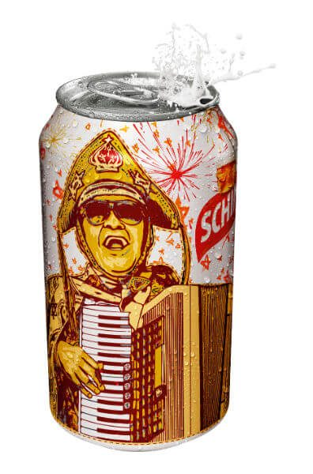
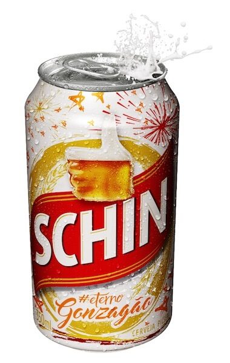

Galera, o PdB foi conferir a coletiva de imprensa da Schin que lançou sua campanha de São João no Nordeste, com uma homenagem mais que merecida ao eterno Rei do Baião, **Luiz Gonzaga**.

<!--more-->

## O Nordeste se preparando para o São João Schin

Iniciado o mês de junho e o nordeste inteiro se prepara para as festas que mais expressam a vida do povo da região. Comidas típicas com base em ingredientes locais, como milho e amendoim, fogueiras para aquecer o frio do interior e muita bebida, claro.

Foi nesse clima que a Schin resolveu lançar uma super campanha e sua programação para os festejos juninos do Nordeste.

### Grande Gonzagão

Nordestino arretado nascido em Pernambuco, Luiz Gonzaga do Nascimento, o famoso Gonzagão, é um dos maiores músicos do Brasil, com fama e trajetória internacionais. Autor de mais de 600 músicas, com mais de 200 discos gravados, ganhou o título de Rei do Baião e deixou uma legião de fãs (1912 – 1989) e muitas saudades.

É para homenagear esse ilustre homem que levou para o mundo um ritmo outrora tão regional, que a Schin, cerveja que é do jeito que o povo gosta, e que possui grande identidade com o povo nordestino, dedica sua campanha junina 360º a Gonzagão.

## E como será campanha do São João Schin pro Gonzagão?

https://youtu.be/DIc8PxK2Z1s

A campanha contará com lata temática que estampa Gonzagão, hashtag **#DoJeitoQueOPovoGosta**, um incrível filme de TV, que também está disponível nas plataformas online, que conta com a presença ilustre de Mestrinho do Acordeom, patrocínio de importantes festas, além de uma surpresa que será revelada no decorrer do mês de junho. O conceito da campanha foi criado pela agência New Style.

Em Salvador, a Schin é parceira do São João do Governo do Estado em um evento público que vai rolar para as pessoas que ficarem na capital no período de 15 a 24 de junho. A cervejaria também apoia o **São João Boa Praça e o São João do Clube Espanhol**.

### E no interior?

No interior do estado a Schin estará presente em 22 eventos juninos já confirmados até o momento, entre festas públicas e privadas. A cervejaria renovou sua parceria a eventos tradicionais como o Forró do Sfrega, em Senhor do Bonfim, Forró Tôa a Tôa, em Vitória da Conquista, Forró Coffee, em Itiruçu, dentre outros.

A marca também estará presente em importantes eventos de São João nas cidades de Porto Seguro, Eunápolis, Serrinha, Vitória da Conquista, Jequié, Alagoinhas, Petrolina, Itiruçu, Itagí, Caldas do Jorro, Barrolândia, Guaratinga, Belmonte, São Domingos e Brumado.

Em Aracaju, capital de Sergipe, a cervejaria participa do São João da Fazenda Boa Luz.

Em Pernambuco, a Schin mantém antigas parcerias de sucesso com o São João da Capitá, festa com cidade cenográfica que recria o clima de uma típica festa junina do interior e reúne mais de 30 artistas nos palcos e diversos forrozeiros nos salões, tocando o autêntico forró pé-de-serra, xote e baião; e o Festival de Quadrilhas da Globo Nordeste, evento que valoriza, difunde e incentiva uma das mais populares manifestações culturais da época, as quadrilhas juninas.

## Finalizando

O que não vai faltar é festa boa e cerveja. Vambora galera. **VIVA SÂO JOÂO!!!**
