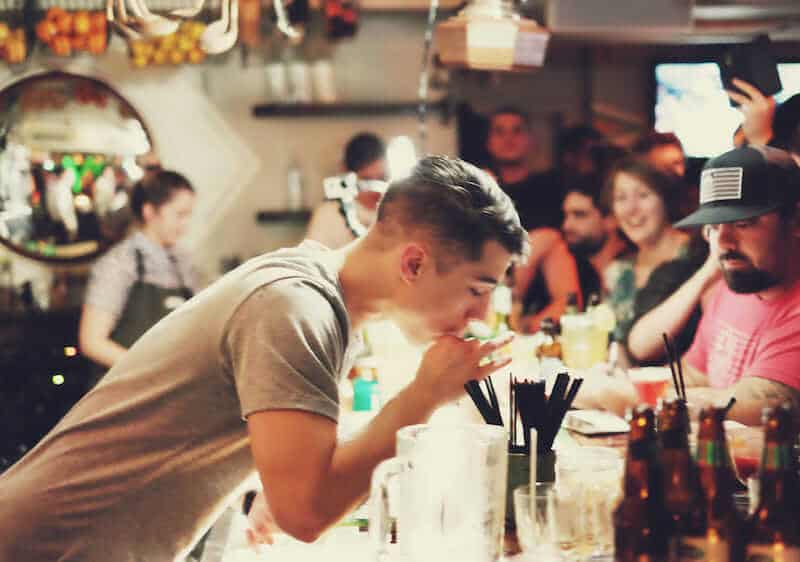

Faaaala galera do Papo de Bar, blz? O Dono do Bar me incumbiu de uma missão: escrever sobre um dos atributos fundamentais para ser um bom barman. Sabe aquele barman das antigas? Do tipo conselheiro e bom ouvinte. Podemos até chamá-lo de **Bartender Psicólogo**. :)

<!--more-->

É isso, fui incumbido de falar sobre isso de uma forma mais descontraída e contar sobre casos e histórias de desabafo dos clientes.

Maaaaaasssss, ao meu ver, as coisas mudaram um bocado e hoje em dia os bartenders não têm sido tão receptivos como antigamente e tem se escondido atrás do balcão e evitado criar laços e relacionamento com seus clientes.

E eu não posso não falar sobre isso!! :D

## Bartender psicólogo, o bartender raiz...

Créditos: Massimo Künstler

Se parar pra pensar, o bartender tradicional era aquele que parecia demais um psicólogo, pois já sabia exatamente **como resolver o problema de um cliente**, de longe, só de vê-lo, pois já se conheciam.

Sabia exatamente qual coquetel poderia servir àquele cliente, dependendo do seu estado emocional. Por exemplo, se o cliente estava estressado, pois teve um dia difícil, ele preparava um coquetel aperitivo para relaxá-lo e acalmá-lo, passando horas conversando até que ele pudesse desabafar.

Se o cliente chegasse cansado, mas pronto para curtir um Happy Hour, ele servia um drink para animá-lo e dava energia para ele **curtir noite adentro**.

### Bartender, um profissional multifuncional

Dependendo do cliente, ele não apenas era um bom ouvinte, como também dava conselhos sobre todo tipo de assunto: relacionamentos, política, esportes, cultura, etc...

Antigamente não bastava você saber servir um coquetel, você precisava estar antenado a todo tipo de assunto e também tinha que saber ouvir seus clientes.

Os laços entre barman e cliente eram tão estreitos, que na maioria dos casos eles se conheciam pelo nome, se tratavam de maneira mais calorosa e informal.

## Agora eu pergunto: As coisas mudaram?

Créditos: Bruno Labarbere

Por que não vemos mais clientes e bartender tão próximos?

Por que, em alguns casos, existem bartenders se colocando em uma posição como se fossem as estrelas ou cerejas do bolo e perderam os clientes como referência a qualidade do serviço, apresentação e atendimento?

Em alguns casos, o bom humor, a simpatia e o **contato são extremamente raros**. Parece que estamos na indústria do "_servir e vender_" e esquecemos que não importa a década que nos encontramos: Estamos na Era do Relacionamento!

### O que seria a Era do Relacionamento?

Cara, pare e veja: Hoje você entra na Starbucks e a atendente pergunta o seu nome!

Aquela bodega pode estar vazia, só com você lá dentro, que ela perguntará seu nome mesmo assim e te chamará por ele assim que seu pedido estiver pronto.

Créditos: David Wong

Ao contrário do portuga da padaria ou os Seus Antônios e Franciscos dos comércios onde você mora, compra pão e almoça todos os dias, há 4 anos, e os caras nunca dão boa tarde, perguntam seu nome e/ou perguntam se você está sendo bem atendido.

Sério, o que mais vemos hoje são as grandes empresas como: Netflix, Spotify, McDonald's, Uber, Burguer King, entre outras, em contato muito próximo ao responder comentários (no facebook, instagram, twitter, etc) de clientes e criando campanhas pensando neles.

Isso, no lado financeiro a curto prazo, não muda muita coisa, mas eles perceberam que é importante demais criar esses laços com o cliente. É gerar valor para a empresa quando valorizamos a opinião dos nossos clientes.

Quando ouvimos, aprendemos e mudamos para melhor com as críticas de quem está sendo atendido ou recebido. Veja algumas dicas:

- Pare de ser preguiçoso e reclamão;
- Pare de levar seu trabalho como carma e passe a curti-lo;
- Faça seu networking, conheça seus clientes, através deles podem surgir oportunidades;
- Seus clientes são seres humanos iguais a você! Ali é de igual para igual. Antes de julgá-lo, procure conhecê-lo;
- Nessa troca de energia em uma conversa, você pode aprender muito com seus clientes e eles com você;
- Nada como os feedbacks dos nossos clientes para nos mostrar o caminho que devemos seguir;

## Finalizando

Então é isso, galera. Na maioria das vezes você vai se divertir, pois é muita resenha e história engraçada, mas nunca se esqueça que tudo tem limite e você continua sendo um funcionário, ou seja, **não confunda liberdade com libertinagem**!

Tudo tem que ocorrer dentro da naturalidade, **sem forçação de barra e nem desrespeito com o cliente**.

Grande abraço e até logo.

Créditos da foto de capa: Gable Denims
