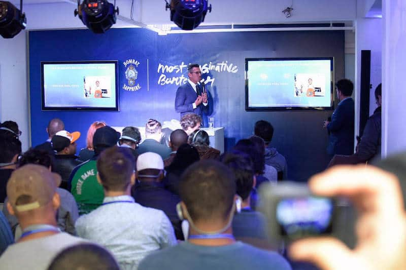

No dia 3 de julho, rolou em São Paulo a segunda edição do evento Most Imaginative Bartender (MIB), uma competição promovida pela **Bombay Sapphire**, que elegerá o profissional mais criativo da coquetelaria latino-americana.

<!--more-->

## Bombay Sapphire organiza grande evento de coquetelaria

Com a presença de duas ilustres figuras do mundo da coquetelaria internacional, Remy Savage, head bartender do Little Red Door, de Paris, e o mexicano Ricardo Nava, trade ambassador da Bacardi, o evento bombou, com mais de 100 bartenders presentes no summit sobre criatividade.

Profissionais do México, Porto Rico, República Dominicana, Panamá, Colômbia, Chile, Argentina e, claro, Brasil, competem com suas receitas criadas com o [gin](https://www.papodebar.com/o-que-e-gin-sabia-mais-sobre/) Bombay Sapphire, que serão avaliadas por um júri especializado, para descobrir quem será o Most Imaginative Bartender de 2017.

## Finalizando

Oito bartenders brasileiros irão para a final nacional, no dia 4 de setembro, e o grande vencedor daqui competirá com os outros campeões nacionais na final regional, em Bogotá, Colômbia.

Nós do Papo de Bar já estamos na torcida e aguardando ansiosamente o mês de setembro para saber quem vai defender o país na edição em Bogotá.

Fiquem ligados em nossas páginas para conhecer o grande vencedor dessa competição!

E vocês, já beberam o gin Bombay Sapphire? Gostaram? A garrafa é bem bonita, não é?

Beijos.
