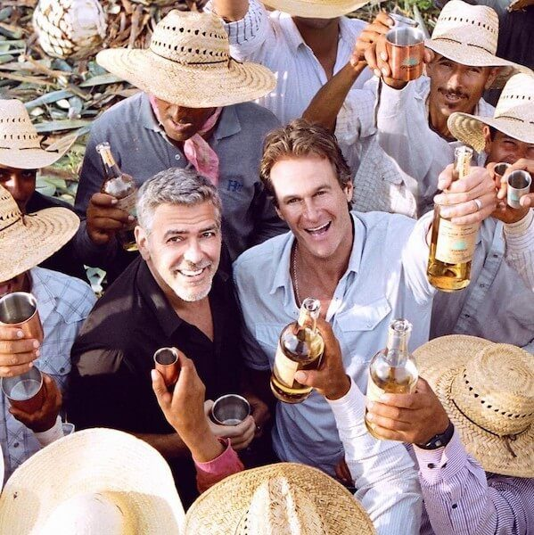

Hello my friends amiguinhos! Todos conhecem o ator de Hollywood, George Clooney, certo? O cara é boa pinta, bom ator, já esteve envolvido em romances com algumas beldades e hoje está casado com a espetacular advogada de direitos humanos, Amal Clooney. Fora tudo isso, Clooney vendeu sua marca de tequila, Casamigos, em negócio bilionário. Admirável, realmente.

<!--more-->

Em 2013, Clooney e os amigos Rande Gerber e Michael Meldman, fundaram a marca de **tequila Casamigos**. Os dois primeiros possuem residência em Cabo San Lucas, no México e passeando por lá, entre uma tequila e outra, surgiu a inspiração de investir na bebida.

## Surgimento da Casamigos

\[caption id="attachment_32976" align="aligncenter" width="599"\] Aloha!\[/caption\]

Não sei se à época a ideia seria criar, fazer crescer e vender a marca, mas de um jeito ou de outro tudo deu muito certo. A **Diageo**, dona de diversas marcas de bebidas alcoólicas, comprou a Casamigos por 3,3 bilhões de de reais, que hoje daria algo em torno de **1 bilhão de dólares**.

Esse é o montante total, mas isso pode variar. De início a Diageo pagará ? do valor e o último terço será pago apenas quando as metas definidas forem atingidas. Os três amigos continuarão a promover a Casamigos, que tem a cara deles.

## Finalizando

\[caption id="attachment_32975" align="aligncenter" width="800"\] Bora beber?\[/caption\]

Estamos contanto tudo aqui hoje, mas o negócio foi anunciado há um mês atrás. Por aqui a marca não é muito conhecida, afinal não é vendida em lojas nacionais. Na verdade, nem em freeshops eu vi a Casamigos à venda. Se alguém já experimentou, conte-nos se é realmente boa ;)

Oh… e nada de ficar com inveja do amigo George Clooney, hein! O cara é bom mesmo!

Aquele abraço
