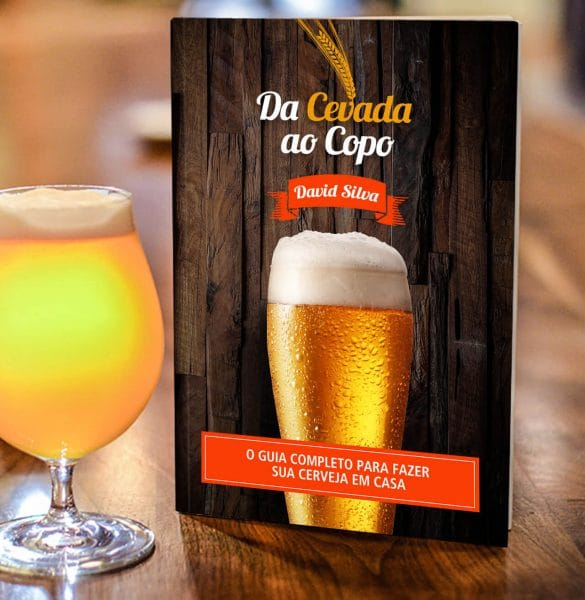
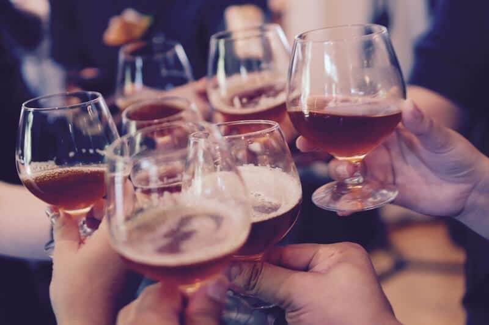

E aí, meus nobres adoradores do líquido sagrado. Mais uma vez falaremos sobre cerveja, mas agora é sobre algo que muitos acham difícil: **como fazer cerveja em casa**. Isso me lembra 2009, quando fiz o [curso de Produção de cerveja](https://www.papodebar.com/curso-de-fabricacao-de-cerveja-na-confraria-do-marques/) com a galera da Confraria do Marquês.

<!--more-->

## Produzir e beber cerveja boa

Tem muita gente que prefere só beber a cerveja mesmo, é prático, não suja quase nada e não dá praticamente trabalho nenhum. Eu até concordo com isso, mas produzir cerveja é como um filho(a) seu(ua), você fica orgulhoso quando vê e apresenta para seus amigos.

Nós aqui do Papo de Bar temos alguns integrantes que produzem cerveja, como a [Senhorita Cerevisae](https://www.papodebar.com/author/simoner/). Eu já estou com todo equipamento em casa e produzirei a primeira leva/experiência caseira.

## Mas como fazer cerveja em casa?

Já tem muitos anos que participei do curso com a galera da Confraria, então bate aquela insegurança, esquecimento de várias coisas que você aprendeu, principalmente a parte química, coisa que a nobre [Etanólica](https://www.papodebar.com/author/marangoni/) tira de letra e nos ajudará na nossa produção caseira.

Toda a parte de sanitização, maturação, fermentação, dentre outros passos cervejeiros, sempre bate algumas dúvidas. Eu precisava de algum guia, algo que me mostrasse de forma direta e também divertida, afinal, nós aqui do PdB somos zoeiros :D

Eis que surge...

## Da Cevada ao copo - Guia Completo Para Fazer Sua Cerveja em Casa

Me apresentaram o livro que mostra tudo sobre como produzir cerveja. E o melhor, de uma forma descontraída, sem aquela coisa séria que geralmente vemos em livros.

A produção é do nobre David Silva, consultor, cervejeiro caseiro (claro :P ) e editor do blog [Condado da Cerveja](http://www.condadodacerveja.com.br/). Um livro sem #mimimi, como o próprio diz.

Alguns pontos no livro sobre como fazer cerveja:

- Os principais insumos cervejeiros e como eles influenciam sua cerveja
- As propriedades para a água cervejeira ideal
- Os tipos e as equivalências de maltes
- As técnicas de lupulagem e mais de 76 variedades de lúpulo com suas características e substitutos
- Os tipos e as principais características das leveduras
- Os equipamentos essenciais para fabricar cerveja em casa
- Como montar seu kit cervejeiro e economizar uma graninha
- Os fatores imprescindíveis para uma boa cerveja
- A importância de cada etapa do processo cervejeiro
- Como e por que simplificar a etapa de brassagem
- 22 dicas essenciais para a hora do fabrico
- Como otimizar o tempo de resfriamento do mosto
- Como conduzir corretamente a fermentação da sua cerveja e os 4 pilares essenciais para uma boa fermentação
- O tempo ideal de fermentação
- A importância de uma boa maturação
- A grande diferença entre maturação e clarificação a frio e a importância de não confundi-los
- Como proceder corretamente com o envase e a refermentação
- O passo a passo para a produção da sua cerveja
- Dicas e conteúdos essenciais para facilitar sua jornada cervejeira

## Pontos fortes do livro

Achei legal que tem fotos em alguns momentos, ilustrando uma produção caseira, apresentação de elementos, etc. A escrita é bem legal também, tirando a parte 1, que fala sobre os ingredientes básicos da cerveja: água, malte, [lúpulo](https://www.papodebar.com/lupulo-o-ingrediente-mais-charmoso-da-cerveja/) e levedura. Ela ficou um pouco diferenciada, coisa normal, o David talvez poderia ter sido mais descontraído nesses quatro capítulos. Mas eu acho que é porque nós aqui do PdB somos extrovertidos ao extremo, isso não é nenhum ponto fraco. :)

Ele frisa bastante a parte do BIAB (Brew In A Bag), e ainda mostra outros passos necessários para produção que não seja com o BIAB, achei excelente isso. Não é sempre que temos a oportunidade de fazer a cerveja com o método mais sagaz.

Ele fala muito bem sobre os equipamentos necessários. Para mim, que estou começando, foi excelente. Já vi alguns pontos que não tinha previsto.

Ele falou simplesmente  de **TODOS** os processos cervejeiros de forma clara, e na linguagem não só de um cervejeiro, mas também da galera que só bebe. Afinal, eles serão nossas "_cobaias_". :P

Vários termos que eu nem conhecia, como _mashout_, _fly sparge_, _bath sparge_, _priming_, dentre outros, foram citados e explicados.

### Dicas, MUITAS dicas...

Sim. Realmente tem MUITAS dicas dentro do livro. A parte final do livro foi dedicada a isso, falando também sobre o BeerSmith e outros aplicativos cervejeiros. Fora que dentro de cada capítulo ele fala sobre dicas específicas. Mas não é só isso...

### Área reservada para quem compra o livro

Sim, existe uma área destinada aos nobres que comprarem o livro. Separados em capítulos e três páginas reservadas para o Glossário do livro, dicas de onde comprar os insumos e equipamentos para fazer cerveja em casa e uma para os erros mais comuns do cervejeiro caseiro.

E o sagaz é que dentro de alguns tópicos dos capítulos tem separação para assuntos que têm a ver ao capítulo, por exemplo, na área reservada do capítulo #5 Equipamentos básicos, tem uma área [**Montando Seu Kit Cervejeiro**](http://bit.ly/dacevadaaocopo) com várias dicas, por exemplo, **Montando Sua Panela Cervejeira**.

Além disso, tem uma área de avaliação onde você manda sua sugestão, crítica e elogio sobre o livro.

Achei bem legal, lembrou um pouco livros de TI, onde você tem links com exemplos de código, só que nesse caso é com exemplos e dicas cervejeiras.

## Como faço pra comprar o livro _Da Cevada ao copo - Guia Completo Para Fazer Sua Cerveja em Casa_?

[É só acessar o site oficial do livro](http://bit.ly/dacevadaaocopo). Sabe quanto custa? Preço bem baixo, **[SÓ R$37,00](http://bit.ly/dacevadaaocopo)**. Sim, TRINTA E SETE REAIS. Um e-book com mais de 220 páginas, com uma área reservada por esse preço está bem tranquilo.

E legal que ele meio que instiga a ler cada vez mais, até acabar, coisa rara para um livro que tem uma pegada um pouco técnica da área.

E não satisfeito, o David ainda disponibiliza uma forma de pagamento em 8x de R$5,25, ou seja, bem mais barato que a cerveja que você bebe em qualquer boteco. Mas claro, você pode pagar no boleto e também com PayPal.

### Versão Impressa

O lançamento da versão impressa é hoje e o valor é bem tranquilo: **[R$ 57 + Frete de R$ 7,90](http://bit.ly/dacevadaaocopo)** para qualquer lugar do Brasil. E o melhor, comprou a versão impressa, leva de brinde a versão digital, assim você já pode ir esquentando a curiosidade cervejeira enquanto seu livro está a caminho :)

## Finalizando

Compre agora o livro e depois não esqueça de nos contar o que achou do livro.

Você já comprou? Leu? O que achou do livro? Conte pra nós!

Aquele abraço.
