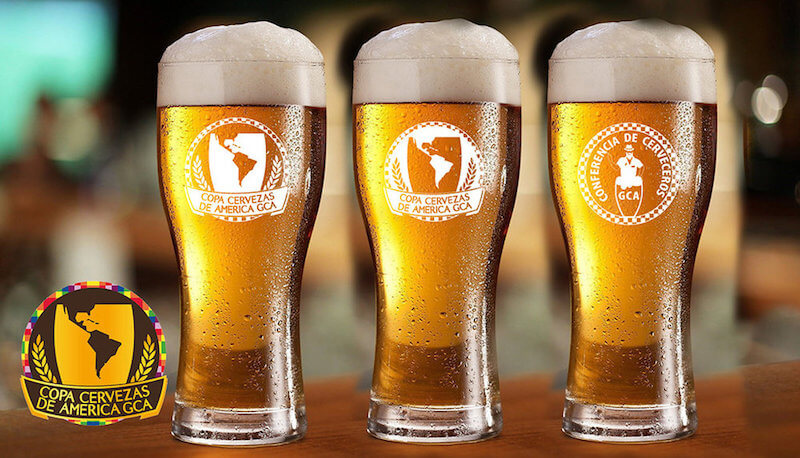

Atenção PdBs cervejeiros, estão abertas as inscrições para a Copa Cervezas de America 2017. O evento vai acontecer de 16 a 22 de Outubro em Santiago no Chile, e vai premiar os melhores rótulos da América Latina em diferentes categorias. Até 11 de agosto os produtores podem cadastrar seus rótulos para esta que será a 7ª edição do evento. Além do cadastro online, os produtores devem enviar seus rótulos para um dos 12 centros de recepção de amostras.

<!--more-->

No Brasil, a Copa conta com Centro de Recepção com câmara fria no Brazil Realli Insumos Cervejeiros, em São Paulo (SP). As inscrições devem ser [realizadas pelo site](http://www.copacervezasdeamerica.com).

## E como surgiu a Copa Cervezas de America?

A **Copa Cervezas de America** nasceu em 2011 e rapidamente entrou para o calendário cervejeiro oficial nas Américas. Além de premiar os melhores rótulos o evento tem como objetivo reunir cervejeiros de diferentes países, criando uma rede de cooperação entre os amantes de cervejas e produtores artesanais.

### Avaliação das cervejas

As cervejas serão avaliadas por uma equipe de jurados de amplo reconhecimento mundial, dentre eles os americanos Gordon Strong e Kristen England, presidente e Juiz Gran Master III do BJCP (Beer Judge Certification Program). Além da nota, os juízes entregam às cervejarias participantes um completo feedback eletrônico de suas avaliações, de modo que elas possam melhorar cada vez mais suas receitas.

### A participação brasileira no evento

O Brasil é de longe um dos grandes campeões da competição, só em 2016 dos 378 rótulos de 67 cervejarias inscritos na competição, trouxemos para casa 17 ouros, 24 pratas e 39 bronzes. Também somos o país que inscreve o maior número de rótulos. Restando pouco mais de um mês para o final das inscrições, o Brasil figura em primeiro lugar nesse quesito seguido por Estados Unidos e Chile.

Daniel Trivelli, presidente da Copa, destaca o seguinte:

> “Já é tradição a grande participação das cervejarias Brasileiras no concurso e esse ano não será diferente, mesmo com os EUA estando perto em número de inscritos. Sempre as recebemos com grande expectativa, pela qualidade e inovação nas receitas”.

## Finalizando

A Copa Cervezas de America se realizará de 16 a 22 de outubro, na UDLA, Universidad de las Américas, em Santiago do Chile. As regras do concurso, os detalhes para as inscrições e envio das amostras estão em:

- [http://www.copacervezasdeamerica.com](http://www.copacervezasdeamerica.com)
- Inscrições: até 11 de agosto
- Recepção de amostras: 14 de agosto a 1º de setembro
- Copa Cervezas de America: Concurso 16 a 22 de outubro
