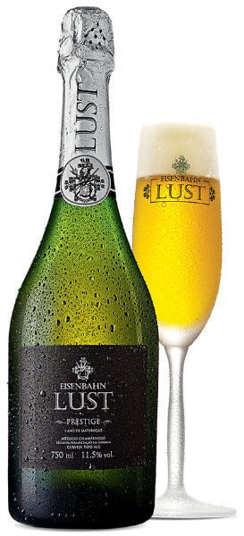

Fundada em 2002, a cervejaria Eisenbahn nasceu da paixão da família Mendes por cervejas. A ideia de uma cervejaria artesanal surgiu devido ao descontentamento dos fundadores em relação ao mercado Brasileiro de cerveja da época.

<!--more-->

Que além de nem sempre obedecerem [a lei de pureza alemã da cerveja](https://www.papodebar.com/reinheitsgebot-1516-lei-da-pureza-da-cerveja/), apresentava produtos de baixa qualidade e pouca variedade de rótulos. Assim surgiu a marca que tinha por missão trazer para o Brasil a tradição cervejeira alemã, aliada a qualidade, sabor e variedade de rótulos presentes na Europa a mais de 100 anos.

## Eisenbahn e sua inovação

Reconhecida por sua produção diferenciada e inovadora, a cervejaria já criou 11 rótulos numa cuidadosa seleção dos melhores tipos de [cerveja](https://www.papodebar.com/cerveja/). Com reconhecimento garantido, a marca coleciona mais de 80 prêmios internacionais e é uma das de maior prestigio no país.

Vendida em 2008 para o grupo Kirin, hoje a marca pertence ao grupo Heineken. Dos seus 11 rótulos, dois são mais especiais: o Eisenbahn Bierlikör - o licor de cerveja - e o Eisenbahn Lust.

## Eisenbahn Bierlikör

Nas diversas viagens que os irmãos Mendes faziam para visitar cervejarias na Alemanha, eles notaram que além de excelentes rótulos de [cerveja](https://www.papodebar.com/cerveja/), é tradição a produção de licor a partir delas.

O primeiro licor de cervejas produzido no Brasil utilizou a premiadíssima Eisenbahn Dunkel como matéria prima para essa bebida licorosa. De sabor doce, apresenta coloração escura, notas de chocolate, café e baunilha.

https://youtu.be/BKXmzU1WdeM

Com ausência de amargor, é uma bebida refinada, suave e elegante. O licor é composto de 50% da Eisenbahn Dunkel, 30% de álcool e algumas especiarias que ressaltam o aroma e o sabor da bebida.

## Eisenbahn Lust

Muitos se perguntam se esse é um champanhe de cerveja, ou uma cerveja de champanhe. Segundo Juliano Mendes, fundador da Eisenbahn, nem uma coisa nem outra. A cerveja mais especial produzida nas instalações da fabrica em Blumenau é resultado da combinação de dois processos.

No primeiro a cerveja tem todo seu processo de produção conduzido normalmente, utilizando uma levedura Belga. Depois da fermentação e maturação da cerveja no tanque pelo método convencional, a mesma é envasada em garrafas de espumantes onde passa pelo processo tradicional de produção de champagnes, descansando em garrafas nas caves, onde sofre mais uma fermentação, utilizando o famoso método Champenoise.

https://www.youtube.com/watch?v=EruzK721D04

A utilização do método Champenoise para a produção de cervejas é relativamente nova, tem no máximo dez anos. A Einsenbanh é a terceira cervejaria no mundo a produzir [cervejas](https://www.papodebar.com/cerveja/) utilizando tal método, as duas primeiras são Belgas.

A Eisenbahn Lust tem duas versões, a Lust e a Lust Prestige. O que diferencia as duas é que enquanto a Lust matura por três meses, a Prestige é maturada por um ano, através de um processo denominado **cuvée**. Em função disso, apresenta paladar mais seco e aromas amanteigado, de brioche e tabaco.

## Finalizando

Essas maravilhas podem ser encontradas nos principais mercados e lojas especializadas no ramo no país inteiro, além da internet pela wbeer.
