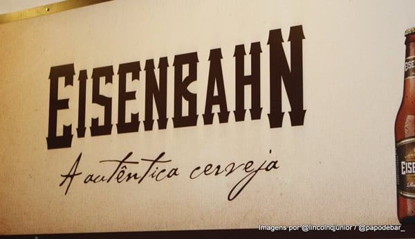

O concurso Eisenbahn Mestre Cervejeiro chega na 8ª edição e dessa vez com novidades. O concurso vai se tornar um reality show idealizado pela Leo Burnett, criado e produzido pela Endemol Shine Brasil. O programa irá ao ar ainda em 2017 e suas inscrições pelo site foram até o dia 17 de julho. Caso você tenha feito a inscrição, não esqueça que o prazo de entrega das amostras é até o dia 31 de julho.

<!--more-->

## APA é o estilo escolhido para o Eisenbahn Mestre Cervejeiro 2017

A atração desafiará os participantes a produzirem uma receita autoral de American Pale Ale, nossa famosa APA. Muitas pessoas podem acabar se enrolando na hora da produção e acabar carregando nos maltes especiais, fabricando assim uma Amber ou carregar no amargor e derivar para uma IPA.

Para evitar confusões é bacana estudar bastante o estilo. O Beer Judge Certification Program –BJCP (Programa de Certificação de Juízes de Cervejas) identifica da seguinte forma estes estilos:

## Conte mais sobre a APA

A American Pale Ale (APA) foi desenvolvida nos Estados Unidos em 1980, inspirada na Pale Ale Inglesa. É uma Ale clara, com teor alcoólico entre 4,5 a 6,2%v/v, com amargor de 30 a 50 IBU, que se mantém refrescante e lupulada, porém com suporte de malte na quantidade certa para fazer uma cerveja equilibrada e com drinkability, ou seja, agradável de beber. Para os cervejeiros de plantão, uma curiosidade: mesmo utilizando levedura e malte americanos, é o lúpulo americano que diferencia uma APA de uma Pale Ale britânica. Considerando o tempo de produção e maturação, a American Pale Ale leva em torno de 20 dias para ficar pronta.

### O sabor da APA

O sabor da APA é mais cítrico, com teor de lúpulo de moderado a alto. Quem toma a cerveja sente que o sabor e o amargor desse ingrediente permanecem até o final, mas o retro gosto geralmente deve ser limpo e sem aspereza. Dryhopping, se realizado, pode adicionar notas gramíneas, embora este caráter não deva ser excessivo.

### Quase uma IPA?

O estilo está próximo de uma India Pale Ale (IPA), entretanto, as IPAs são mais fortes e possuem amargor mais elevado. Além disso, também se aproxima de uma American Amber Ale, mas estas são mais escuras e maltadas, devido ao uso de maltes mais caramelizados.

### Harmonizando com APA

A APA combina com várias comidas fáceis de fazer e que agrada o paladar do brasileiro como hambúrguer de carne, comida mexicana ou tailandesa, frango assado e queijos cheddar ou parmesão.

## Finalizando

- Fonte: BJCP 2015 -O Beer Judge Certification Program
- Tradução: Fernanda Lazzari, Instituto da Cerveja
- Revisão: Fernanda Lazzari e KathiaZanatta, Instituto da Cerveja

Para se inscrever Eisenbahn Mestre Cervejeiro, consulte as condições no regulamento do programa no site [www.mestrecervejeiro2017.com.br](http://www.mestrecervejeiro2017.com.br).
