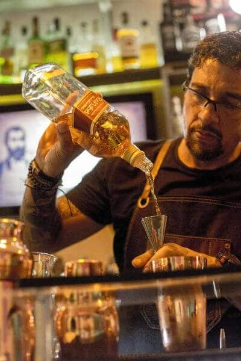
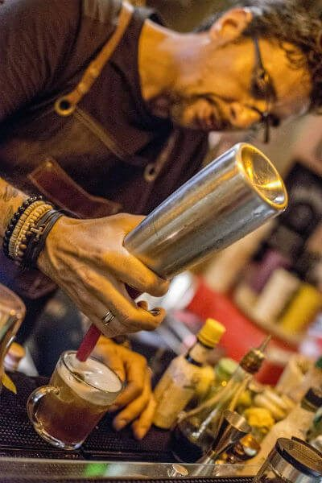
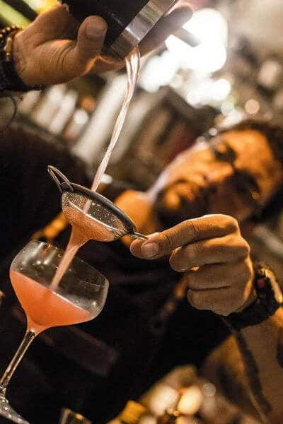

Olá amigos PdBs! Fomos convidados à conhecer um **Speakeasy** e ficamos curiosos para descobrir do que se tratava. Esperando um bar ou restaurante, tomamos um susto quando percebemos que seria numa sala comercial de um prédio no Centro do Rio. Mas o fato de ficarmos ressabiados se deu porque (leigos que somos) não sabíamos o que era exatamente um Speakeasy. Descobrimos.

<!--more-->

## Mas o que é um Speakeasy?

É um pequeno encontro de pessoas que querem beber algo e bater papo. Simples assim. O nome rebuscado surgiu na época da [Lei Seca nos Estados Unidos](https://www.papodebar.com/lei-seca-norte-americana/), que se deu entre 1920 e 1933, quando a fabricação, transporte e venda de bebidas alcoólicas para consumo foram banidas nacionalmente, conforme determinou a 18ª emenda da Constituição dos Estados Unidos.

No início, grande parte da população apoiou a medida, mas com o passar do tempo, muita gente queria continuar bebendo seu [whisky](https://www.papodebar.com/whisky/) ou qualquer que fosse sua bebida preferida, contrariando a [Lei Seca](https://www.papodebar.com/a-nova-lei-seca-brasileira-saudades-antecipadas-da-minha-cerveja/), e davam seu jeito para isso.

O comércio e consumo ilegal de bebidas se tornaram corriqueiros, com o governo fazendo vistas grossas. Traficantes e comerciantes, como Al Capone, em Chicago, por exemplo, montaram grandes esquemas que lucravam com o consumo ilegal. Aí surgiram e se proliferaram os Speakeasies. Em 1933, já no governo de Franklin Roosevelt, a emenda foi revogada.

### Mas um Speakeasy hoje em dia?

Sim! Chegando a tal sala comercial, vimos que no local funciona uma escola de coquetelaria, a Shake, que além dos cursos, criaram o Speakeasy que rola todas as quintas com um cardápio de 4 drinks diferentes por mês. Todos os [drinks](https://www.papodebar.com/category/drinks/) da casa podem ser consumidos, mas 4 que não constam na carta, são oferecidos com exclusividade durante 4 (ou 5) quintas-feiras.

Por ser um ambiente pequeno, onde apenas poucas pessoas poderão estar ali consumindo, o nome Speakeasy ficou perfeito!

## E quais cursos a Shake oferece?

São 6 diferentes tipos de cursos que, naturalmente, acabam por se complementar. Bartender nível 1 e 2, Flairbatender, Mixologia básica, Mixologia molecular e Mixologia com cachaça. Quem ministra as aulas é Walter Garin, que tem um currículo impressionante:

- Proprietário e diretor da [Shake Rio](http://www.shake-rj.com/shake-escola-de-bartenders.html), é embaixador da World Flair Association no Brasil, sendo hoje referência dentro do mundo da coquetelaria.
- Campeão do Concurso nacional Expo-Cachaça 2012
- Campeão do 1° Torneio Aberto de coquetelaria Clássica
- Vice-Campeão do Torneio Equipotel de Coquetéis a base de cachaça 2012
- Vice-Campeão no Flair & Mixology “Colors” 2012 em Bogotá/Colômbia
- Campeão do Torneio Gentleman of The Bar 2015
- Ministrou cursos na área em diversos países: Brasil, Uruguai, Venezuela, Colômbia, Peru, Espanha, etc.

## Finalizando

Vimos Walter fazendo seus [drinks](https://www.papodebar.com/category/drinks/), batemos um papo legal, e o cara é muito bom mesmo! Gostamos muito também do local e do evento em si. Recomendamos muito dar uma passada lá após o trabalho e beber aquele seu drink favorito.

### Onde fica?

R. Senador Dantas, 117 - Sala 1728 - Centro, Rio de Janeiro/RJ. Todas as quintas à partir das 19h.

Aquele abraço!
