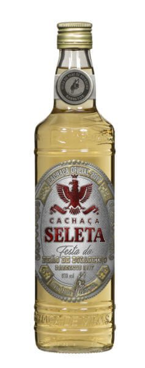
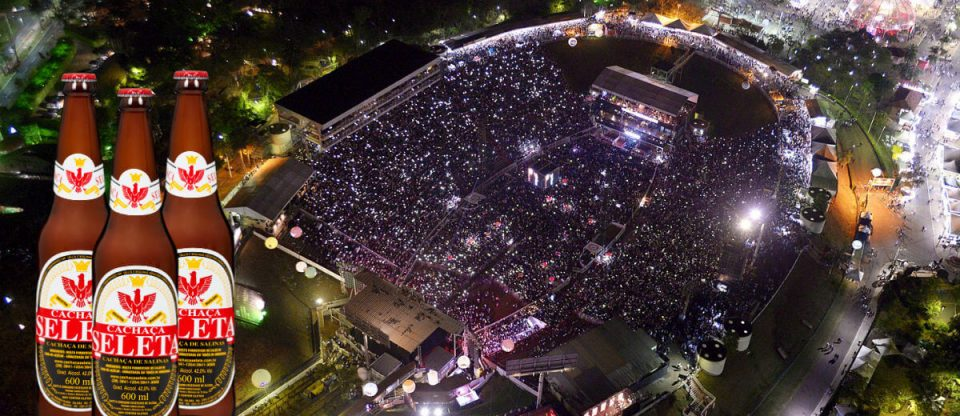

Caros amigos PdBs, vamos falar de coisa séria: uma dose de cachaça, por favor! Vem aí **a Festa do Peão de Barretos 2017** e o evento deste ano terá sua cachaça oficial. A Cachaça Seleta apresenta uma garrafa criada exclusivamente para festa.

<!--more-->

A Festa do Peão de Barretos faz sucesso desde o ano de 1956 e pela primeira vez terá produtos licenciados com seu nome. A Cachaça Seleta foi a primeira marca a lançar o seu. O diretor comercial da Seleta, Ednilson Machado, comentou orgulhoso:

> “Poder produzir uma cachaça para uma festa tão tradicional e querida pelos brasileiros é motivo de muita honra. Estamos unindo duas culturas muito fortes no país e isso fortalece a nossa identidade e nosso compromisso com a disseminação da cultura da cachaça”.

Este é o primeiro produto licenciado com a marca da Festa do Peão de Barretos, explica Hussein Gemha Junior, presidente da associação promotora da Festa.

> “Neste ano iniciamos o licenciamento de vários produtos com a nossa marca e o primeiro a ser lançado é a cachaça Seleta, um produto de qualidade com excelente aceitação no mercado e que tem tudo a ver com o evento”.

## Como nasceu a Festa do Peão de Barretos

A Festa do Peão de Barretos nasceu em 1956 como o primeiro evento do gênero realizado na América Latina. Desde então, a festa tornou-se referência cultural sertaneja no interior do Brasil.

Atualmente com repercussão internacional, faz parte do Calendário Mundial de Peões de todos os cantos. Este ano, a festa espera um público próximo a 1 milhão de pessoas no evento que acontece de 17 a 27 de agosto e contará com diversas atrações musicais e gastronomia.

Depois de 61 edições realizadas e milhões de pessoas reunidas, a Festa do Peão de Barretos terá a sua própria cachaça. A Seleta, cachaça artesanal mais consumida do Brasil, se inspirou na festa, abraçou a ideia e lançou com exclusividade uma edição especial inspirada na maior festa de rodeio da América Latina.

## Finalizando

Achei bem legal a garrafa e o fato da festa ter um produto criado só para ela. Outras marcas de diferentes segmentos farão o mesmo e só fará aumentar o sucesso da Festa do Peão de Barretos. Aliás, taí um lugar que nunca fomos e gostaríamos muito! Alguém já esteve por lá? Conte-nos mais sobre isso ;)

Aquele abraço!
