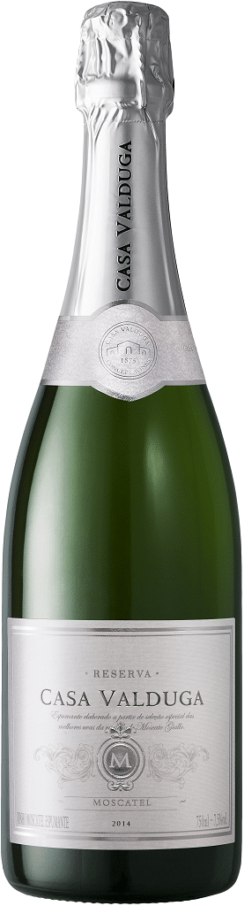

Amigos PdBs de plantão! É sempre legal ver uma empresa brasileira fazendo sucesso em outros países. Mostra reconhecimento de um trabalho bem feito que vai se propagando pelo mundo. A [Casa Valduga](https://www.papodebar.com/casa-valduga-impressiona-mercado-de-vinhos/) ganhou pelo segundo ano consecutivo medalha de ouro no concurso Muscats du monde, realizado na França.

<!--more-->

## O espumante vencedor

O espumante premiado foi o Casa Valduga RSV Moscatel, que elaborado com safras de alta qualidade e maturado em caves subterrâneas, o espumante Reserva apresenta perlage fino e duradouro. Para elaboração deste espumante, as uvas foram cuidadosamente selecionadas através de colheita manual. A bebida é caracterizado por um intenso aroma floral e frutado, é refrescante e agradável, resultado da qualidade da uva Moscato Giallo.

## Como funciona o concurso?

A premiação francesa avaliou os melhores rótulos do tipo moscatel produzidos de várias partes do mundo. Realizada anualmente, esta é a 17ª edição da competição, considerada uma das mais importantes em sua categoria.

O evento foi realizado entre os dias 5 e 6 de julho, e avaliou mais de 200 espumantes, de 20 países. A escolha dos rótulos vencedores foi feita por 55 juízes especialistas, de diferentes nacionalidades, sendo metade deles franceses.

## Sobre a Casa Valduga

A Casa Valduga, localizada no Vale dos Vinhedos, em Bento Gonçalves (RS), possui a maior adega de espumantes da América Latina e foi uma das primeiras vinícolas brasileiras a dominar e desenvolver o método tradicional (champenoise) para elaborar espumantes ícones.

### Finalizando

O prêmio é um reconhecimento e tanto para a vinícola brasileira, que sempre investiu em qualidade dos seus [vinhos](https://www.papodebar.com/vinho/) e hoje também está inserida no mercado cervejeiro. Que continuem nesse caminho e que venham mais premiações!

Aquele abraço!

