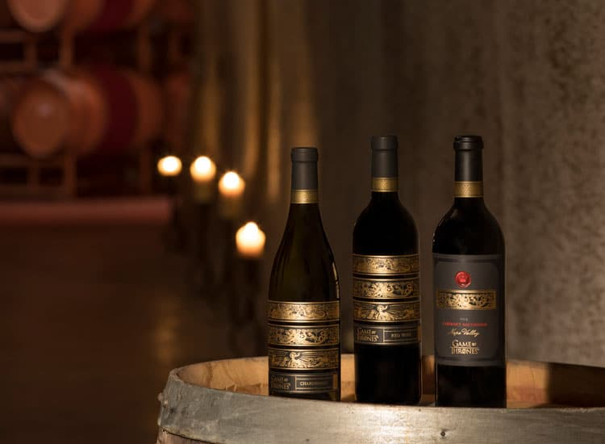

Se tem uma coisa que eu aprendi com Game of Thrones é que, seja para comemorar ou para planejar a sua próxima batalha, é prudente sempre ter um vinho por perto. E agora, pra gente se sentir um pouquinho mais parte do mundo de Westeros, finalmente foi lançada **a linha de vinhos inspirada em Game of Thrones**.

<!--more-->

São três vinhos, produzidos pela vinícola americana [Vintage Wine Estates](http://www.vintagewineestates.com/), a partir de uma parceria com a HBO. A bebida é tão apreciada na série, que um canal de **YouTube** chegou a fazer um mix com todas as cenas dos personagens **bebendo vinho**, da primeira até a quarta temporada. Se liga.

\[embed\]https://www.youtube.com/watch?v=QPf-sXqMb90\[/embed\]

Em novembro de 2016, o PdB já tinha anunciado que os [vinhos seriam produzidos](https://www.papodebar.com/vinhos-oficiais-de-game-thrones/). O responsável pelos vinhos é Bob Cabral, que já foi premiado como o Enólogo do Ano, em 2011, pela _Wine Enthusiast Magazine_, e naturalmente é um grande fã de Game of Thrones. Saiba mais sobre cada um dos vinhos:

## Cabernet Sauvignon

Com um aroma de groselha preta, briar e baunilha do Taiti, o vinho foi envelhecido em barris de carvalho francês. Possui taninos suaves e um toque de cacau. Está sendo vendido nos Estados Unidos por $ 49,99 (em torno de R$ 155).

## Chardonnay

Um elegante blend, composto por 90% de Chardonnay e 10% de Riesling, possui aroma frutado e paladar em que se pode sentir o sabor de pêssegos, damascos, tangerina, limão Meyer, especiarias e mel, com boa acidez e toque de carvalho no final. O preço de venda nos EUA é de $ 19,99 (aproximadamente R$ 62).

## Red Wine Blend

O blend apresenta notas de cereja negra, amora, baunilha e cacau. Os sabores suaves e suculentos de frutas pretas combinam com toques de couro e especiarias. A sensação é de um acabamento quente e apimentado, com toque de baunilha. Está sendo vendido nos EUA por R$ 19,99 (aproximadamente R$ 62).

## Finalizando

Por enquanto, os vinhos só estão sendo vendidos no [site da vinícola](http://www.gameofthroneswines.com/wine-shop), nos Estados Unidos, mas vamos torcer que cheguem logo ao Brasil. E se você, nosso leitor, estiver aí pelos _States_ e conseguir comprar um desses, manda a foto pra gente, pelo email contato@papodebar.com. Cheers!

Fontes das imagens: [http://www.vintagewineestates.com/our-brands/game-of-thrones-wines](http://www.vintagewineestates.com/our-brands/game-of-thrones-wines)
