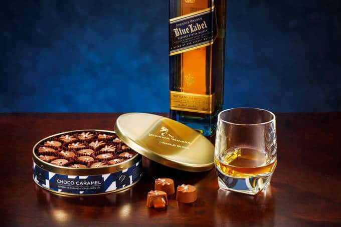
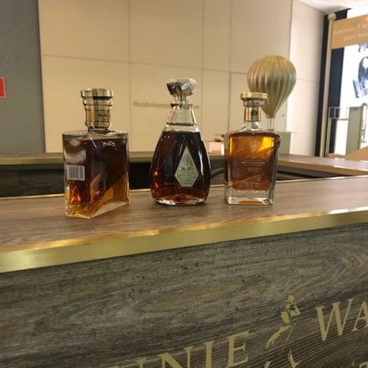

Salve, salve, amigos do Papo de Bar! O Dia dos Pais é a segunda data que o comércio mais fatura com o público masculino, só perdendo para o Natal. A data, que esse ano será comemorada dia 13 de agosto (segundo domingo do mês), se aproxima e com ela pipocam ações de diversas marcas tentando capturar clientes. Enxergando assim, a loja Johnnie Walker é apresentada em shopping de São Paulo.

<!--more-->

Nos dias atuais, todos bebem de tudo. Não existe mais uma bebida para homens ou mulheres, pessoas mais novas e mais velhas. O gosto é pessoal e não se discute! Mas nas gerações mais velhas, quem bebia o whisky era o homem e ainda vemos muito dessa “_tradição_” entranhada na sociedade.

## Johnnie Walker aproveita oportunidade

A Johnnie Walker, que não é boba nem nada, aproveita a data e o público-alvo para lançar uma gift store, que nada mais é que uma loja de presentes, no Shopping Iguatemi, em São Paulo. Lá estarão disponíveis todos os rótulos mais conhecidos da marca, inclusive os mais raros e caros.

São eles:

- Red Label
- Black Label
- Blue Label
- Gold Label
- Green Label
- Platinum
- Swing
- The Collection
- Odyssey
- The John

Os dois últimos dois chegam a custar **entre 6 e 17 mil reais a garrafa**!

## E ainda tem mais na loja Johnnie Walker...

Alguns single malts também poderão ser encontrados na loja, como:

- Glenkinchie 12
- Cardhu
- Singleton Glen Ord 12
- Talisker 10

Os famosos e raros - além de caros - King George V e John Walker & Sons Private Collection 2017, edição de colecionador com rótulos anuais exclusivos, fecham a “_carta_” de whiskies da gift store de Johnnie Walker.

### E também temos kits...

Duas versões de um kit especial para o Dia dos pais serão lançadas em parceria com a Chocolat Du Jour. O maior, com uma garrafa de JW Blue Label 750ML e 21 bombons de caramelo com flor de sal e o menor contendo o mesmo whisky em garrafa de 200 ml acompanhado de 14 bombons. Ambos virão numa caixa exclusiva da marca.

## Finalizando

Para aqueles que desejam algo mais exclusivo para o paizão, a loja terá uma máquina para gravar mensagens personalizadas em garrafas de Blue Label.

Lembrando que o quiosque fica perto da loja Calvin Klein, e funcionará até dia 13 de agosto. Gostaram da novidade? Achei bem legal e queria que meu pai fosse fã de whisky, pois assim seu presente já estaria decidido.

Aquele abraço!
