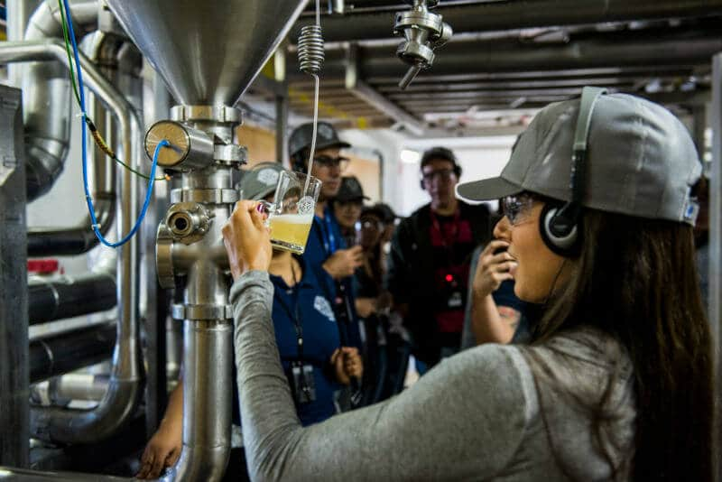

Pela primeira vez na sua história a Ambev, dona das famosas Skol, Antarctica e Brahma, vai abrir as portas da sua fábrica, em Jaguariúna/SP, para mostrar aos amantes de cervejas e curiosos em geral como são produzidas as suas.

<!--more-->

O tour cervejeiro da Ambev será dividido em seis estações que vão permitir ao visitante conhecer cada detalhe do processo de produção das cervejas. Desde as etapas iniciais de seleção dos ingredientes, até o envase do produto final.

O público também vai poder contar com uma aula sobre a cerveja seguindo uma ordem cronológica, trazendo informações que remontam a presença do produto desde a antiguidade até os tempos modernos. Além, claro, de informações sobre o universo cervejeiro de diversos países, além do Brasil.

## O passeio pelo tour cervejeiro da Ambev

Durante o passeio os visitantes terão acesso aos ingredientes que compõem os diferentes tipos de cervejas produzidas na unidade, além de ver de perto os processos de controle de qualidade e finalização.

Será explicado, por exemplo, como se dá o processo de brassagem, quando é feita a mostura, momento em que a galera vai poder inclusive experimentar o mosto da receita que estiver sendo produzida. Também vão acompanhar os processos de fermentação e maturação.

Mais que isso, será possível ao final do percurso provar com exclusividade cervejas fresquinhas com segundos de vida, retiradas diretamente do tanque pro copo.

É ou não é uma chance única?

## Finalizando

Ao final da visita, os participantes serão convidados ainda a degustar alguns rótulos da Ambev harmonizados com petiscos  mais clássicos de boteco, como salame e amendoim, e quitutes mais diferentes, como queijos e chocolates.

Os interessados **[podem se inscrever no site](http://www.ambev.com.br/beer-lovers)**. As visitas são gratuitas, acontecem aos sábados no período da manhã e da tarde, com o limite de 20 pessoas por turma. Apenas maiores de 18 anos podem participar.

E aí, o que acharam da ideia?

Abs.
