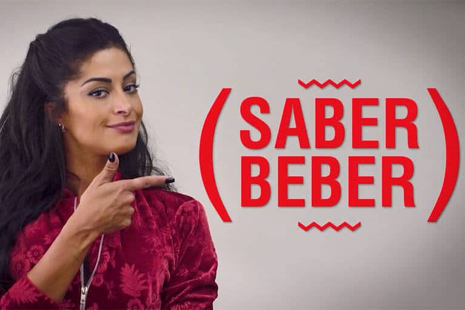

Setembro é o mês escolhido por varias empresas para conscientizar sobre a importância do **consumo responsável**, e a indústria etílica não poderia ficar de fora desse time. O Grupo Petrópolis, por exemplo, escolheu esse mês para lançar seu programa de conscientização chamado **Saber Beber**. O programa nasce para enfatizar a necessidade de beber com sabedoria e consciência, respeitando seus limites.

<!--more-->

O programa Saber Beber vai englobar todo o portfólio da empresa para fortalecer a ideia do consumo consciente, através das redes sociais e dos grandes eventos promovidos pelas marcas.

Além do apoio da musa da Itaipava, Aline Riscado, e da dupla sertaneja Zé Neto & Cristiano, garotos propaganda da Crystal. Também tem o time Santa Cruz, de Recife, que vai reforçar o programa durante alguns jogos.

## Ações do Saber Beber

O Saber Beber ainda terá ações em eventos realizados na Itaipava Arena Fonte Nova, na Bahia. O programa começou com uma ação interna que envolveu os mais de 26 mil colaboradores do grupo além das agências parceiras.

Emerson Neves, Gerente de comunicação do Grupo Petrópolis, alerta que a proibição não é o melhor caminho para reduzir os impactos negativos do consumo de bebidas alcoólicas. Mas o consumo descontrolado pode afetar as relações pessoais e profissionais. O gerente também deu sua opinião sobre o consumo responsável do álcool e o programa saber beber.

> “Como o próprio nome do programa garante, entendemos que o problema não está no ato de ingerir álcool, mas sim a forma como é consumido. Com o Saber Beber, queremos lembrar que não é preciso parar de beber, mas sim beber com sabedoria”.

### O importante é saber beber

O Programa Saber Beber vai abordar o tema de forma criativa e educativa, trazendo para a população mais conhecimento sobre os riscos e os benefícios que envolvem o consumo de álcool. Para tanto o programa utilizará de iconografias modernas, como os famosos emoticons, para tornar o dialogo além de didático, divertido.

Desde o dia 15/09 o grupo está utilizando as redes sociais para reforçar as ações do programa. As mensagens do programa já estão sendo impressas nas embalagens dos produtos da empresa. Para 2018 a companhia estar planejando um calendário de ações para o programa.

## Finalizando

https://youtu.be/J3yps0JJ6RA

O consumo responsável já faz parte da identidade do Grupo Petrópolis. Em 2013, para a marca Itaipava a companhia lançou o filme "Embaraçado”, ressaltando os efeitos do álcool sobre quem dirige.

A cervejaria também é parceira do programa Cidade Responsável, da CervBrasil e da ABRABE, como o Sem Excesso.

Você pode ter mais informações do programa **[através do site](http://www.saberbeber.com.br)**, ou pelas redes sociais com @saberbeber, no [Instagram](https://www.instagram.com/saberbeber/) e [Facebook](https://www.facebook.com/saberbeber).
