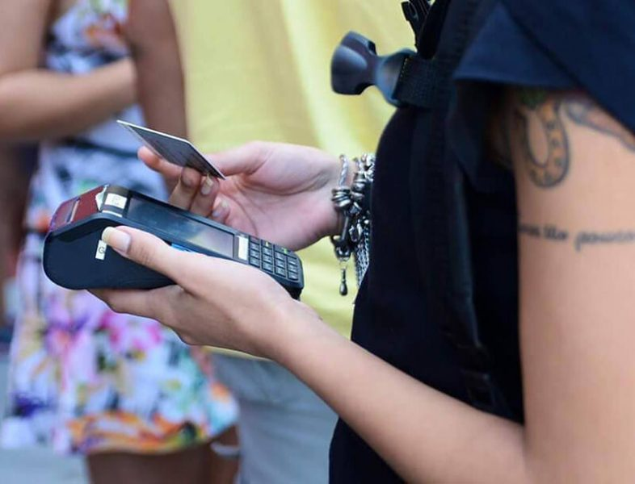

Eu jurei a mim mesma que não iria para o Mondial de La Bière esse ano, por motivos de “eu não tenho dinheiro”. Não é um evento barato, e, pra piorar, sou uma bêbada rica, então acabo gastando rios de reais e o arrependimento só vem no dia seguinte. Esse ano a crise tá forte, melhor sossegar. Pois é, mas na sexta à noite eu já estava desesperada e arrependida, então fui correndo comprar ingresso para o domingo, último dia do evento.

<!--more-->

Cheguei bem na abertura do evento, como sempre, com minha listinha de 40 [cervejas](https://www.papodebar.com/cerveja/), focada nas novidades. Ao cruzar o portão, embarquei numa montanha-russa de alegria, raiva, empolgação e decepção, e vou me esforçar aqui para ressaltar os pontos fracos e fortes do evento, na minha opinião. Vale ressaltar que tudo o que está escrito aqui condiz com a minha percepção particular. Pode discordar, pode reclamar (sem xingar a mãe, por favor). A gente não precisa – e nem deve – pensar igual.

## O local

Não é a primeira vez que o evento é no Píer Mauá, mas esse foi o primeiro ano que fui de transporte público (metrô + VLT) e percebi o quanto a localização é conveniente. Na volta, após as 23h, peguei o 99Pop (com desconto especial para o público do evento) nos arredores da Praça Mauá e me senti relativamente segura. Sem contar que o local é lindo!

O interior do evento é amplo, bem iluminado, fresco, e os banheiros estavam limpos mesmo com muita gente entrando e saindo.

## Meia-entrada Social

Nessa edição do evento também foi possível comprar ingressos de meia-entrada social: você pagava meia entrada levando 1 quilo de alimento que seria doado a instituições informadas no site do Mondial. Segundo a organização do evento, foram arrecadas mais de 40 toneladas de comida. A economia não era muito grande não, já que obviamente eles compensaram essa diferença no preço da entrada, mas a iniciativa em ajudar as instituições é muito válida!

## O Copo da Discórdia

A maior garoteação que pode acontecer num evento cervejeiro inacreditavelmente também aconteceu no Mondial, depois de QUATRO edições de puro luxo e glamour: as doses de 125mL marcadas no copo na verdade eram 100mL. É claro que os homebrewers, essa raça enjoada, pegaram suas provetas, erlenmeyers e pipetas e conferiram o volume do copo. Viram que estava erradíssimo e puseram a boca no mundo. A organização do evento botou no ~bolso~ da Cisper e estava instaurada a treta. Adoro!

### Nota de Esclarecimento na página do Mondial de La Bière

Longe de mim querer alimentar essa briga, mas vocês juram que não teve um só elemento da organização do Mondial que pensou em medir o volume desses copos? Depois de tanto evento esculhambado pelo mesmo motivo, eles não podiam ter dado um mole desses, vamos combinar...

A solução encontrada foi instruir a galera dos estandes a colocar a cerveja até a letra N floreada da palavra Mondial. Eu não saberia dar solução melhor mas vou dizer que não gostei dessa: mais de uma vez fiquei com a impressão de que não enchiam meu copo com o volume certo.

Além disso, como a repercussão sobre o caso foi grande, normalmente as pessoas perguntavam algo ao retirar o copo na entrada do evento. As atendentes já deviam estar de saco cheio de falar a mesma coisa e respondiam nitidamente de mau humor. Uns cartazes explicando isso na entrada do evento já resolveriam metade do problema, né, não?

## Não Tá Fácil Pra Ninguém

Deu pra ver que a crise não chegou só pra mim não: a grande maioria dos estandes estava bem mais humilde do que no ano passado. Tudo bem bonitinho, arrumadinho, mas a pompa foi deixada de lado pela maioria dos expositores. Eu acho até que faz falta ver os estandes cheios de firula, mas o importante é a [cerveja](https://www.papodebar.com/cerveja/), né? Então tá certo!

## Promoção: uma cordinha por dois rins!

Desde a primeira edição eu me incomodo com uma coisa que acontece todos os anos no Mondial: a partir de um determinado momento MUITOS copos começam a se espatifar no chão. Ora, se no churrasco que você faz aí na sua casa sempre tem um ou dois (ou três ou quatro) amigos bêbados que quebram copos e garrafas, o que não vai acontecer num evento com uma multidão bêbada com copos de vidro na mão, né?

Todo mundo comemora o copo quebrado como se fosse gol, é muito engraçado, só que não: alguém poderia (e talvez até aconteceu) se machucar sério. Tem gente de sandália de dedo, tem crianças e tem um monte de bêbado, que é pior que criança. É caso de segurança, mas aparentemente ninguém tá se importando muito.

Como ninguém curte tomar [cerveja boa](http://www.papodebar.com/a-cerveja-e-seus-tipos/) em copo de plástico, não acho que essa seja uma solução viável (apesar de outros eventos de cerveja terem adotado). Ter uma cordinha prendendo o copo poderia evitar muitas das quedas e seria bem mais prático. Algumas pessoas tiveram essa ideia e vendiam cordinhas, mas a preços surreais. A Realli, por exemplo, estava vendendo uma cordinha bem mequetrefe a QUINZE golpinhos. Sério, minha gente?

Sinceramente eu tenho esperança de ganhar uma cordinha com o copo no ano que vem e torço de verdade para que esse festival de copos quebrados não cause um acidente sério nunca. Oremos.

## Domingo de Xepa

Em todas as edições anteriores eu fui no primeiro dia, essa foi a única vez em que fui no último dia do evento. Vou ter que dizer: pra nunca mais, viu? Cerca de um terço das cervejas da minha lista já havia se esgotado. Amigos expositores: **VOCÊS ESTÃO DANDO MOLE**!  Eu até relevo quando acontece com aquela marca nova, que ainda não tem o bizu sobre os volumes consumidos, mas teve macaco velho que participou das cinco edições marcando essa bobeira. É muito frustrante você alimentar expectativas sobre aquela [cerveja diferentona](http://www.papodebar.com/a-cerveja-e-seus-tipos/), chegar no estande e não poder tomar porque acabou no dia anterior. E aí isso se repete uma, duas, três, doze vezes. Melhorem, please!

## Cartão para Pagamento

Sem dúvida o cartão substituiu maravilhosamente aqueles tíquetes de papel das outras edições. Muito mais prático. Porém, sei lá por qual motivo, neste ano você não recebia o comprovante informando o seu consumo e saldo. Para saber, ou ia num ponto de consulta de saldo ou ficava lá atento quando o amizade passava o cartão (e tinha gente que saía de perto ou passava embaixo do balcão, o que dificultava muito a conferência).

Você não recebia nenhum comprovante. Se te cobrassem 50 paus por uma cerveja você poderia demorar bastante pra se ligar, nunca se ligar e não conseguiria nem saber quem foi. Li bastante reclamações sobre isso na página do evento também. Bola fora.

## Pontos de Hidratação

Eu sou aquela chata que dá uma rinsada (só os nerds entenderão) no copo entre uma cerveja e outra, então estou sempre procurando um ponto de hidratação ao longo do evento. Pode ser impressão minha, mas achei que esse ano reduziram o número de pontos e indiscutivelmente a falta de sinalização aérea fez falta. É uma bobagem, mas quebra um galho danado.

## Atrações

Do mesmo jeito que o Medina continua achando boa ideia colocar Jota Quest e Capital Inicial no Palco Mundo do Rock in Rio, a organização do Mondial continua achando que quem gosta de cerveja obrigatoriamente só gosta de rock. Pura falta de feeling.

É um saco ver só bandas de rock repetitivas se revezando no palco. Não que elas não sejam boas, mas deveria ter mais diversidade nisso aí. Basicamente é assim desde o primeiro ano, mas acho que alguém deu um toque nos caras e eles deixaram rolar umas coisinhas diferentes.

Foi uma agradável surpresa ver uma banda de forró no meio das roqueiras, por exemplo. E muita gente dançando.

Outra atração foi um estúdio de tattoo e piercing da Lady Luck Tattoo, que além de furar e tatuar quem quisesse, também vendia pomada vegana e copos de cerveja. Olha, as tatuadoras são ótimas, o local tava bonito, é legal para elas ter este tipo de espaço mas, particularmente, achei meio sem pé nem cabeça ter um estúdio de tatuagem num evento de cerveja...

## As modinhas da vez

Quem disse que não existe modinha no mundo da cerveja? Esse ano todo mundo pensou em inovar mas acabou fazendo a mesma coisa, e choveu cerveja com lactose, centeio (Rye IPA, Rye Stout, Rye Pilsen, desconfio que até a água do bebedouro tava com centeio) e cryo hops (uma espécie de concentrado de lúpulo extraído a temperaturas muito baixas, também conhecido como lupulina).

Adorei a maioria das receitas com lactose, já tinha um caso de amor com o centeio e curti muito essa história de cryo hops, mas foi no mínimo curioso ver estes ingredientes diferentões em tantas receitas de tantos expositores.

Outra modinha que não tinha no ano passado mas bombou nessa edição foram os display caps: quadros de madeira rústica para colocar chapinhas vendidos a preços absurdamente caros.

## Machismo descarado em pleno 2017

Em um dos estandes (e eu só não escrevo o nome porque não lembro mesmo) havia uma mulher com uma fantasia super curta estilo Oktoberfest tirando fotos com os visitantes. Bem, se a moça fosse uma visitante que quisesse ir vestida daquele jeito ao evento, sem problemas, ela faz o que quiser.

Mas uma empresa contratar uma mulher, vesti-la com roupas curtas e expô-la no seu estande como se fosse parte da decoração é uma objetificação inadmissível nos dias de hoje. Que porra é essa, minha gente? Mulher não é enfeite não!

Felizmente esse foi um caso isoladíssimo e eu pude ver e conversar com mulheres produtoras de [cerveja](https://www.papodebar.com/cerveja/) nos estandes, ver mulheres tocando e cantando nas bandas (poucas, hein, produção! Pode ter mais no ano que vem, se liguem!) e principalmente muitas mulheres apreciando as cervejas, ainda que tenha tanta gente besta achando que o público cervejeiro é essencialmente masculino.

## E o Balanço Geral?

E no fim das contas, valeu ou não valeu? Valeu muito! Que bom que mudei de ideia a tempo e pude passar um domingo maravilhoso bebendo cervejas ótimas (outras nem tanto, mas isso é papo pra outro artigo), conhecendo gente legal e me divertindo horrores!

No outro dia, além de uma leve dor de cabeça, bate aquela ansiedade para a edição que vem! Tomara que chegue rápido e que seja sempre melhor!
