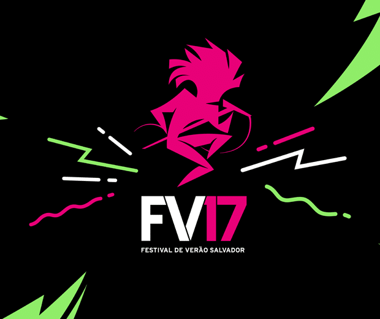

Olá, amigos PdBs! Indo direto ao ponto, a Itaipava apresenta: Festival de Verão de Salvador 2017! Pelo segundo ano consecutivo a marca será a **cerveja oficial** do maior evento de música do Verão no Nordeste que vai acontecer nos dias 16 e 17 de dezembro, na Itaipava Arena fonte Nova, na capital baiana.

## <!--more-->

## 

## Quem vai se apresentar no Festival?

**Viva 100 Festivais de Verão em 1**, com esse mote a Itaipava ativa o patrocínio do Festival de Verão de Salvador, com direito a filme especial para redes sociais e TV. Serão cerca de 20 atrações em mais de 30 horas de festa. O evento pretende sacudir a cidade com nomes consagrados como Ivete Sangalo, O Rappa, Dj Alok, Anitta, Safadão dentre outros. A Itaipava estará com uma tirolesa para uso dos participantes do evento nos dois dias. A marca também contará com uma carreta de chope como parte das suas ações.

## E o que mais?

Além dos artistas fodásticos, o **Festival de Verão de Salvador 2017** terá com uma superestrutura _hightec,_ que conta com um gigantesco palco, adornado com mil metros de led e internet grátis para todos. A Itaipava lançou um filme especial para o [evento](https://fv17.com.br) que faz parte da campanha “Viva 100 Verões em 1”, composta por uma microssérie especial para o Verão. Os vídeos destacam a Itaipava como marca proprietária da estação, e convida os consumidores a viverem com intensidade todas as possibilidades que o verão propõe.

\[embed\]https://www.youtube.com/watch?v=Y6rCiac98tM\[/embed\]

### Finalizando

A Itaipava investe muito nesse tipo de evento e ganha muito retorno com isso. Ganha marketing, mídia, gera buzz e promove seu produto, óbvio. Parabéns a empresa por participar de uma das maiores festas da Bahia e ajudar a fazer a felicidade dos baianos. Nós estaremos marcando presença no Festival de Verão de Salvador 2017 e você pode acompanhar tudo no nosso [Instagram](http://instagram.com/papodebar). Fui!

