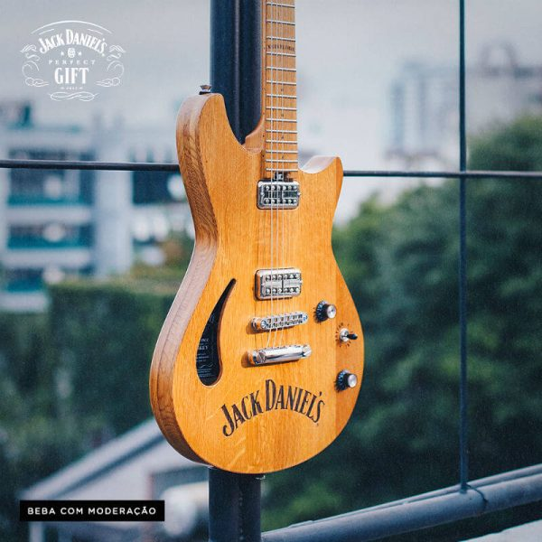
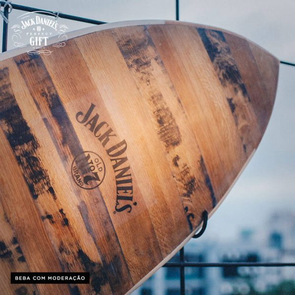

Semana retrasada fomos convidados a participar da festa de lançamento do Jack Daniel's Perfect Gift e segue tudo que rolou por lá.

<!--more-->

A festa rolou no Backyard Coliving, localizado na Vila Madalena, com a presença de alguns amigos da Jack para a apresentação desses três presentes mais que perfeitos da Jack. O local tem muito charme, um terraço delicinha e todo mundo da casa é muito simpático, o que com certeza vai garantir nossa volta lá pra contar mais do espaço e do que eles oferecem!

## Por que presente perfeito?

Porque os três foram desenhados e criados com madeira que provém de barris de Jack Daniel’s, desenhados por um peruano (Marco Reynaud - prancha de surfe), um paulista (Marcio Zaganin - guitarra) e um argentino (Matías Flocco - bicicleta)

Perfeito é pouco pra quem é fã da marca e não dispensa uma boa apresentação e estilo, afinal, não é sempre que a gente pode se gabar de ter madeira de barris de carvalho da Jack em casa.

## E o que rolou no Jack Daniel's Perfect Gift?

Entre comes e bebes deliciosos, era possível babar nos presentes e imaginar se valia a pena comprar pra dar pra alguém muito querido ou simplesmente se presentear, afinal, se tem alguém que merece ser feliz, esse alguém somos nós mesmos, concorda?

O valor dos presentes varia de R$2.000,00 a R$5.000,00 e você pode ir babar nas obras de arte lá no coliving. As peças ficaram disponíveis até o dia 15 de dezembro e se for do interesse levar uma belezinha dessas pra casa você pode enviar um email para conecta@livinbackyard.com.

## Finalizando

Agora, se o preço ficou um pouquinho salgado, uma ideia sem dúvida perfeita é presentear quem você ama com uma garrafa de Jack. Entre as opções disponíveis para venda no Brasil, o sugerido é o Jack Fire, que é com canela, tem um sabor delicioso e sem dúvida deve ficar excelente para misturar e adicionar a receitas natalinas.

Que tal fazer o teste?
