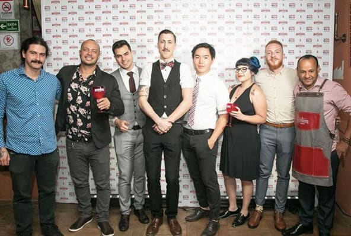
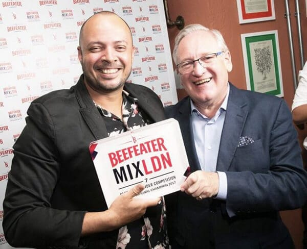
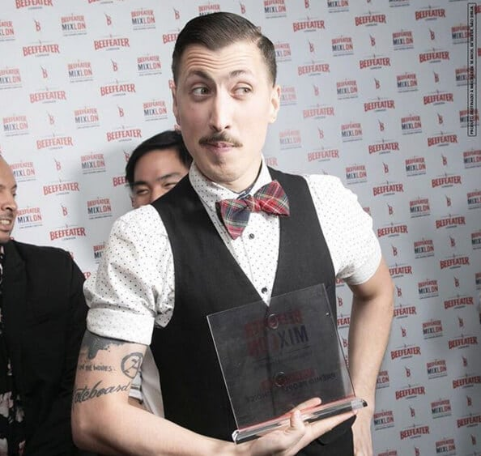

Quando a gente pensa em escrever de maneira diferente, contando outros fatos e outros detalhes sobre um evento a gente nunca pensa que vai começar assim, mas como a vida é uma caixinha de surpresas, sempre acontece algo inesperado. E é contando que fui assaltada uma semana após o evento da Beefeater que eu começo falando desse evento maravilhoso, do qual não tenho nenhum registro, porque não tinha feito backup das imagens e vídeos antes do acontecido. Mas a gente tá aqui pra falar de coisa boa e é isso o que interessa.

<!--more-->

## Noites com Beefeater

No dia 21 de novembro fomos convidados para um evento mais que especial, no Primeiro Andar, onde tivemos uma surra de aula com o mestre destileiro da Beefeater Desmond Payne. Só de profissão são 50 anos. De humor britânico pode colocar mais um centenário. Não existe uma só possibilidade de não amar o Mr. Payne. Um senhorzinho simpático e agradável que deu essa aula com maestria e fez essa que vos escreve passar algumas vergonhas divertidas no decorrer da noite.

Isso porque o Mr. Payne e a Beefeater nos desafiaram depois dessa aula a fazer nosso próprio gin, com essências básicas contidas no Beefeater, como a base de zimbro (base de todo gin), cascas de laranja, raiz e sementes de Angélica e coentro. Fizemos.

### Ficou bom?

De acordo com Mr. Payne, sim. Porém, não era gin, porque as outras essências tinham maior concentração que o próprio zimbro.

## A base do gin

E como dissemos, o zimbro é a base do gin. Ele pode ter apenas mais outros 2 ou 3 ingredientes, como também pode ter uma mistura de 47 botânicas diferentes - ou mais. O que importa não é quantidade, mas sim a qualidade e a combinação dessas botânicas, que vão fazer não só o gin, mas também o seu Gin Tônica terem um sabor único, principalmente por conta dos [mix que você pode ou não fazer com ele](https://www.papodebar.com/gin-club-no-shots/).

Gins com notas mais herbais combinam com mix mais herbais, enquanto os mais frutados, por consequência ficam excelentes com misturas de frutas que combinem entre si. Tudo também é uma questão de gosto, e nós do PdB prometemos não julgar a sua preferência.

## Mix LDN 7

Após essa aula de alquimia nós fomos agraciados com um jantar harmonizado com drinks de Gin & Tonic de fazer qualquer glutão chorar. Uma pena não termos fotos, nem receitas, porque de fato, faria sucesso!

Mas a semana não terminou por aí. No dia seguinte tinha mais Beefeater e mais festa e descobertas incríveis.

Na quarta, dia 22, a Beefeater realizou a final do Mix LDN 7 - que consagrou Luciano Guimarães como o grande vencedor da etapa brasileira, e que vai viajar pra gringa tentar levar essa taça pra gente. Desejamos toda a sorte do mundo pra ele.

Também tivemos outro vencedor da noite, dessa vez por escolha do público, que pôde provar os drinks e votar no melhor. Quem levou o People’s Choice foi o Heitor Marin, bartender do Seen, onde já passamos nesse evento da Dewar’s, que também foi um show à parte.

## Finalizando

Pra encerrar a noite, além de muitos comes e bebes tivemos o lançamento da nova garrafa do Beefeater 24, toda vermelhinha, coisa linda de se ver e beber, isso porque além de outras botânicas, o Beefeater 24 leva esse nome por deixar toda essa fórmula secreta da alegria descansando por 24 horas antes de seguir seu processo padrão. Ele fica excelente com especiarias mais quentes, como cardamomo, canela e outros.

Continue acompanhando nossas peripécias pelo mundo dos drinks e deixa seu recado pra gente.

Cheers to all!
