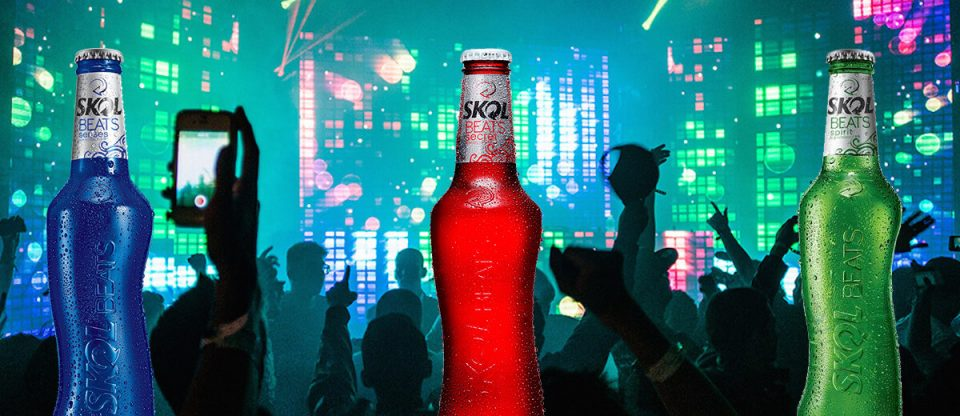
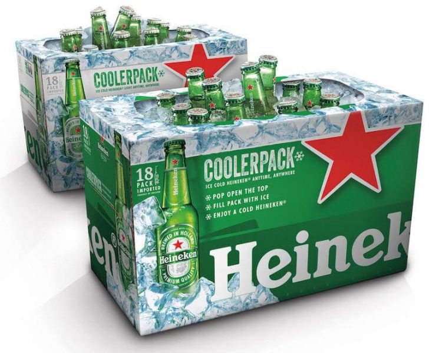
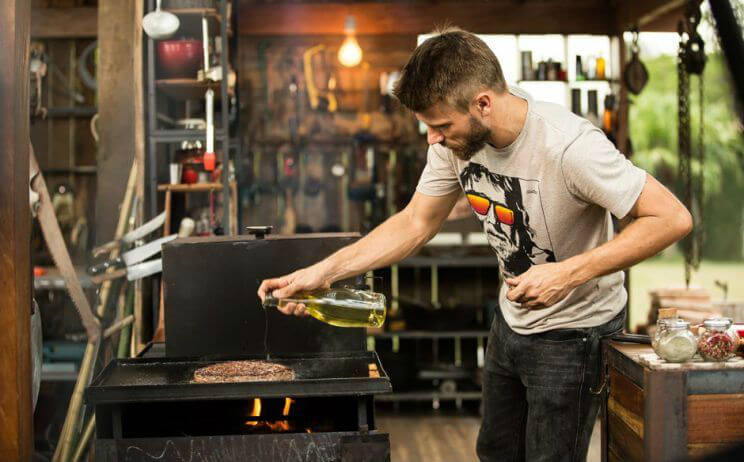
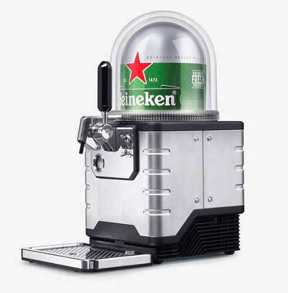

Olá amigos PdBs que nos acompanharam durante esse ano que chega ao fim. Quando janeiro vai se aproximando, fazemos uma reflexão sobre o que passou e iniciamos os preparativos para 2018 sempre com empolgação de criar e fazer parte de grandes projetos. O ano de 2017 foi de muito aprendizado, com saldo bastante positivo e vamos fazer nossa **retrospectiva Papo de Bar 2017** para vocês lembrarem os principais assuntos publicados por aqui.

<!--more-->

## Janeiro

Iniciamos o ano com uma [bola fora da Proibida](https://www.papodebar.com/bola-fora-da-proibida/), lançando uma propaganda um tanto quanto machista. Em pleno 2017, não dá mais para aturar isso! As boas notícias foram que o café do Jack Daniel's existe e você pode comprar! Além disso, a [cultura cervejeira belga](https://www.papodebar.com/cultura-cervejeira-belga-patrimonio-cultural-humanidade/), foi declarada como **patrimônio cultural da humanidade**. Merecidamente, diga-se de passagem.

## Fevereiro

No segundo mês do ano, falamos sobre o [estilo near beer](https://www.papodebar.com/voce-conhece-estilo-near-beer/), que são essas **Skol Beats** da vida e a [Heineken tornou-se a segunda maior cervejaria do país](https://www.papodebar.com/heineken-se-torna-segunda-maior-cervejaria-brasil/), após a compra da Brasil Kirin. Como fevereiro é o mês do [Carnaval](https://www.papodebar.com/o-carnaval-e-magico/), festa pela qual somos apaixonados, as ações das marcas cervejeiras não passaram batidas, como as [latas especiais da Antárctica](https://www.papodebar.com/lata-especial-da-antarctica-carnaval-2017/), que é patrocinadora do Carnaval carioca e a [Skol](https://www.papodebar.com/skol-e-as-surpresas-para-o-carnaval-de-salvador-2017/), com ações inovadoras na festa de rua de Salvador.

## Março

Dia 8 de março é dia de celebrar o [Dia Internacional das Mulheres](https://www.papodebar.com/dia-internacional-da-mulher-dia-delas/) e elas merecem todas as homenagens! Na parte de eventos, comentamos sobre o [Lollapalooza](https://www.papodebar.com/lollapalooza-brasil-2017-sera-fantastico/), que foi fantástico! Lançamos também um post sobre a [arte de beber em pé nos botecos](https://www.papodebar.com/arte-de-beber-em-pe-nos-botecos/) e os perigos do [misturar ansiedade e bebida](https://www.papodebar.com/os-perigos-de-aliar-ansiedade-e-bebida/).

## Abril

Continuamos nossa **retrospectiva Papo de Bar 2017** com um debate sobre a [relação Cliente x Atendente](https://www.papodebar.com/atendentes-clientes-educados/), questionando o tratamento dado e recebidos pelas partes envolvidas. Na delicosa época de Páscoa, a [Kopenhagen](https://www.papodebar.com/ovos-de-pascoa-alcoolicos-kopenhagen/) lançou maravilhosos ovos de chocolate misturados com licor, rum e cerveja. A [Stella Artois lançou uma bela campanha](https://www.papodebar.com/stella-artois-cria-tacas-para-ajudar-projeto-de-agua-potavel/), na qual vendia suas taças para arrecadar fundos para levar água à locais onde a água potável é escassa. E fechando o mês de abril, tivemos um pedido de uma cara que estava a beira da morte e só queria [um cigarro, uma taça de vinho para desfrutar do pôr do sol](https://www.papodebar.com/adeus-taca-de-vinho-cigarro-por-sol/) 3>

## Maio

Lançado no Estados Unidos, o [coolerpack da Heineken](https://www.papodebar.com/coolerpack-o-novo-pack-da-heineken/) foi um sucesso e ainda temos esperança e chegar por aqui em 2018. A Skol seguiu mandando bem e lançou especialmente para a **Parada LGBT**,  [latinhas celebrando a diversidade](https://www.papodebar.com/skol-lata-especial-parada-lgbt-sao-paulo/). O [Dia Mundial do Whisky](https://www.papodebar.com/dia-mundial-whisky/) não poderia passar batido, além de um texto valorizando [nossas mulheres e o consumo de cerveja](https://www.papodebar.com/e-de-cerveja-que-elas-gostam-mais/) também foi publicado.

## Junho

O sexto mês do ano, é mês de **festa de São João** e [a Schin homenageou Gonzaguinha](https://www.papodebar.com/sao-joao-schin/) em sua latas. A AMBEV divulgou números animadores sobre o [aumento da venda de cerveja no Brasil](https://www.papodebar.com/ambev-aumenta-volume-cerveja-vendida-brasil/). Ainda tivemos a grande [Negroni Week](https://www.papodebar.com/negroni-week-2017/) que celebra o mais famoso drink de Campari. E no oitavo dia do mês de junho, comemora-se o [Dia do Citricultor](https://www.papodebar.com/dia-do-citricultor-e-frutas-citricas/), que indiretamente nos permite criar drinks e caipirinhas deliciosas! Ensinamos também a [melhor forma de conservar vinho](https://www.papodebar.com/qual-melhor-forma-de-conservar-o-vinho/) e como preparar aquele [drink de camadas](https://www.papodebar.com/como-fazer-drinks-em-camadas/) bonito!

## Julho

Começamos o mês de julho mostrando alguns [rótulos especiais de Eisebahn](https://www.papodebar.com/eisenbahn-e-seus-rotulos-especiais/) e pulamos para ensinar nossos leitores a [fazer cerveja em casa, da cevada ao copo](https://www.papodebar.com/como-fazer-cerveja-em-casa-da-cevada-ao-copo/). Descobrimos um [Speak Easy, no Centro do Rio de Janeiro](https://www.papodebar.com/speakeasy-no-centro-rio-de-janeiro/), que é uma delícia e vimos [George Clooney ficar mais rico](https://www.papodebar.com/casamigos-george-clooney-vende-marca-de-tequila-negocio-bilionario/) vendendo sua marca de tequila, a Casamigos. No mundo cervejeiro a Budweiser lançou a possibilidade de você [pedir cerveja via Twitter](https://www.papodebar.com/budweiser-e-twitter-cerveja-em-casa/) 3> e um líder hindu pediu a Brahma que mudasse de nome. Era só o que me faltava!

## Agosto

Abrimos o mês encantados com a ação da **Jose Cuervo**, comemorando o [#TequilaDay](https://www.papodebar.com/fontes-de-tequila-em-los-angeles/) em Los Angeles! Foi demais! A AMBEV inovou e lançou um [tour cervejeiro inédito](https://www.papodebar.com/tour-cervejeiro-da-ambev-inedito/) com informações e curiosidades sobre os métodos de fabricação de suas cervejas. [Rodrigo Hilbert, aquele homão da porra](https://www.papodebar.com/obrigado-rodrigo-hilbert/), mereceu ocupar nossas linhas e num tom de agradecimento escrevemos ao homem do ano 2017 (eleito por nós mesmos). Para o **Dia dos Pais**, a [Johnnie Walker abriu uma Gift Store](https://www.papodebar.com/loja-johnnie-walker-dia-dos-pais-sao-paulo/) em Sampa e a [Kopenhagen uniu-se a Jack Daniel´s](https://www.papodebar.com/kopenhagen-se-junta-jack-daniels-e-cria-presente-exclusivo-para-o-dia-dos-pais/) para lançar uns kits lindos! Tomara que tenha mais em 2018! Achamos uma pesquisa que confirma que [maconha é melhor que o álcool na hora do sexo](https://www.papodebar.com/sexo-maconha-e-melhor-que-alcool-pesquisa/)! E para fechar o mês de agosto, nosso nobre [Dono do Bar](https://www.papodebar.com/author/dulcetti/) saiu num [mochilão](https://www.papodebar.com/mochilao-pelo-mundo/) e contou um pouco da experiência que deve ter sido incrível mesmo.

## Setembro

Esse mês é um momento de perdição para muitos! Tem início de Oktoberfests pelo mundo, [Rock in Rio](https://www.papodebar.com/rock-in-rio-2017-chegou-tudo-sobre-o-primeiro-fim-de-semana/) na Cidade Maravilhosa ([que foi incrível](https://www.papodebar.com/rock-rio-2017-parte-2/)) e vários outros eventos legais. A Adidas lançou um [tênis à prova de cerveja](https://www.papodebar.com/adidas-tenis-a-prova-de-cerveja-oktoberfest/) bem na época da **Oktoberfest** de Munique, na Alemanha. A galera do [whisky Dewar's](https://www.papodebar.com/evento-dewars-no-seen-em-sao-paulo/) fez dois eventos em São Paulo e nós conferimos tudo. Setembro também marcou pelas primeiras ações da [Amstel como patrocinadora da Libertadores](https://www.papodebar.com/amstel-e-sua-primeira-libertadores/), a AMBEV fazendo a [8ª edição do #ResponsaDay](https://www.papodebar.com/8a-edicao-do-dia-de-responsa-ambev/) e o Grupo Petrópolis lançando seu [programa de consumo responsável](https://www.papodebar.com/saber-beber-grupo-petropolis-consumo-responsavel/).

## Outubro

Seguindo a vibe de Oktoberfest, a festa aconteceu em São Paulo pela primeira vez e foi um sucesso, com um recorde mundial sendo conquistado lá: [carregamento de canecas de chopp](https://www.papodebar.com/carregamento-de-canecas-de-chopp-oktoberfest/). A [Heineken comprou os naming rights do GP do Brasil de Fórmula 1](https://www.papodebar.com/grande-premio-heineken-do-brasil/) e o **Mondial de La Biere**, que rola todo ano no Rio de Janeiro, está cada vez melhor, merecendo 3 publicações sobre: [aqui](https://www.papodebar.com/o-mondial-de-la-biere-2017-foi-incrivel/), [ali](https://www.papodebar.com/mondial-de-la-biere-2017-emocoes-conflitantes/) e [acolá](https://www.papodebar.com/mondial-de-la-biere-2017-mandando-brasa/). E concluindo seus eventos, o Dewar's mitou com o [Most Imaginative Bartender](https://www.papodebar.com/imaginative-bartender-mib/) (MIB)!

## Novembro

No penúltimo mês de 2017, começamos falando sobre o [Steinhaeger Becosa](https://www.papodebar.com/steinhaeger-becosa/) que nos convidou para beber uns drinks criados por eles. Foi nesse mês que teve início o [Reality Show cervejeiro da Eisenbahn](https://www.papodebar.com/o-reality-show-cervejeiro-ja-comecou/) e conhecemos o projeto [Cerverbaria](https://www.papodebar.com/cerverbaria-cervejas-textos-rotulos/), onde os rótulos de garrafas de cervejas, vêm com textos inéditos publicados. Achei isso fantástico! A Heineken mitou mais uma vez e lançou a **Blade**, uma [máquina que produz cerveja a partir de cápsulas](https://www.papodebar.com/nespresso-da-heineken/), no melhor estilo nespresso e a [Cervejaria 2 Cabeças ensinou na prática, como se faz cerveja](https://www.papodebar.com/brassagem-coletiva-cervejaria-2-cabecas/)! Listamos as [6 melhores bebidas para você mandar bem](https://www.papodebar.com/6-melhores-bebidas-para-voce-mandar-bem/) e debatemos sobre nossos queridos [botecos e a relação com cervejas artesanais](https://www.papodebar.com/cerveja-de-boteco/).

## Dezembro

Encerrando nossa retrospectiva Papo de Bar 2017, a **Stella Artois** entrou dezembro mandando brasa no [projeto Música no Vão](https://www.papodebar.com/stella-artois-e-masp-musica-no-vao/), no MASP. Tivemos algumas [noites de gin com Beefeater](https://www.papodebar.com/noites-de-gin-com-beefeater/) e a [Itaipava nos levou ao Festival de Verão de Salvador](https://www.papodebar.com/festival-de-verao-salvador/). No dia 19, postamos sobre o que a galera da **Jack Daniel's** anda aprontando com seus [Perfect Gift,](https://www.papodebar.com/jack-daniels-perfect-gift/) que são realmente perfeitos!

## Finalizando

É isso! 2017 chega ao fim e 2018 vem com tudo! Desejamos que seja um ano maravilhoso para todos vocês, com muitos muitos a serem comemorados. #Cheers e aquele abraço!

