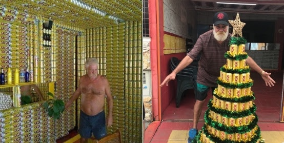

Um fã da cerveja Skol viralizou na internet ao mostrar sua casa decorada com 27 mil latas de cerveja da marca. Ao tomar conhecimento, os representantes da marca iniciaram uma busca para encontrar o dono da residência através das redes sociais, para presenteá-lo com um árvore de Natal de latinhas de cerveja.

<!--more-->

A Skol teve sucesso na sua busca e conseguiu achar o senhor Dorival Paes D’Oliveira. Ele tem 62 anos e mora na Praia Grande, na Baixada Santista. Ele conta que sempre foi um grande fã da Skol e iniciou o projeto da casa com a ajuda da esposa, Cida. “Tomo Skol há pelo menos 30 anos”, conta.

Os dois tiveram um bar entre 2012 e 2016 instalado na área externa da residência do casal. Com acesso a centenas de latas diariamente, logo tiveram a ideia de decorar todo o espaço com a marca preferida dos dois.

## Veja o vídeo do 'O Brasil Que Deu Certo' com o Dorival:

https://youtu.be/LHAeY1DExAA

Entre garagem, sala, cozinha, corredor e banheiro, a casa está decorada com pouco mais 27 mil latas de cerveja. Sr Dorival conta que a ideia surgiu quando ainda tinham o bar, e que hoje a casa se tornou uma espécie de ponto turístico da região onde mora. Todo mundo quer fazer selfie numa casa de cervejas.

Para completar a decoração da casa do casal D’oliveira, a Skol entregou uma árvore de natal de latinhas da marca. A foto em questão foi tirada em 2013, e embora hoje tenha perdido as paredes internas de latas, a residência ainda conta com a calçada frontal pintada com o nome da cerveja, assim como no portão da residência.

## Finalizando

Dorival ficou muito contente e disse que foi uma homenagem muito legal depois de tantos anos dedicados a valorizar a marca, que também enviou alguns packs de cerveja junto com a árvore.

> “SKOL adora estar perto de seus consumidores e quando eles são tão originais como o Dorival fica ainda mais legal. Ele saiu do quadrado, fez uma casa única e é muito bacana poder tornar o Natal dele e da família mais especial”

Comentou Kim Moraes, gerente de marketing de SKOL.

E você, o que achou? Gostaria de uma também?

