E ae, meus nobres adoradores de boas cervejas e petiscos, como estamos? Hoje começa um dos eventos que eu mais gosto no Brasil, o Comida Di Buteco RJ 2019.

<!--more-->

Desde que o evento expandiu para o Brasil todo, tivemos diversas cidades participando com vários butecos fodas mandando ver em petiscos deliciosos.

Inclusive o Papo de Bar já foi júri de um Comida Di Buteco em SP, lembram?

## Mas agora é Comida Di Buteco RJ 2019

Nem Belo Horizonte, nem São Paulo, agora vamos degustar os petiscos criados no Rio de Janeiro. O evento começa hoje e vai até o dia 12 de maio, ou seja, um mês pra encher a pança de comida boa.

São 66 botecos participando com 66 petiscos (dã, óbvio).

## São 20 anos de Comida Di Buteco

Sim, é a vigésima edição do evento. E a parada mais foda é que os petiscos precisam custar até R$20. Portanto, comeremos bem por um preço bem razoável.

Talvez vamos ver um petiscos não tão regado, com muita quantidade, mas o que vale mais é qualidade e não a quantidade, não é verdade, meus nobres?

Vamos então ver os 66 petiscos participantes, começando pelos botecos iniciantes, no seu primeiro ano:

## Butecos Estreantes no Comida di Buteco RJ 2019

### Barbahtchê

- Rua São Francisco Xavier, 313, loja A – Tijuca.
- Funcionamento: De segunda a domingo, de 11h às 23h
- Petisco: Vaquinha atolada – aperitivo de costela com purê de aipim

### Birosca do Camarão

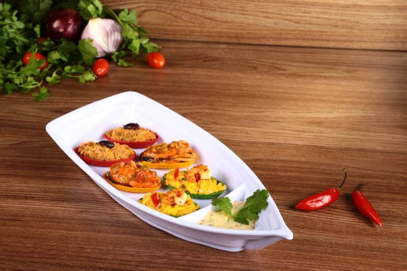

- Rua Antônio Sales, 4, Colonia z10 – Ilha do Governador. Tel.: 98900-8547
- Funcionamento: De terça a sábado, de 12h às 22h30. Domingo, de 12h às 18h e feriados sob consulta
- Petisco: Encontro das barcas - Três poderosos frutos do mar servidos em barquetas comestíveis: Barquetas de bacon recheadas com siri, barquetas de parmesão recheadas com mexilhão e barquetas de orégano com recheio de camarão. Acompanha molho tártaro.

### Boêmia Social Clube

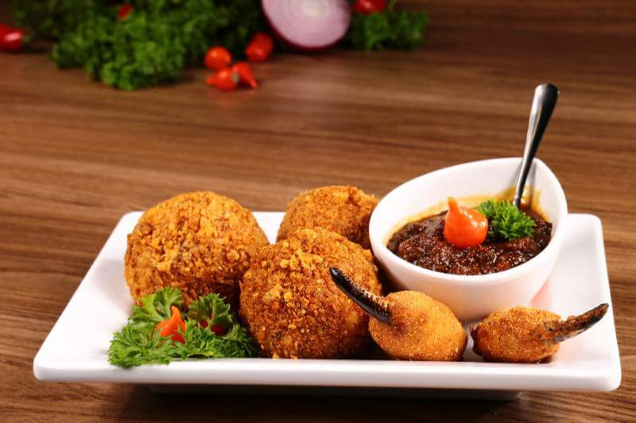

- Avenida Oliveira Belo, 1.180, loja E – Vila da Penha.
- Funcionamento: Segunda de 18h às 23h30 e de terça a domingo de 12h às 23h30
- Petisco: Sirigueijo – bolinho de siri recheado com gorgonzola e empanado em farinha de torresmo, acompanhado de garra de caranguejo empanada e geleia de bacon

### Bom Gourmet

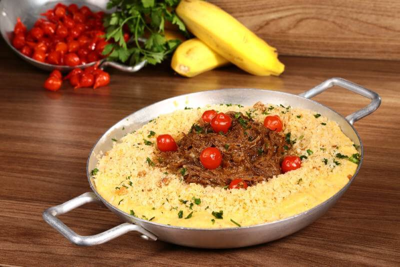

- Rua Morais e Silva, 107 – Tijuca. Tel.: 3689-0795
- Funcionamento: Segunda a sexta de 17h às 00h, sábado de 14h à 00h e feriados sob consulta
- Petisco: Ragu do Maracá – ragu de costela bovina servido com creme de banana da terra e batata acompanhado de farofa panko ao alho decorado com pimenta biquinho e salsinha

### Booze Bar

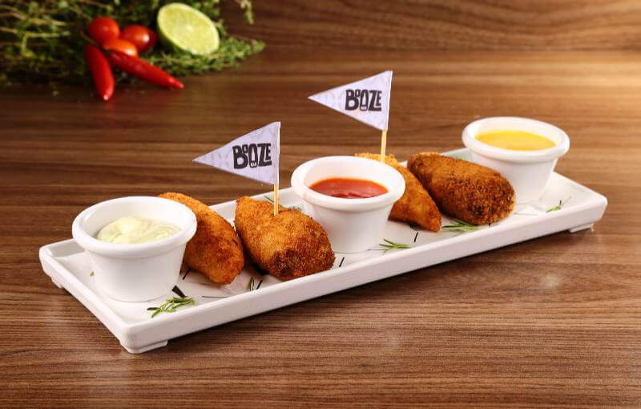

- Avenida Mem de Sá, 63 – Lapa. Tel.: 2252-1588
- Funcionamento: Terça a quinta de 12h às 23h, sexta e sábado de 12h à 2h e domingo de 12h às 18h
- Petisco: Coxinha sem massa do Booze – coxinhas nos sabores salmão, costela, frango e pernil recheadas com cream cheese e acompanhadas dos molhos de maionese de wasabi, geleia de pimenta biquinho e maionese caseira

### Boteco Vou de Mais

- Rua Paula Brito, 240 – Andaraí. Tel.: (21) 2278-9629
- Funcionamento: Sábado e domingo de 11h30 às 01h, segunda à sexta de 11h30 à 0h
- Petisco: Kafta Vou de Mais - Duas kaftas recheadas com queijo coalho e tomate seco com acompanhadas de geleia de pimenta e vinagrete

### Brows

- Rua José Maria Ortigão Sampaio, 55, loja A – Barra da Tijuca. Tel.: 2433-1411
- Funcionamento: Terça, quarta e domingo de 12h às 23h, quinta, sexta e sábado de 12h às 00h
- Petisco: Casal 20 do Sertão – bolinhos de aipim e carne seca com pimenta dedo de moça. Não leva massa e é servido com geleia de pimenta

### Cachaça Social Club

- Rua do Rezende nº 53, loja A – Lapa. Tel.: 2582-8463
- Funcionamento: Terça a sábado, de 18h às 2h e domingo de 13h às 20h
- Petisco: Jiló à moda da Lapa - fatias de jiló empanadas em massa de panqueca e legítimo queijo parmesão acompanhadas de geleia agridoce de abacaxi, pimenta dedo de moça e cachaça artesanal

### Caldo de Pinto

- Rua Ministro João Alberto lote 40, quadra 88 – São João de Meriti.
- Funcionamento: Terça a sexta, de 17h às 1h e sábado e domingo de 12h às 1h
- Petisco: Um brinde aos nossos 20 anos – escondidinho de frango

### Casa Porto

- Largo de São Francisco da Prainha, sobrado – Centro.
- Funcionamento: Segunda a segunda, de 12h às 1h e feriados sob consulta
- Petisco: Bololô – petisco bem mineiro que parece um bolo doce de aniversário, mas feito com massa de torta de empada na banha de porco, brownie de tutu com bacon, creme de confeiteiro de mandioquinha, granulado de linguicinha de pernil, couve crispy e farelo de pururuca

### Confraria da Carne

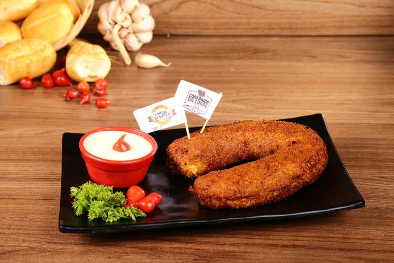

- Rua Capitão Feliz, 110, pavilhão 2, loja 2, rua 11, bloco P – Benfica.
- Funcionamento: Terça a sexta, de 11h às 21h, sábado de 11h às 19h e domingo de 11h às 15h
- Petisco: Lingüiça Alheira – peças de charcutaria: embutido de carne suína, pão e frango. Acompanha molho de caipirinha (limão e cachaça)

### Desacato

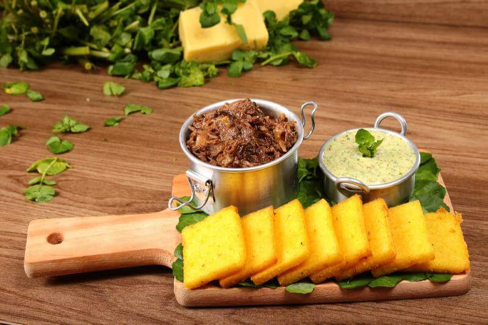

- Rua Conde de Bernadote nº 26, loja A – Leblon.
- Funcionamento: Segunda, de 12h às 16h, terça a quinta e domingo de 12h à 1h e sexta e sábado de 12h às 2h
- Petisco: Rabada na Lata – Rabada na lata com polenta Frita e aioli de agrião com bacon defumado

### Empório Santa Oliva

- Avenida Tenente Coronel Muniz de Aragão, 26, BC Anil – Jacarepaguá.
- Funcionamento: Terça a quinta, de 16h às 23h, sexta e sábado de 14h à 00h, domingo e feriados de 12h às 22h
- Petisco: Maria Fumaça - Três bolinhos de angu recheados de joelho de porco defumado, acompanhados de trilho de queijo da serra da Mantiqueira, atolado em geleia de goiaba com pimenta dedo de moça e flocos de torresmo. Acompanha dose de cachaça mineira

### Fábrica Nômade

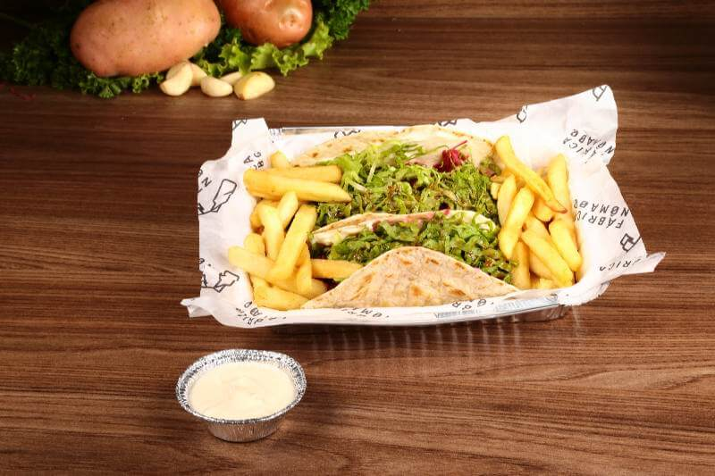

- Avenida Tenente Coronel Muniz de Aragão, 104, Anil - Jacarepaguá.
- Funcionamento: Quarta e quinta de 18h às 23h30, sexta e sábado de 18h às 00h30 e domingo de 18h às 22h30
- Petisco: O Porquinho que pulou o muro - duas tortilhas recheadas com sobrepaleta suína defumada na casa, picles de beterraba, pimenta dedo de moça, sour cream, alface e molho agridoce. Acompanha batatas fritas e molho sour cream

### Ge Bar e Bistrô

- Rua Carvalho Alvim, nº 333, lojas H e I – Tijuca.
- Funcionamento: Segunda a domingo de 12h à 00h
- Petisco: Bruschetta de Boteco – três bruschettas de carne assada com bacon e crispy de cebola

### Hora Extra

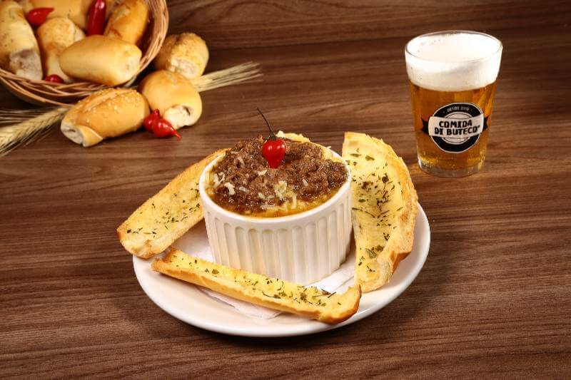

- Rua Arcozelo, 60, loja B – Vila Valqueire.
- Funcionamento: Terça a sexta de 18h à 00h, sábado de 12h à 00h, domingo e feriados de 12h às 22h
- Petisco: Mugido de Boi na Polenta – ragu de costela na polenta. Acompanha torradas de pão francês

### Irmandade

- Rua Barão do Bom Retiro, 2.781 – Grajaú.
- Funcionamento: Segunda a quinta de 11h às 23h, sexta, sábado e domingo de 11h às 23h
- Petisco: “Si vira nus 20” - Mió de bão canoas de massa de pastel artesanal, com recheio de carne seca desfiada com abóbora moranga ralada, bastões de mandioca branca (cacau) cozidos e fritos. Acompanha molho à parte

### Neném de Ramos

- Rua Lígia, 202, lojas A e B – Olaria.
- Funcionamento: Terça a domingo de 11h às 22h
- Petisco: Um Chorinho de Costela - Costela suína com dadinhos de polenta, acompanhados de geleia de sabor alho caramelizado

### Pasta da Nona

- Avenida Brasil, 367 – Vila São Luiz, Duque de Caxias.
- Funcionamento: Segunda a sexta de 17h à 00h, sábado e domingo de 13h à 00h
- Petisco: Sertão Gostoso - Linguiça artesanal de carne de sol recheada com queijo coalho preparada com as tradicionais técnicas da Toscana. Acompanha dadinhos de aipim, massa crocante, creme de aipim, molho especial e molho de pimenta

### Raízes Bar

- Rua Afonso Pena, 66 - Tijuca.
- Funcionamento: Segunda a quinta de 17h às 23h, sexta e sábado de 13h à 00h,domingo de 13h às 18h e feriados sob consulta
- Petisco: Coração Cervejeiro - porção de coração de frango embriagado ao molho de cerveja puro malte levemente picante servido na panela de barro. Acompanha farofa de flocos de milho amarela refogada na banha de porco

### Ruanita

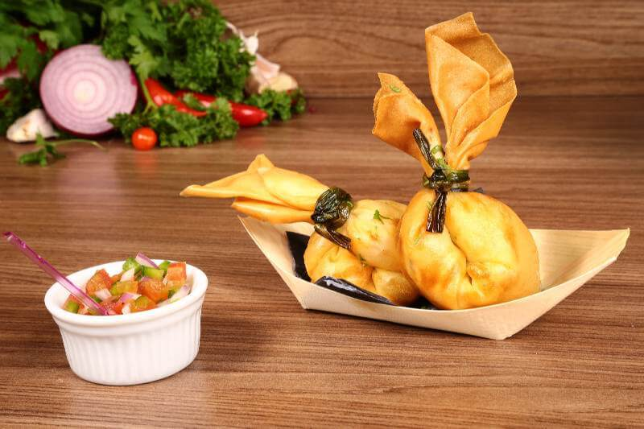

- Rua Anita Garibaldi, 60, loja F - Copacabana.
- Funcionamento: Terça a quinta de 17h às 23h30, sexta de 17h à 00h30, sábado de 12h à 00h30, domingo de 12h às 17h e feriados sob consulta
- Petisco: 20 VER - Trouxinha a base de massa harumaki recheada com moqueca de peixe e camarão com requeijão cremoso. Acompanha molho à campanha apimentado

### Salete

- Rua Afonso Pena, 189 - Tijuca.
- Funcionamento: Segunda a quarta de 10h às 22h e quinta a domingo 10h às 23h
- Petisco: Boi, Eva e Adão - três empadas de recheios de carne moída, costela de boi com agrião e maçã

### Sociedade da Carne

- Rua Lopo Saraiva, 179, bloco 2, loja K - Tanque.
- Funcionamento: Segunda a quinta, de 17h à 00h, sexta e sábado de 16h às 2h, domingo e feriados de 12h à 00h
- Petisco: Frankito do Sócio – frango no palito empanado

### Taberna 564

- Rua Cosme Velho, 564 – Cosme Velho.
- Funcionamento: Segunda e terça de 12h à 22h, quarta, domingo e feriados de12h às 23h
- Petisco: Junto e Misturado - combinação de frutos do mar com frutos da terra

### Tasca do Carvalho

- Rua Ronald de Carvalho, 266, loja D – Copacabana.
- Funcionamento: Segunda a sexta de 18h à 1h
- Petisco: Atum à Moda quer alho - atum fresco grelhado acompanhado de cabeças de alho, tomatinhos e molho verde

## Butecos Veteranos no Comida di Buteco RJ 2019

### Adega Pérola

- Rua Siqueira Campos, 138 A – Copacabana. Tel.: 2255-9425
- Funcionamento: Segunda a sábado de 11h às 1h
- Petisco: “Podrão” de Bacalhau - petisco de bacalhau elaborado com ingredientes da culinária popular brasileira

### Baixo Araguaia

- Rua Araguaia, 1709 – Freguesia. Tel.: 3392-3760
- Funcionamento: Segunda a sexta de 18h à 0h, sábado de 12h à 0h e domingo, das 12h às 22h30
- Petisco: Fondue de costela - Costela desfiada e servida em duas “cestinhas” de pão italiano. Acompanha uma terceira “cestinha” de pão com uma fusão de queijos, onde predominam gorgonzola e provolone

### Baixo Gago

- Rua Gago Coutinho, 51 – Laranjeiras. Tel.: 2556-0638
- Funcionamento: Segundas e terça de 11h às 22h, quarta à sábado, de 11h à 0h e domingo, de 11h às 18h
- Petisco: Comadi Sebastiana - bolinho de massa de feijão, recheado com baião de dois, carne seca, linguiça, bacon e queijo coalho

### Bar Caiçara

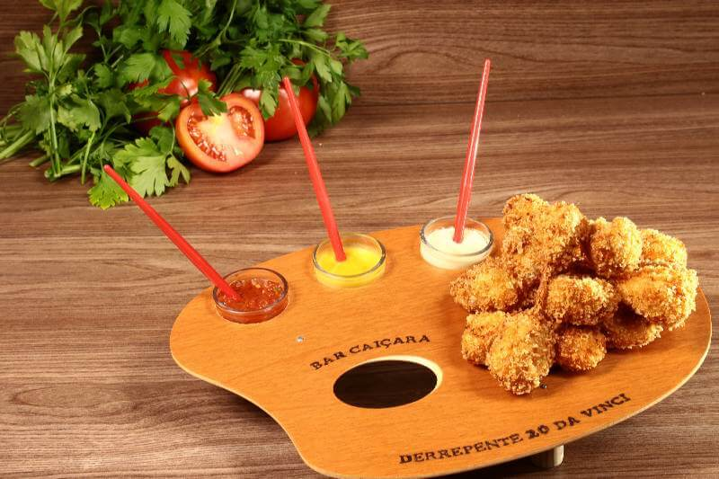

- Rua Dr. Sebastião de Aquino, 170 - Ilha da Gigóia. Tel.: 2484-7983
- Funcionamento: Quarta a sexta de 16h às 23h, sábado de 13h às 23h, domingo e feriados de 13h às 20h
- Petisco: De repente 20 Da Vinci - 20 cubos de filé de frango crocantes, acompanhados de três surpreendentes molhos

### Bar da Gema

- Rua Barão de Mesquita, 615 - lojas C e D – Tijuca. Tel.: 3549-1480
- Funcionamento: Terça a sexta de 17h à 23h, sábado de 12h às 23h, domingo de 12h às 17h e feriados sob consulta
- Petisco: Pra Festejar - Três bolinhos feitos com massa de aipim e carne de porco, recheado com queijo minas padrão derretido

### Bar da Portuguesa

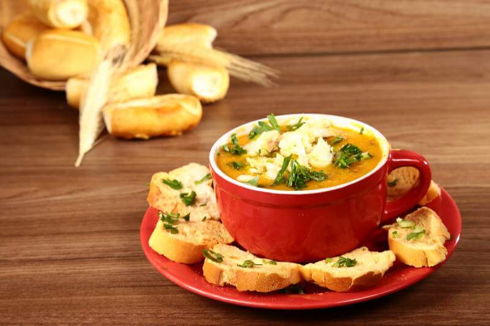

- Rua Custódio Nunes, 155, loja D – Ramos. Tel.: 3486-2472
- Funcionamento: Terça a quinta de 17h30h às 23h, sexta de 17h30h à 0h, sábado de 12h às 21h, domingo de 12h às 17h e feriado sob consulta
- Petisco: Pixinguinha, 20 ver; Dondon 20 aplaudir - Caldinho de grão de bico com bacalhau

### Bar Dafoca

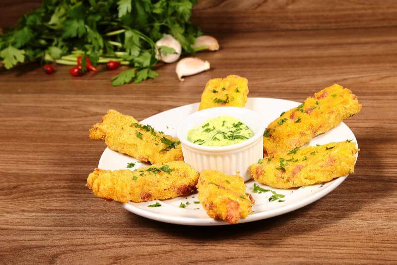

- Rua Farani, 23, lojas A/B – Botafogo. Tel.: 2553-7045
- Funcionamento: Terça a sexta de 18h à 0h, sábado de 14h à 0h, domingo de 14h às 22h e feriados sob consulta
- Petisco: Sabor da Fazenda - Polenta frita recheada com linguiça acompanhada de molho de ervas

### Bar do Gallo

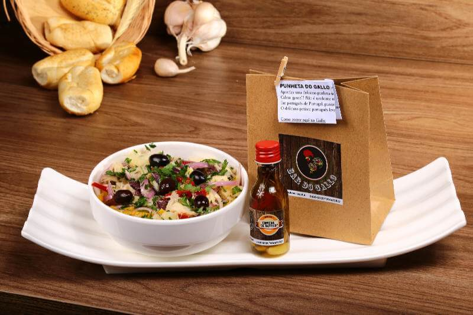

- Rua Cidade do Rio, 185 – Taquara. Tel.: 2426-5059
- Funcionamento: Terça a quinta de 16h às 21h, sexta de 16h às 23h, sábado de 13h às 23h, domingo e feriados de 12h às 22h
- Petisco: Punheta do Gallo – Punheta com bacalhau, pimentões coloridos, cebola roxa, tomate cereja, azeitonas portuguesas, acompanha mini pão francês

### Bar do Mariano

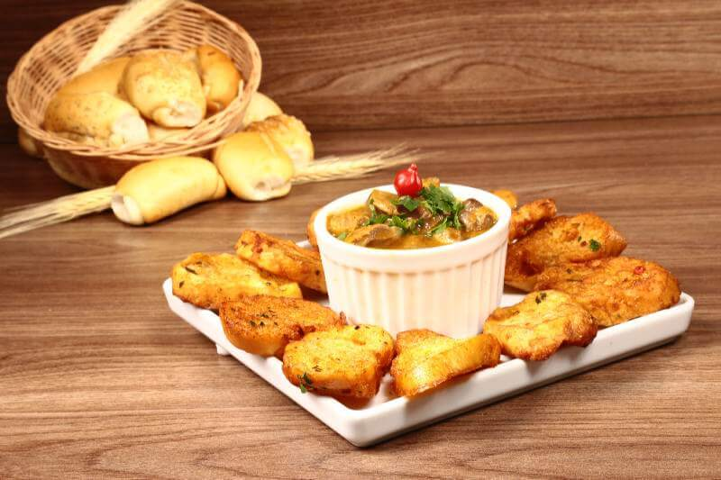

- Rua Professor Valadares, 78 – Grajaú. Tel: 2578-1232
- Funcionamento: Segunda a sábado de 15h30 às 22hs, domingo e feriados de 15h30 às 22h
- Petisco: Como Moela e Rabanada - Moela temperada ao vinho com rabanada salgada

### Bar do Momo

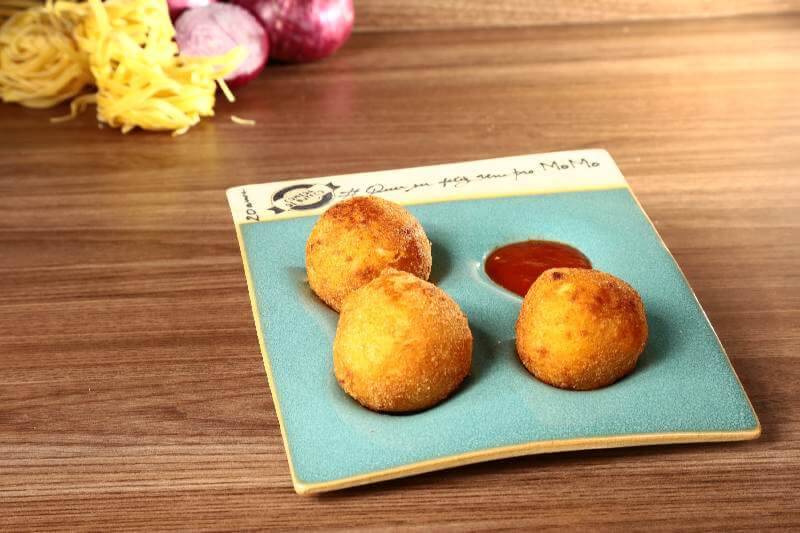

- Rua General Espírito Santo Cardoso, 50\\A – Tijuca. Tel.: 2570-9389
- Funcionamento: Segunda a Sexta de 15h às 22h, sábado de 11h às 22h, domingo e feriados sob consulta
- Petisco: 20 Fazer Feliz - Bolinho de macarrão com cheddar, cebola roxa e bacon. Acompanha molho de pimenta caseiro

### Bar do Omar

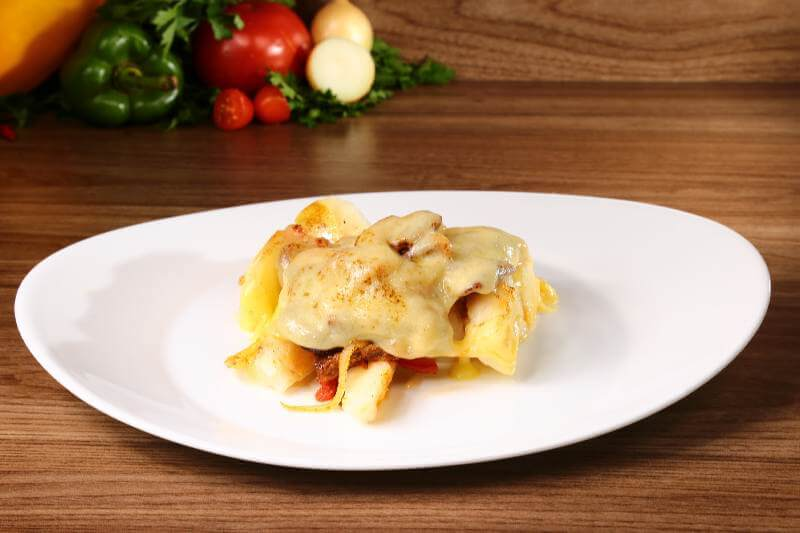

- Rua Sara, 114 - Santo Cristo. Tel.: 95905-0680
- Funcionamento: Quarta e quinta de 17h às 22h, sexta e sábado de 12h às 23h, domingo e feriados de 12h às 21h
- Petisco: Escondidinho de escondidinho - Aipim cozido acompanhado de carne seca acebolada coberto com queijo gratinado

### Bar dos Amigos

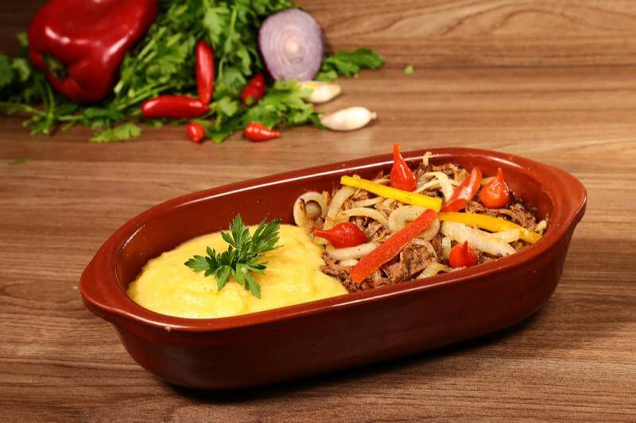

- Rua Pacheco Leão, 1124 A - Jardim Botânico. Tel.: 31147924
- Funcionamento: Terça a sábado de 12h às 22h, domingo de 12h às 18h, feriados sob consulta
- Petisco: Vintão - Peito de boi assado e desfiado com temperos da casa e angu

### Bar Madrid

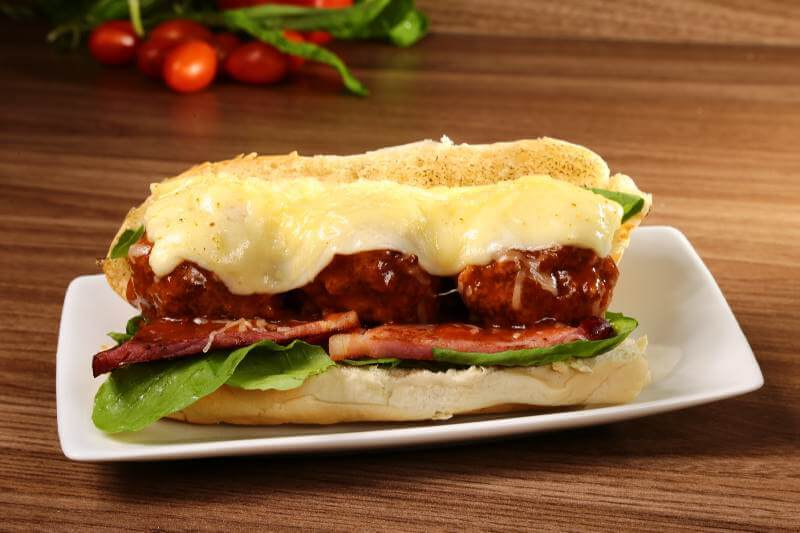

- Rua Almirante Gavião, 11-G – Tijuca. Tel.: 3786-8480
- Funcionamento: Segunda a sexta de 11h às 17h30min, sábados e domingos de 12h às 18h30min
- Petisco: Bocata de Almôndegas - Sanduíche com almôndegas no pão de leite, bastante molho da casa com bacon, queijo mussarela e parmesão gratinados e rúcula para terminar a combinação

### Bar O Original do Brás

- Rua da Justiça, 230 A - Vila da Penha. Tel.: 3689-3699
- Funcionamento: Segunda a quinta de 16h às 22h, sexta e sábado de 14h às 22h e domingo não abre
- Petisco: Trio Mineiro Uai - Polenta em cubos empanadas com parmesão, linguiça mineira e carne suína

### Bar Palhinha

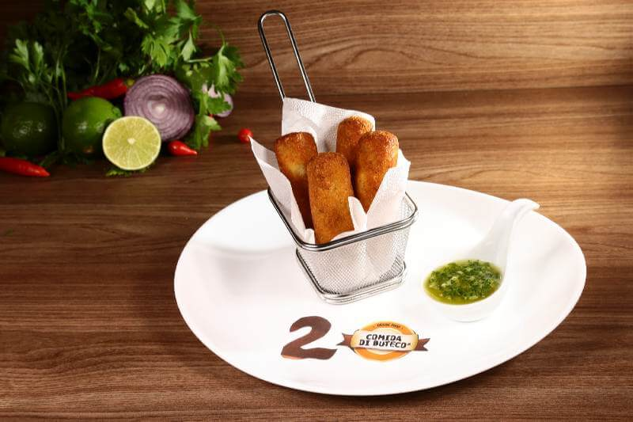

- Rua Humaitá, 12 - loja C – Humaitá. Tel.: 2539-5709
- Funcionamento: Segunda de 17h às 23h, ter a sábado de 12h à 0h, domingo de 12h às 20h
- Petisco: Kimukeka - Croquete de moqueca de peixe. Acompanha molho de coentro com azeite e castanhas de caju

### Bar Santo Remédio

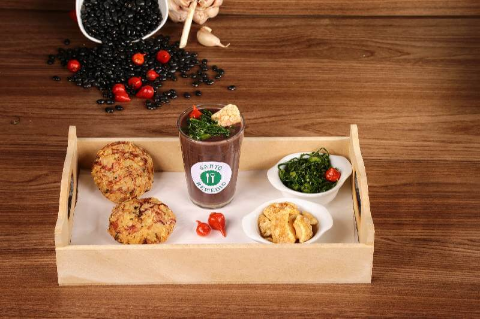

- Rua Barão de Mesquita, 922 – Grajaú. Tel.: 2238-9915
- Funcionamento: Terça a sexta de 17h às 23h, sábado de 12h às 23h, domingo de 12h às 20h, feriado sob consulta
- Petisco: Jóias do Brasil - Caldinho de feijão invertido e bolinho de arroz dos pampas

### Bistrô Aconchego

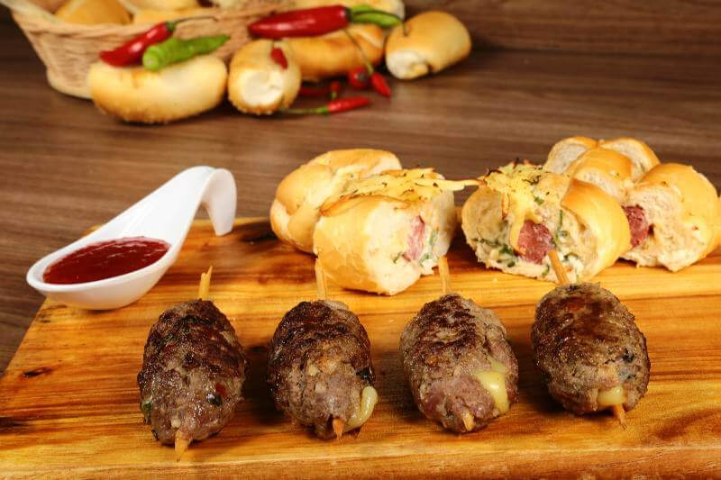

- Rua das Rosas, 1500 - Vila Valqueire. Tel.: 2454-9149
- Funcionamento: Quarta a sexta de 18h à 0h, sábado de 12h às 01h, domingo e feriados de 12h às 22h
- Petisco: Dupla Explosiva - Quatro suculentas kaftas recheadas com mussarela e acompanhadas por um delicioso pão de alho recheado com linguiça, couve e geleia de pimenta

### Bobô Bar

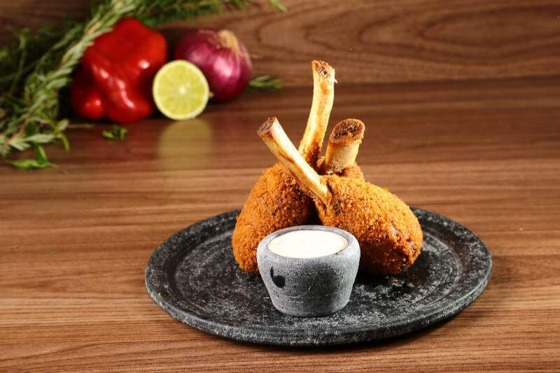

- Rua Manuela Barbosa, 45 – Méier. Tel.: 3495-8223
- Funcionamento: Segunda a quinta de 17h às 23h, sexta de 17h às 01h, sábado de 12h às 01h, domingo 12h às 23h, feriado de 12h às 23h, véspera de feriado de 17h às 01h
- Petisco: O porco prensô e fritô - Trio de bolinhos de costela de porco e panceta ao molho barbecue. Desfiada e prensada com recheio de queijo provolone defumado empanado em farinha panko

### Bode Cheiroso

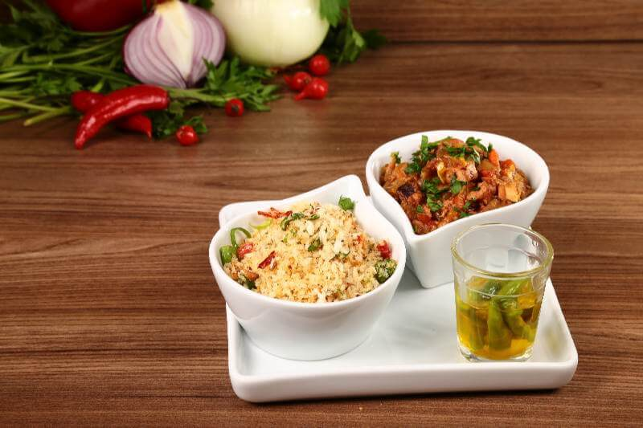

- Rua General Canabarro, 218 – Maracanã. Tel.: 2568-9511
- Funcionamento: Segunda de 15h às 22h, terça a sexta de 15h às 0h, sábado de 15h ás 21h, feriados sob consulta
- Petisco: Pimenta no ragu dos outros é refresco - Ragú de porco acompanhado de farofa crocante apimentada

### Bodega do Sal

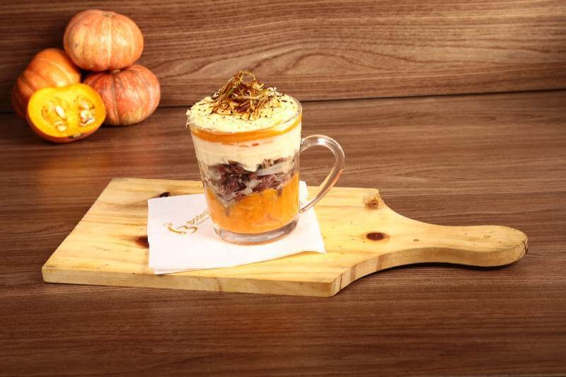

- Rua Argemiro Bulção, 33/35 – Centro. Tel.: 2516-4548
- Funcionamento: Segunda e sexta de 11h às 01h, terça, quarta e quinta de 11h às 20h, sábado e domingo de 11h às 20h
- Petisco: Achadinho - Escondidinho de abóbora, carne seca, catupiry e queijo coalho e crispy de alho poró

### Boteco Carioquinha

- Av. Gomes Freire, 822 – Lapa. Tel.: 2252-3025
- Funcionamento: Segunda a segunda de 11h às 01h
- Petisco: Mente Aberta - Bolas de pernil mergulhadas no molho de tomate artesanal sobre cama de creme roxo e crispy de couve

### Boteco do Lobo

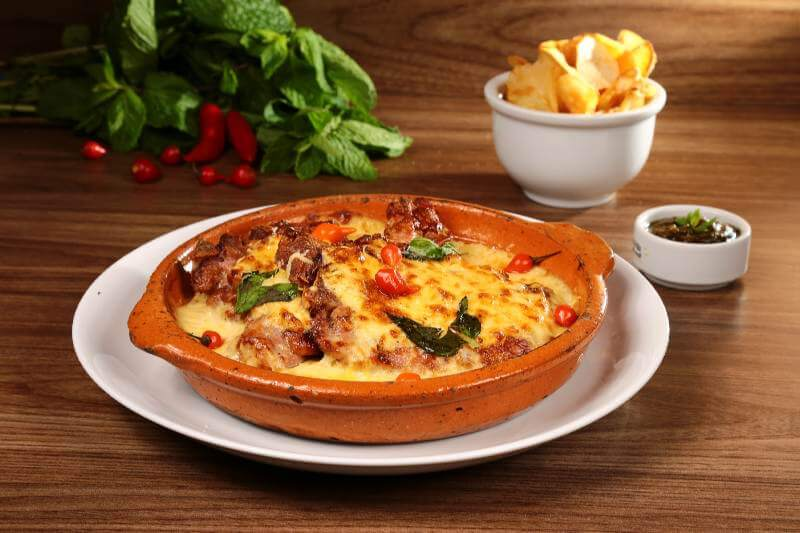

- Rua Professora Carmem de Freitas Salgado, 237 - Califórnia. Nova Iguaçu. Tel.: 3851-1438
- Funcionamento: Terça a sexta de 16h à 0h, sábado de 12h à 0h, domingo de 12h às 21h
- Petisco: Lobo em pele de cordeiro - Costeleta de porco gratinada acompanhada de geleia de hortelã e chips de aipim

### Boteco do Teixeira

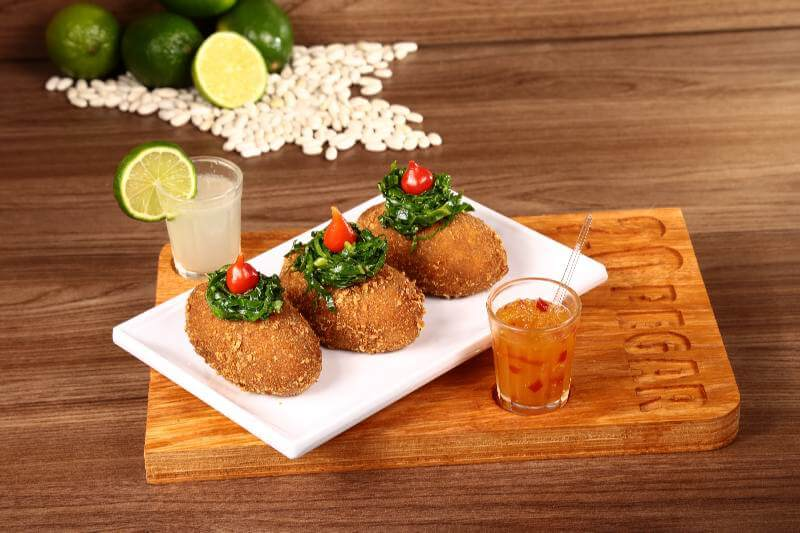

- Rua General Venâncio Flores, 594 - Vinte e Cinco de Agosto - Duque de Caxias. Tel.: 2772-4258
- Funcionamento: Segunda a sexta de 18h às 23h, sábado e domingo de 16h às 23h
- Petisco: 20Pegar - Bolinhos de feijão branco recheado com carne seca, calabresa e bacon, servidos com couve, geleia de pimenta e shot de caipirinha

### Botequim Rio Antigo

- Rua Uranos, 1489 – Olaria. Tel.: 3867-6124
- Funcionamento: Terça a quinta de 17h à 0h, sexta de 17h às 01h, sábado de 12h às 01h, domingo de 12h às 21h e feriados sob consulta
- Petisco: Bafo de Porco! - Costelinhas suínas preparadas no bafo, acompanhadas de farofa panko de bacon e molho especial da casa

### Buteco do Portuga

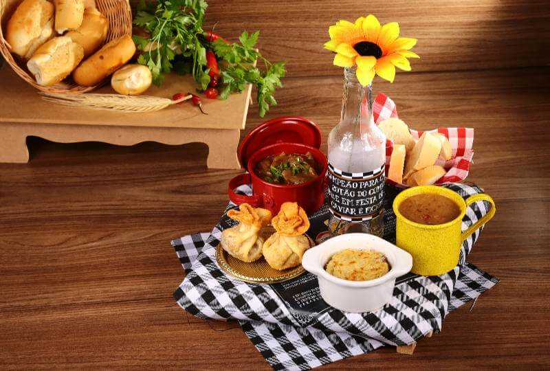

- Rua Coronel Francisco Soares, 1351 - Centro - Nova Iguaçu. Tel.: 2767-4356
- Funcionamento: Terça a sábado de 16h às 22h e domingo de 16h às 21h
- Petisco: De Campeão para Campeão. 20tão do comida. Porque em festa de buteco caviar é fichinha - Mini porções dos petiscos campeões de preferências nos butecos. É moela que se fala (moela feita com vinho do porto); De trouxa nós só tem a cara (pastel em formato de trouxa com recheio de costela); Kepp Caldo (caldinho de carne com aipim) e #sóquenãoébatata (rosty de aipim com recheio de carne seca).

### Buteko em nome do pai e do filho

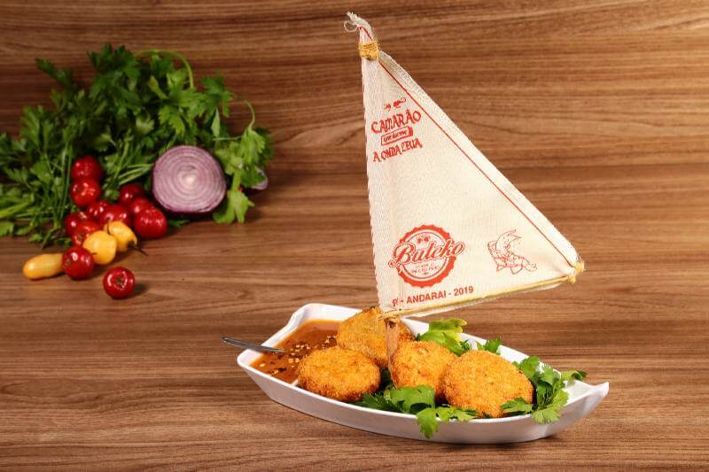

- Rua Barão de Mesquita, 893 – Andaraí. Tel.: 3437-6166
- Funcionamento: Segunda a sexta de 16h à 0h, sábado, domingo e feriados de 12h à 0h
- Petisco: Camarão que dorme a onda leva - Bolinhos de camarão com cebola roxa, ervas e temperos, levemente apimentados acompanhados de molho especial

### Cachambeer

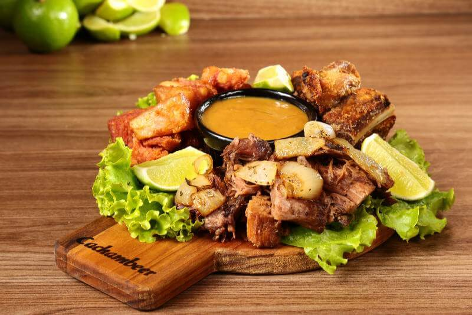

- Rua Cachambi, 475 - lojas A e B – Cachambi. Tel.: 3042-1640
- Funcionamento: Terça a sexta de 17h à 0h, sábado de 12h à 0h, domingo e feriados de 12h às 18h
- Petisco: Olha a marra do Porquinho Embriagado e da Costela no bafo nos 20 anos de Comida di Buteco - Minicostelas de boi, de porco e pancetas, tudo no bafo, acompanhados por um molho especial de mel, mostarda, limão, barbecue e shoyu

### Cais Bar

- Alameda dos Ingás, 190 - Ilha da Gigóia. Tel.: 2495-6532
- Funcionamento: Segunda a domingo de 13h às 19h
- Petisco: Peixe na Maré - Cubinhos de peixe ao leite de coco com batatas e pimentões acompanhados farofa de banana

### Cevina

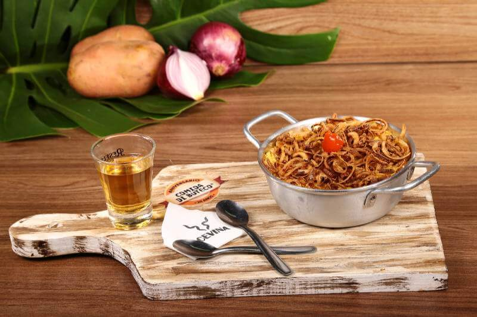

- Rua General Venâncio Flores, 955 - Vinte e Cinco de Agosto - Duque de Caxias. Tel.: 3842-2525
- Funcionamento: Segunda a sexta de 18h à 0h, sábado e domingo de 16h à 0h
- Petisco: P’Dégua - Ragu de carne assada recheada com bacon e calabresa sobre base de creme de batata com toque de gorgonzola (Aligot) finalizado com camadas de farinha de bragança, crispy de cebola e pimenta biquinho. Acompanha um drinque de 51 e mel

### Dida Bar

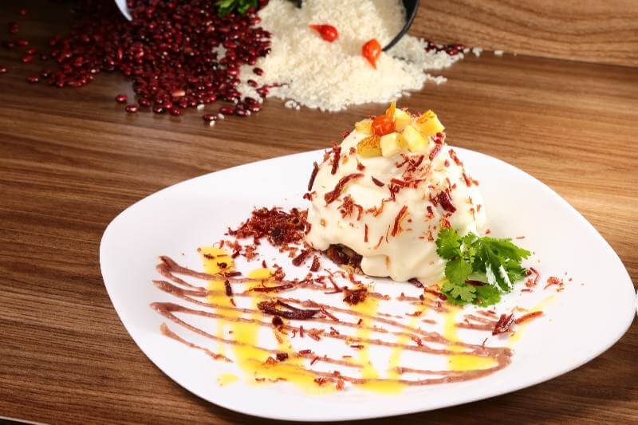

- Rua Barão de Iguatemi, 408, lojas A e B - Praça da Bandeira. Tel.: 2504-0841
- Funcionamento: Terça e quarta de 16h às 22h, quinta a sábado de 12h às 22h, domingo e feriados sob consulta
- Petisco: Maria Bonita - Baião de Dois com creme de aipim e crispy de carne seca

### Edinho do Caranguejo

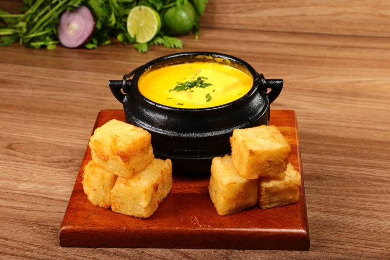

- Rua Humberto de Campos, 143 - Centro - Duque de Caxias. Tel.: 2772-1319
- Funcionamento: Segunda a sexta de 17h à 0h, sábado de 12h à 0h, domingo de 12h às 17h30, feriados sob consulta
- Petisco: Peixinho Manhoso - Picadinho de peixe ao molho de moqueca baiana acompanhado de crocantes de aipim

### Empório Quintana Boteco

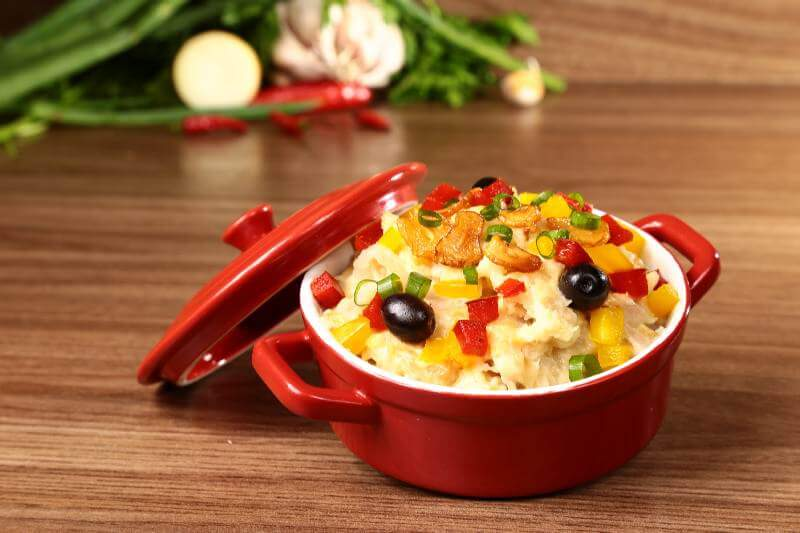

- Rua Capitão Felix, 110, loja 14 - Cadeg - Benfica - Tel.: 96017-3849
- Funcionamento: Terça a sábado de 12h às 21h, domingo e feriados de 12h às 18h
- Petisco: Uai Pois! - Bacalhau desfiado com cartupiry, cebola roxa, pimentões coloridos e alho em uma cama de polenta frita

### Enchendo Linguiça

- Av. Engenheiro Richard, 2 – Grajaú. Tel.: 2576-5727
- Funcionamento: Terça a quinta de 12h à 0h, sexta e sábado de 12h à 01h, domingo e feriados de 12h à 0h
- Petisco: Panela Velha - Porpetas bovinas recheadas com linguiça suína sobre polenta, coberta com ragu de tomate

### Esconderijo Bar

- Rua Itabaiana, 8, lojas B e D – Grajaú. Tel.: 3178-2525
- Funcionamento: Segunda a sexta de 17h45 às 23h, sábado e domingo de 13h à 23h
- Petisco: Que peito, hein! - Peito bovino desfiado na cerveja preta, alho, cebola, tomate, tomilho, cominho, loro e pimenta do reino, acompanhado de geleia de pimentões (verde, amarelo e vermelho) e tiras de polenta frita

### Folia do Boi

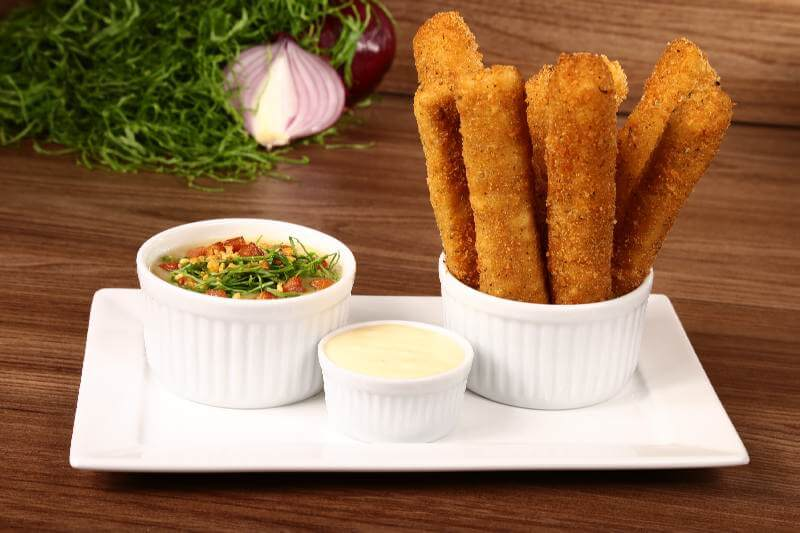

- Rua Cachambi, 253, loja B - Cachambi. Tel.: 2261-0058
- Funcionamento: Terça a quinta de 11h às 23h, sexta e sábado de 11h à 0h, domingo de 10h às 18h
- Petisco: Petisco do Mano - Palitos de lombo suíno empanados na mistura de farinha panko e ervas de provence servidos com molho de queijo. Para complementar um delicioso creme de aipim com calabresa, bacon, lombo salgado

### Imaculada

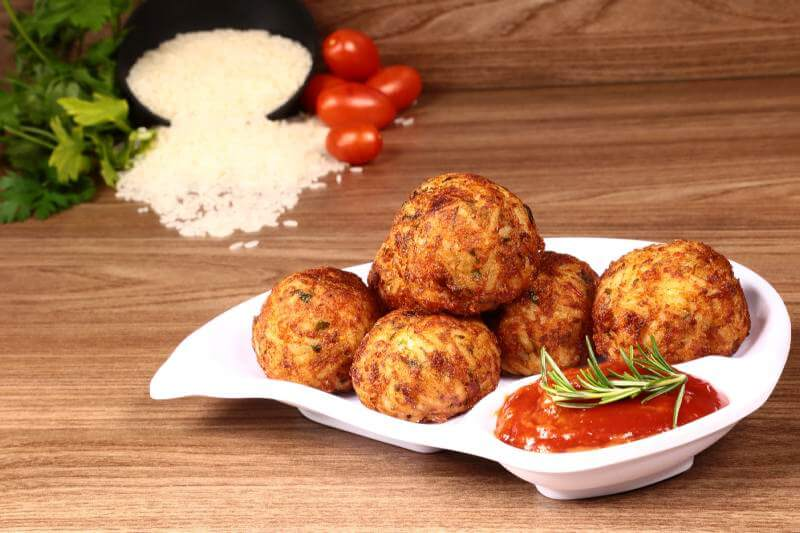

- Ladeira João Homem, 7 - Morro da Conceição. Tel.: 2283-2747.
- Funcionamento: Domingo a terça de 11h às 17h, quarta a sábado de 11hs às 22h
- Petisco: Sacro Santo Bolinho de Arroz - Bolinho de arroz recheado com linguiça, parmesão, mussarela e outros segredos sagrados

### Noo Cachaçaria

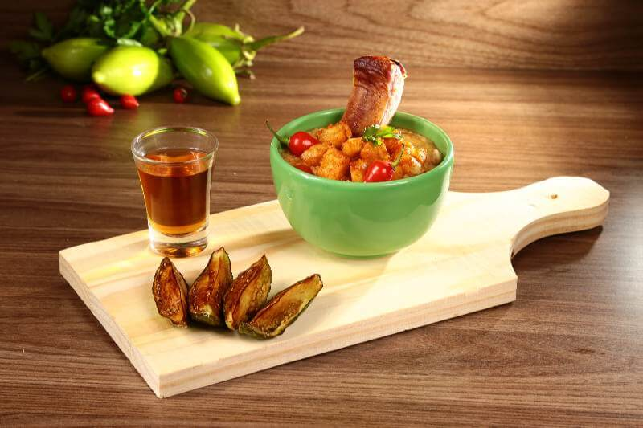

- Rua Barão de Iguatemi, 358 – Pça da Bandeira. Tel.: 99924-4044
- Funcionamento: Terça a quinta de 17h às 23h, sexta de 14h às 23h30, sábado de 12h às 23h30, domingos e feriados sob consulta.
- Petisco: Brindando CDB - Canjiquinha cremosa com paio, calabresa e costelinha defumada, pipoquinha de queijo coalho e jiló agridoce

### Os Imortais

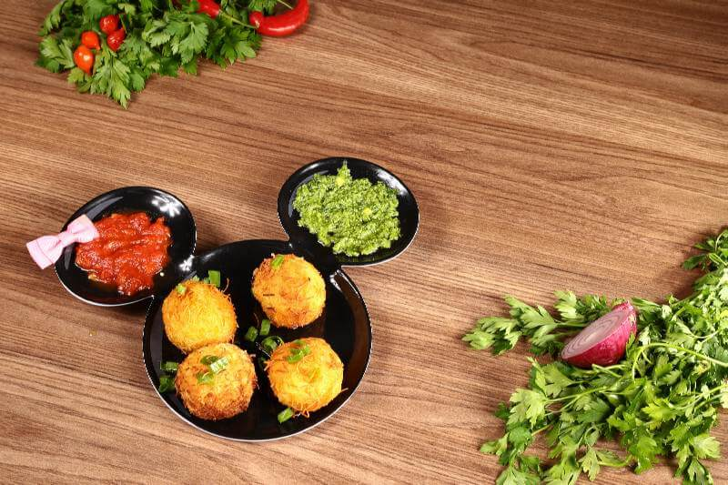

- Rua Ronald de Carvalho, 147A – Copacabana. Tel.: 3563-8959
- Funcionamento: Segunda a quinta de 17h à 01h, sexta de 17h às 02h, sábado de 12h às 02h, domingo de 12h à 0h
- Petisco: As Marias - Quatro bolinhos de massa de milho empanados com cabelinho de anjo, recheados de ragu de calabresa, queijo e um pouquinho de pimenta. Acompanha molhos pesto e de tomate picante

### Serpentina Bar Artesanal

- Rua Araguaia, 1480 – Freguesia. Tel.: 3486-4782
- Funcionamento: Terça a quinta de 18h à 0h, sexta de 18h às 02h, sábado de 12h às 02h, domingo de 12h às 22h
- Petisco: Os Três Porquinhos e Lobo Mau - Três petiscos de carne de porco reunidos num só prato: mini hambúrguer de copa lombo, um super torresmo (Torresmão) com molho barbecue e fatias de bacon, acompanhados de fatias de limão, dadinhos de aipim e geleia de pimenta

### Zeca’s

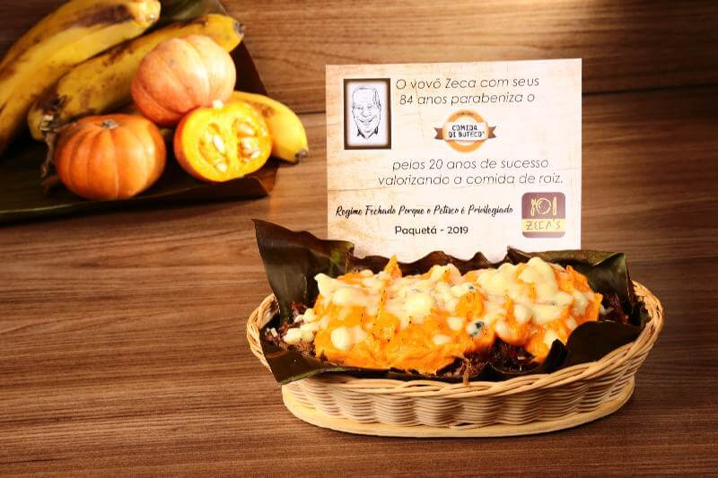

- Praça Bom Jesus, 12 - Ilha de Paquetá. Tel.: 3397-0322
- Funcionamento: Segunda e quinta de 11h às 17h, sexta e sábado de 11h às 23h, domingo de 11h às 21h30
- Petisco: Regime Fechado porque o Petisco é privilegiado - Carne assada desfiada junto com purê de abóbora cremoso e queijo gorgonzola, acompanhado de autêntica farofa de banana

### Zezimbar

- Rua Barata Ribeiro, 354, loja D – Copacabana. Tel.: 2236-6363
- Funcionamento: Segunda a domingo de 11h30 à 0h
- Petisco: Costelada do Zé “não interessa se ela é com barôa, panela velha é que faz costela boa” - Costela bovina feita no bafo e na pressão, marinada no vinho d’alho, com ervas, sal e pimenta.

## Finalizando

E aí, o que acharam? Só senti falta de um tema ou ingrediente chave para a participação dessa edição tão comemorativa e especial. Mas de boa, tá valendo, o que importa é comer bem.

Senti falta também de um patrocínio de uma cervejaria.

Qual petisco vocês gostaram mais? Estou pilhado em experimentar o do Cachambeer e do Bobô Bar. O do Bar Madrid também me agrada. Curti o do Bar do Mariano também porque amo [moela](https://www.papodebar.com/receita-moela-de-boteco/).

Aquele abraço.
